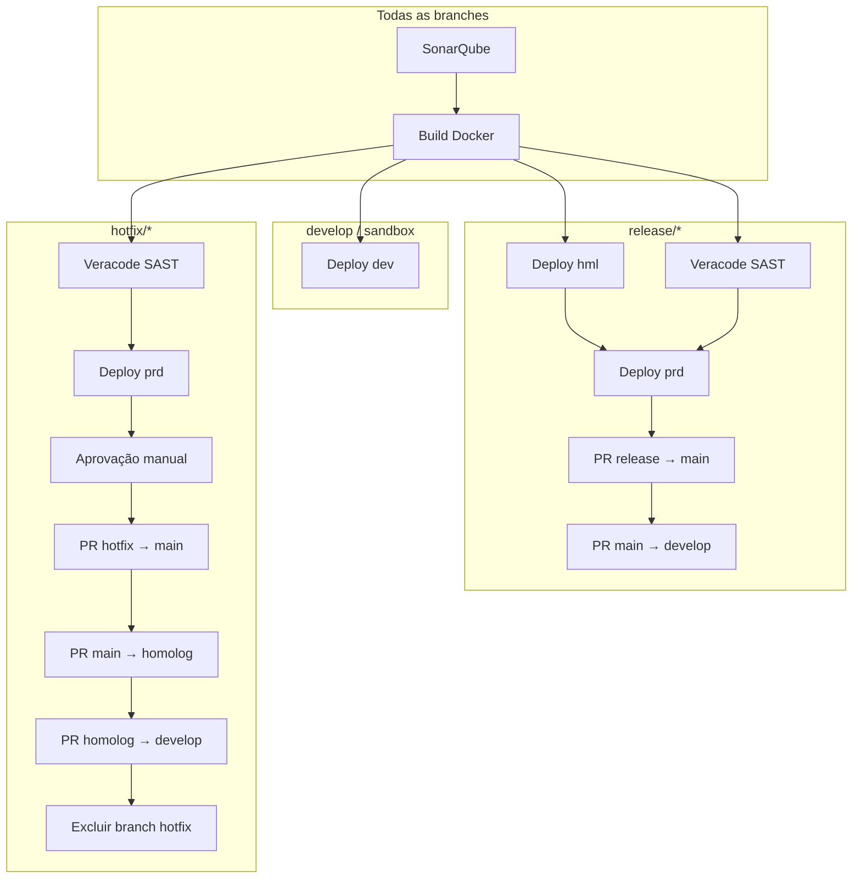

# Changelog

Biblioteca centralizada de templates de pipeline Azure DevOps para backends .NET do Banco Fibra.  
Este repositório concentra **CI/CD reutilizável**, **manifests de infraestrutura** (Terraform + Kubernetes) e **automação de promoção entre branches**, evitando duplicação de YAML em cada microserviço.

O versionamento segue [Semantic Versioning](https://semver.org/lang/pt-BR/) (`MAJOR.MINOR.PATCH`):

| Tipo | Quando usar |
|------|-------------|
| **MAJOR** | Mudança incompatível (parâmetros removidos/renomeados, fluxo de stages alterado) |
| **MINOR** | Nova funcionalidade compatível (novo template, novo parâmetro opcional, novo ambiente) |
| **PATCH** | Correção compatível (bugfix, melhoria de `displayName`, ajuste de script sem quebrar contrato) |

Ao referenciar este repositório nos pipelines das aplicações, **fixe a versão por tag** (ex.: `@refs/tags/v1.2.0`) em vez de apontar para `main`.

---

## Conceito e arquitetura

### Objetivo

Padronizar o ciclo de vida de APIs .NET implantadas em **Amazon EKS**, com provisionamento de recursos AWS via **Terraform** e gates de qualidade (**SonarQube** + **Veracode**).

### Como as aplicações consomem

Cada repositório de microserviço define um `azure-pipelines.yml` enxuto que **estende** o stack:

```yaml
resources:
  repositories:
    - repository: templates
      type: git
      name: Fibra.DevOps/fibra-devops-pipelines
      ref: refs/tags/v1.2.0

extends:
  template: templates/stacks/dotnet-backend.yaml@templates
  parameters:
    pod: { ... }
    networking: { ... }
    resources: { ... }
    observability: { ... }
    config: { ... }
```

### Estrutura do repositório

```
fibra-devops-pipelines/
├── templates/
│   ├── stacks/           # Ponto de entrada por tipo de aplicação
│   ├── stages/           # Stages reutilizáveis (deploy, veracode)
│   ├── dotnet/           # Build Docker + .NET
│   ├── sonarqube/        # Análise de qualidade
│   ├── veracode/         # Scan SAST
│   ├── hotfix/           # Fluxo dedicado a branches hotfix/*
│   ├── infra/            # Setup transversal (auth Git para módulos TF)
│   ├── utils/            # Automação de PRs
│   ├── variables/env/    # Variáveis por ambiente (dev, hml, prd)
│   └── deploy-backend.yaml  # Steps de deploy (ECR, TF, kubectl)
├── manifests/
│   ├── k8s/              # Templates Kubernetes (placeholders)
│   └── terraform/        # Infra AWS por aplicação
```

### Fluxo por branch



### Etapas do deploy (`templates/deploy-backend.yaml`)

1. Baixa artefato da imagem Docker (`.tar`) do stage de build
2. Publica imagem no **Amazon ECR**
3. Copia manifests de `manifests/k8s` e `manifests/terraform` para o workspace
4. Provisiona infraestrutura AWS (IAM Pod Identity, API Gateway, DynamoDB, S3, SQS, Secrets, etc.)
5. Substitui placeholders nos manifests Kubernetes
6. Gera ConfigMap com `env_vars` da aplicação
7. Aplica recursos no cluster EKS e anota o deployment com metadados de rastreabilidade

---

## Boas práticas

### Consumo dos templates

- **Fixe versão por tag** no `resources.repositories.ref` — evita quebras silenciosas quando `main` evolui.
- **Passe apenas parâmetros da aplicação** (`pod`, `networking`, `resources`, `config`); variáveis de conta AWS e cluster ficam em `templates/variables/env/`.
- **Não duplique** lógica de build/deploy no repositório da aplicação; estenda o stack e sobrescreva só o necessário.
- Configure o **Variable Group** `git-credentials` (com `GIT_PAT`) para módulos Terraform privados no Azure DevOps.

### Parâmetros da aplicação

| Bloco | Responsabilidade |
|-------|------------------|
| `pod` | CPU/memória, réplicas, HPA |
| `networking` | Ingress, domínio, base path, visibilidade da API, Cognito |
| `resources` | DynamoDB, S3, SQS, Secrets Manager |
| `config.env_vars` | Variáveis injetadas via ConfigMap |
| `config.ssm_parameters` | Parâmetros SSM por ambiente (dev/hml/prd) |
| `observability` | Datadog (`dd_lang`, `dd_lib_version`) |

### Qualidade e segurança

- **SonarQube** roda antes do build; o build só prossegue se o stage anterior for bem-sucedido.
- **Veracode** é obrigatório em `release/*` e `hotfix/*` antes do deploy em produção.
- Use `continueOnError` apenas onde explicitamente tolerado (ex.: Sonar em fase de adoção); o build breaker deve permanecer ativo em produção.
- Branches protegidas (`main`, `develop`, `homolog`) não podem ser excluídas pelo script de hotfix.

### Deploy e infraestrutura

- Cada ambiente possui **service connection AWS** e cluster EKS próprios (`templates/variables/env/*.yaml`).
- O backend Terraform usa **state remoto S3** por aplicação e ambiente (`tfstate-<repo>-<env>`).
- Manifests K8s usam **placeholders** substituídos em runtime — não edite valores fixos nos YAML base.
- Anotações de deploy (`deploy.fibra.io/build-id`, `commit`, `branch`) permitem rastrear qual build está em execução.

### Manutenção deste repositório

- Adicione `displayName` descritivos em português em toda nova etapa — facilita troubleshooting no Azure DevOps.
- Alterações em parâmetros obrigatórios exigem **MAJOR** e nota de migração neste changelog.
- Teste mudanças em um microserviço piloto antes de publicar nova tag.
- Mantenha `templates/deploy-backend.yaml` alinhado ao path referenciado em `templates/stages/deploy.yaml`.

### Convenção de branches (aplicação consumidora)

| Branch | Comportamento do pipeline |
|--------|---------------------------|
| `develop`, `sandbox` | Build + deploy em **dev** |
| `sandbox/*` | Build + deploy em **sdx** (infra de DEV, recursos com sufixo `-sdx`) |
| `release/*` | hml → Veracode → prd → PRs de promoção |
| `hotfix/*` | Veracode → prd → aprovação → PRs em cascata → exclusão da branch |

---

## [2.4.0] - 2026-08-19

Registro de release (DORA) para o **stack de frontend**: `Deploy_hml`/`Deploy_prd` do
`spa-frontend` passam a gravar o `.deploy/history.jsonl` e renderizar o `DEPLOY-PRD.md` do app,
com os mesmos perfis do backend. Para isso o registro foi separado em dois steps — **identidade
do artefato** (`resolve-artifact-image` | `resolve-artifact-static`) e **registro**
(`record-prod-release`, agora sem lógica por tipo) —, evitando duplicar o registro nos dois
stacks. **Compatível (MINOR)**: nenhum parâmetro de `stacks/*` mudou; o backend mantém o
comportamento e a saída anteriores, exceto por um campo **aditivo** no JSONL. Origem: item 3 da
auditoria de paridade backend × frontend.

### Alterado (refactor interno — steps, não contrato de app)

- **`steps/record-prod-release.yaml` passou a fazer SÓ registro.** A lógica de ECR (resolver
  digest, mover tag móvel `prod`) saiu dele e foi para um step próprio; o record não usa mais
  AWS (task `Bash@3`, sem `serviceAccount/awsRegion/awsAccID`). Ele lê a identidade do artefato
  das variáveis **`RELEASE_*`** exportadas pelo step anterior, via defaults `$(...)`:
  `artifactKind`, `artifactTag`, `artifactUri`, `artifactDigest`, `artifactRefByDigest`,
  `movingTag`, `siteUrl` (todos sobrescrevíveis). Sem `resolve-*` antes: warning e
  `artifact.kind: unknown`, nunca falha. Parâmetros removidos do record: `serviceAccount`,
  `awsRegion`, `awsAccID`, `imageName` (→ `appName`), `imageTag`, `prodTag` — **internos**:
  os únicos chamadores (`stages/deploy.yaml`, `stages/rollback.yaml`, `stages/deploy-frontend.yaml`)
  foram atualizados; nenhum parâmetro de `stacks/*` mudou.
- **JSONL (`schema_version` segue `1`, campo aditivo)**: toda entrada — backend inclusive — passa
  a ter `artifact: {kind: "image"|"static", site_url: string|null}`. `latest.json` ganha
  `artifact_kind` e `site_url`. Consultas `jq` existentes não quebram (entradas antigas sem
  `artifact` continuam válidas; o render usa `.artifact.site_url // ""`). Rótulos do resumo, do
  `latest.*` e do `DEPLOY-PRD.md` seguem o `kind` ("Artefato (build)" / "Local" / "Site" em vez
  de "Imagem (tag ECR)" / "Tag móvel").

### Adicionado

- **`steps/resolve-artifact-image.yaml`** (backend EKS) — identidade de imagem no ECR: digest
  (`ecr:DescribeImages`) e tag móvel `prodTag` (`ecr:BatchGetImage` + `PutImage`; `''` = não
  mover). Script movido do record, comportamento idêntico. Exporta
  `RELEASE_ARTIFACT_KIND=image`, `RELEASE_ARTIFACT_{TAG,URI,DIGEST}`, `RELEASE_IMAGE_REF_BY_DIGEST`,
  `RELEASE_MOVING_TAG`, `RELEASE_SITE_URL=''`. Best-effort.
- **`steps/resolve-artifact-static.yaml`** (frontend S3/CloudFront) — identidade de artefato
  publicado: `RELEASE_ARTIFACT_DIGEST` = `sha256:` da árvore de arquivos de **`artifactPath`**
  (caminho relativo + sha256 de cada arquivo, ordenação `LC_ALL=C`, excluindo os nomes em
  **`artifactDigestExcludes`**), `RELEASE_ARTIFACT_URI` = **`artifactLocation`** (ex.:
  `s3://<bucket>`), `RELEASE_ARTIFACT_TAG` = `Build.BuildId` (identidade do build — liga
  `hml` → `prd`), `RELEASE_SITE_URL` = `siteUrl`; sem tag móvel. Bash puro, sem AWS.
- **`stages/deploy-frontend.yaml`**: após o motor, em **`prd`** (perfil completo: carimbo do run,
  captura de aprovador, artefato `prod-release`, `history.jsonl` + `DEPLOY-PRD.md`) e **`hml`**
  (perfil reduzido: `stampRun/captureApproval: false`, artefato `hml-release`), encadeia
  `resolve-artifact-static` (`artifactPath: $(Pipeline.Workspace)/frontend-dist`,
  `artifactLocation: s3://$(FRONT_BUCKET)`, `artifactDigestExcludes: env-config.js` — gerado por
  ambiente, excluído para que o mesmo build tenha o **mesmo digest em hml e prd**, prova de build
  único —, `siteUrl: $(FRONT_SITE_URL)`) → `record-prod-release`. `hotfix/*` herda por passar
  pelo mesmo stage. Best-effort como no backend. O record clona o repo do app por conta própria
  (`System.AccessToken`) — não exige `checkout: self` no job.
- **`stages/deploy.yaml`** e **`stages/rollback.yaml`** (backend): passam a encadear
  `resolve-artifact-image` (hml com `prodTag: ''`; rollback com `imageTag` do parâmetro) →
  `record-prod-release`. Saída do JSONL/`DEPLOY-PRD.md` idêntica à anterior + campo `artifact`.

### Notas de adoção

- Mesmos pré-requisitos de portal do backend: **"Allow scripts to access the OAuth token"** e
  **Contribute** do Build Service no repo do app (ou o registro vira PR `release-record/<buildId>`).
  O frontend não precisa de permissões ECR; no backend, as de hml (`ecr:DescribeImages`/
  `BatchGetImage`) agora são exigidas pelo `resolve-artifact-image`.
- Para o dashboard DORA, filtre por `artifact.kind` quando quiser separar imagens de artefatos
  estáticos; `image.tag` e `source.committed_at` têm a mesma semântica nos dois perfis.

---

## [2.3.0] - 2026-08-18

Novo stack **`stacks/spa-frontend.yaml`**: esteira de **frontend SPA** (React/Vite/Angular) em
**S3 + CloudFront**, no mesmo formato do backend EKS — o app declara dados via `extends`, o
roteamento por branch é o mesmo (`develop`→DEV, `sandbox/*`→SDX, `release/*`→HML→gate
GMUD→PRD→PR main, `hotfix/*`→Veracode→PRD→PR→delete). Substitui o pipeline copiado por app
(`azure-pipelines-fibra-frontend.yaml`, que buildava 3× e abria PRs `develop→homolog→main` no
mesmo run). **Compatível (MINOR)**: nada do stack de backend mudou de contrato; o único toque
no backend é a extração do job de exclusão de branch para `utils/delete-branch.yaml`
(script idêntico, comportamento inalterado).

### Adicionado

- **`templates/stacks/spa-frontend.yaml`** (entrypoint). Parâmetros: `frontend`
  (`node_version`, `install_command`, `build_command`, `output_dir`), `cdn` (`dns_name`
  **obrigatório**, `cloudfront`, `prune_stale_files`), `config` (`env_vars` build-time +
  `runtime_vars.{dev,hml,prd}`), `veracode`, `sistema`, `owner`, `resourceSuffix`. Stage
  `Validate` falha se `cdn.dns_name` estiver vazio. Sem `rollbackImageTag` — rollback de frontend (re-sync de artefato de run anterior)
  fica para versão futura.
- **Stage `SonarQube` no stack de frontend** (Validate → **SonarQube** → Build, como no backend)
  com o novo **`templates/sonarqube/qa-sonar-node.yaml`**: `npm ci` → lint (`npm run lint
  --if-present`) → testes com cobertura (`npm test --if-present -- --coverage`, `CI=true`) →
  scanner **CLI** (`sonar.javascript/typescript.lcov.reportPaths`, exclusões de
  `node_modules/dist/build/coverage/testes/config`, `sonar.test.inclusions`) →
  `SonarQubePublish` → Quality Gate. Publica JUnit (`junit*.xml`) na aba Tests quando existir.
  Parâmetro novo no stack: `quality` (`mode`, `lint_command`, `test_command`,
  `coverage_report`; vazio nos comandos = pular; objeto parcial substitui o default).
  **`quality.mode`**: `warn` (**default**, adoção) — lint, testes e Quality Gate rodam e
  **reportam** (`##vso[task.logissue type=warning]`, job `SucceededWithIssues`) mas **não
  bloqueiam**; o `Validate` emite warning lembrando que os gates estão em modo aviso.
  `block` — lint/testes/gate viram build breaker (comportamento do backend). Decisão
  deliberada: os fronts existentes não têm lint/teste/Sonar estabilizados; default bloqueante
  quebraria toda pipeline nova. Novo parâmetro `enforce` (bool) em `qa-sonar-node.yaml`.
  Cobertura ausente vira `##[warning]` (Sonar reporta 0%), não erro.
- **`templates/sonarqube/quality-gate.yaml`** — step "Avaliar Quality Gate" extraído de
  `qa-sonar-dotnet.yaml` (script idêntico; o `.NET` agora o referencia) e compartilhado com o
  `qa-sonar-node.yaml`.
- **Veracode no frontend**: já roteado em `release/*`/`hotfix/*` (mesmo `stages/veracode.yaml`);
  agora o stack envia exclusões de empacotamento adequadas a JS (`node_modules`, `dist`,
  `build`, `coverage`, `*.map`, `.git`) via novo parâmetro opcional
  **`defaultExcludePatterns`** em `stages/veracode.yaml` — usado só quando o app não informa
  `veracode.excludePatterns` (backend inalterado: default `''`).
- **`templates/frontend/build-frontend-node.yaml`** — job `Build`: `npm ci` (ou `npm install`
  com warning se não houver lockfile), `.env` gerado de `config.env_vars`, `build_command`,
  valida `output_dir/index.html` e publica o artefato **`frontend-dist`**.
- **`templates/stages/deploy-frontend.yaml`** — stage `Deploy_<env>` (deployment job no
  Environment `<env>`, carrega `variables/env/<env>.yaml`), consome o artefato do Build
  (`download: current`) e delega para o motor.
- **`templates/deploy-frontend.yaml`** — motor: copia `manifests/terraform-frontend/` →
  `_app.auto.tfvars.json` (`app_name`, `bucket_name`, `project_name`) → `steps/terraform-apply`
  (state `tfstate-<repo>-<env>` / `<repo>/terraform.tfstate`, mesma convenção do backend; tfvars
  `environment`, `aws_region`, `resource_suffix`, `sistema`, `owner`, `dns_name`, `cloudfront_enabled`,
  `access_logging_bucket`) → lê outputs (`bucket_name`, `cloudfront_distribution_id`,
  `site_url`) → gera **`env-config.js`** (`window.env = {...}` + `APP_ENVIRONMENT`) no
  artefato → `aws s3 sync` (assets com `max-age=31536000, immutable`; `index.html` e
  `env-config.js` com `no-cache`) → invalidation `/*` com `wait` (só se `cdn.cloudfront`).
  Terraform usa `serviceAccountTerraform`; upload/invalidation usam `serviceAccount`
  (separação herdada do legado — menor privilégio).
- **`templates/hotfix/hotfix-frontend.yaml`** — fluxo `hotfix/*` do frontend.
- **Caminhos do motor de frontend ancorados em `$(Pipeline.Workspace)`** (`terraformSourceDir`
  = `$(Pipeline.Workspace)/s/templates/manifests/terraform-frontend`, `terraformWorkDir` =
  `$(Pipeline.Workspace)/terraform`). O job de deploy do frontend faz checkout **só** do repo
  `templates` (o `dist` vem do artefato) e, com checkout único, o ADO aponta
  `Build.SourcesDirectory`/`System.DefaultWorkingDirectory` para a pasta desse repo
  (`…/s/templates`) — o primeiro run real falhou com `…/s/templates/templates/manifests/…`.
  O backend não sofre disso porque faz dois checkouts (`self` + `templates`).
- **`templates/utils/delete-branch.yaml`** — job de exclusão da branch do run (extraído de
  `hotfix/hotfix-backend-dotnet.yaml`, que agora o referencia).
- **`examples/azure-pipelines-frontend.yml`** — app fino de exemplo.
- **`sandbox/Fibra.DevOps.Terraform/modules/aws_cloudfront_distribution`** — novo módulo
  reutilizável (cópia de trabalho a replicar no repositório `Fibra.DevOps.Terraform`), no padrão
  do `aws_lambda_function`: `create_cloudfront_distribution` (+`count`), outputs PascalCase
  (`ID`, `ARN`, `Domain_Name`, `Hosted_Zone_ID`, `Origin_Access_Control_ID`,
  `Response_Headers_Policy_ID`), 4 preconditions (`name`/`origin_domain_name` obrigatórios,
  `aliases` exige ACM, recusa endpoint `s3-website-*`), validations (`price_class`,
  `http_version`, `frame_option`, `referrer_policy`, `geo_restriction`, TLS), README e suíte
  `tests/` offline (setup/validations/preconditions). Escopo deliberado: distribuição + OAC +
  headers policy para **uma origem S3**; bucket, bucket policy, DNS, certificado e invalidation
  ficam com o chamador. Piso `>= 1.3.0`, provider `>= 5.0`.

### Removido

- Arquivos legados do frontend na raiz do repositório (`azure-pipelines-fibra-frontend.yaml`,
  `build-frontend-fibra.yaml`, `deploy-frontend.yaml`, `terraform-for-front.yaml`,
  `datasource.tf`, `locals.tf`, `output.tf`, `provider.tf`, `variables.tf`) — substituídos
  pelo stack e pelo root acima. Histórico: `git show <commit-anterior>:<arquivo>`.

### Decisões de design (e o que muda para o app)

- **Build único.** O legado rodava `npm run build` por ambiente com `.env` diferente
  (`env_vars.dev/hml/prd`) — o que subia em PRD não era o que foi homologado. Agora o
  `dist` é construído uma vez e promovido; **valores por ambiente saem do `.env` e vão para
  `config.runtime_vars.<env>` (`window.env`)**. O app precisa: (1) `<script
  src="/env-config.js"></script>` no `index.html` (a esteira avisa se não achar a referência);
  (2) ler `window.env.X` em vez de `import.meta.env.VITE_X` / `process.env.REACT_APP_X` para
  o que varia por ambiente. `config.env_vars` continua existindo, mas é uma lista só (igual
  nos três ambientes).
- **Nomes derivados**: bucket do site `<repo>-<env>`, domínio
  `<dns_name>-<env>.bancofibra.com.br` (prd: `<dns_name>.bancofibra.com.br`).
- **Sandbox (`sandbox/*` → `Deploy_sdx`) com a mesma semântica do EKS**: usa
  `variables/env/sdx.yaml` (conta/SC de DEV, `resourceSuffix: '-sdx'`), `runtime_vars.dev`,
  Environment `sdx`; sem Veracode/GMUD. O `resourceSuffix` é **efetivo** como no backend:
  bucket `<repo><suffix>` (default `<repo>-sdx`), domínio `<dns_name><suffix>.bancofibra.com.br`
  e, para sufixo customizado (≠ `''`/`-sdx`), state key `<repo><suffix>/terraform.tfstate` —
  isto é, `resourceSuffix: '-wesley'` no app cria **outro sandbox isolado** do mesmo app
  (bucket, distribuição, domínio e state próprios). Mesma limitação do EKS: um sandbox por
  sufixo, sem teardown automático.
- **`prune_stale_files: false`** por default: `--delete` no sync removeria chunks antigos que
  usuários com `index.html` em cache ainda podem pedir (404 até o reload). Ligue só se o app
  aceitar isso.

- **`manifests/terraform-frontend/`** — root module do frontend (S3 + CloudFront), copiado em
  runtime pelo motor. Bucket `var.bucket_name` privado (public access block, versioning,
  SSE-S3, `BucketOwnerEnforced`, logging em `access_logging_bucket`, policy *deny* sem TLS +
  leitura por OAC restrita ao ARN da distribuição); CloudFront opcional (`cloudfront_enabled`,
  case-insensitive) **via módulo reutilizável** `Fibra.DevOps.Terraform//modules/aws_cloudfront_distribution`
  (`source = "git::https://..."`, mesmo padrão do `manifests/terraform/`) — por isso o stage de
  deploy do frontend também roda `infra/setup-git-auth.yaml` e o stack declara o variable group
  **`git-credentials`** (pré-requisito igual ao backend). Defaults do módulo: OAC, response
  headers policy (CORS + HSTS/nosniff/frame/referrer), managed policies
  `CachingOptimized`/`CORS-S3Origin`, `http2and3`, fallback SPA 403/404 → `/index.html`,
  TLS 1.2+, `PriceClass_All` (o `_100` não tem edge no Brasil). Domínio
  `<dns_name>-<env>.<base_domain>` (prd sem env). Certificado: `acm_certificate_arn` ou lookup
  do wildcard em **us-east-1** (provider alias). Outputs `bucket_name`,
  `cloudfront_distribution_id`, `cloudfront_domain_name`, `domain_name`, `site_url`. **Não**
  cria DNS. `resource_suffix` (sandbox) substitui `-<env>` no domínio; o bucket já chega
  sufixado pela esteira. Suíte `tests/*.tftest.hcl` offline (`command = plan`, TF ≥ 1.6):
  domínio por env, sdx default e com sufixo customizado, sem CloudFront, validações de
  `dns_name`/`price_class`. Substitui os dois roots do legado
  (`terraform-front/s3` + `terraform-front/cloudfront`, dois states) por um root/um state.

### Pendências desta versão (próximos passos)

- Validar via **Preview API** com um frontend piloto e, no primeiro deploy, criar o
  CNAME/alias `domain_name` → `cloudfront_domain_name` (DNS fora deste root).
- Publicar o módulo `aws_cloudfront_distribution` no repositório `Fibra.DevOps.Terraform`
  (o `source` do root já aponta para lá) — até então o `terraform init` do frontend falha.
- ~~`record-prod-release` para frontend (hoje é ECR-cêntrico)~~ (feito em 2.4.0), rollback por
  artefato de run anterior, SCA de dependências JS (`npm audit`/Veracode SCA), bloqueio de segredos em
  `runtime_vars`/`env_vars`, smoke test pós-deploy e `npmAuthenticate` para feed privado.
- Pré-requisitos de portal para o Sonar do frontend: service connection `SonarQube` e o
  projeto `<repo>-key` (criado no primeiro run se o token tiver permissão), iguais ao backend.
- Migração de apps existentes: bucket `<repo>-<env>` já existente precisa de `terraform
  import` (`aws_s3_bucket.site`) — o root agora é dono do bucket, não mais `data`.

---

## [2.2.0] - 2026-08-10

Ambiente **sandbox isolado (`sdx`)** para branches `sandbox/*`: deploy igual ao de DEV, na
mesma conta/cluster de DEV, mas com todos os recursos nomeados de forma independente — o dev
testa a versão da branch sem colidir com o que está em DEV. **Compatível (MINOR)**: parâmetro
Terraform novo tem default vazio (nenhum recurso de dev/hml/prd é renomeado) e o roteamento
novo só ativa em `refs/heads/sandbox/*`; a branch fixa `sandbox` segue indo para DEV.

### Adicionado

- **Roteamento `sandbox/*` → `Deploy_sdx`** em `stacks/dotnet-backend.yaml` (compile-time,
  como os demais). Fluxo: Validate → SonarQube → Build → Deploy SDX. Sem Veracode, sem GMUD,
  sem registro de release (o `record-prod-release` continua restrito a prd/hml). Réplicas:
  regra de não-prd já força 1 pod. SSM: o sandbox usa a lista de `config.ssm_parameters.dev`
  (não há chave própria no contrato — os parâmetros são criados na conta de dev com o nome
  sufixado, ver abaixo).
- **`templates/variables/env/sdx.yaml`** — quarto arquivo de ambiente. Mesmos nomes de
  variáveis dos demais (obrigatório), valores de DEV, mais `resourceSuffix: '-sdx'`.
  **Bootstrap (uma vez)**: `albSharedDns`/`albSharedListener` devem apontar para o ALB do
  grupo `sdx-eks-shared-alb` — criado pelo próprio primeiro deploy sdx (annotation
  `group.name` do ingress usa o environment) — e `certificate_arn` precisa cobrir
  `sdx-api-<domain>`. Enquanto o ALB apontado for o de DEV, o API Gateway do sandbox roteia
  para os pods de DEV; instruções no cabeçalho do arquivo.
- **`resourceSuffix`** (novo nome de variável nos 4 `variables/env/*.yaml`, novo parâmetro
  opcional `resourceSuffix: ''` em `deploy-backend.yaml`, nova var Terraform
  `resource_suffix` default `""`). Aplicado aos nomes que **não** embutem o environment e por
  isso colidiriam na conta compartilhada com DEV: IAM roles (`eks-pod-identity-<app>`,
  `<app>-role-apigw`) e policy (`eks-pod-<app>`), log group `/aws/api-gateway/<app>`, nome da
  REST API/usage plan/api key, tabelas DynamoDB, Secrets, parâmetros SSM e o `base_path` do
  custom domain (`<base_path>-sdx` no domain interno compartilhado). Os demais nomes já
  isolam sozinhos por embutirem o environment: namespace `<app>-sdx`, `tfstate-<app>-sdx`,
  S3 `<bucket>-sdx`, SQS/SNS/Lambda `*-sdx-<região>-*` e custom domain público
  `sdx-api-<domain>`.

### Corrigido

- `manifests/k8s/configmap.yaml`: removida a chave **duplicada** `ASPNETCORE_ENVIRONMENT`
  (aparecia duas vezes; a efetiva sempre foi a de `deployment_aspnetcore_environment` —
  comportamento inalterado, só remove a ambiguidade).

### Limitações conhecidas do sandbox (deliberadas nesta versão)

- **Um sandbox por app por vez**: todas as branches `sandbox/*` do mesmo app convergem para
  `<app>-sdx` (mesmo namespace/state). Isolamento por branch fica para depois, se houver
  demanda.
- **Isolamento é de nomes, não de permissão**: a policy `eks-pod-<app>` é ampla (conta
  inteira — antipadrão pré-existente), então um pod sdx *consegue* acessar recursos de dev se
  o app apontar para os nomes sem sufixo. O app que declara recursos próprios (DynamoDB,
  SQS, SSM) precisa referenciar os nomes com o environment/sufixo na configuração do
  sandbox.
- **Sem teardown automático**: recursos sdx permanecem após a branch morrer; limpeza é
  `terraform destroy` manual no state `tfstate-<app>-sdx` (mesmo débito dos demais
  ambientes, mais sensível aqui por ser efêmero).
- **Ref git**: `sandbox` (fixa) e `sandbox/*` não coexistem no mesmo repositório (conflito
  de ref). Cada app escolhe um modelo; a esteira suporta ambos.

---

## [2.1.0] - 2026-08-03

Histórico consolidado de deploys para métricas DORA. **Compatível**: parâmetros novos são
opcionais e os defaults preservam o comportamento de `2.0.0`; a única mudança observável para
quem adota é o registro passar a cobrir também a HML.

### Adicionado

- **`.deploy/history.jsonl` no repositório da aplicação** — histórico acumulativo de deploys,
  um objeto JSON por linha (`schema_version: 1`), gravado pelo `record-prod-release.yaml` na
  mesma máquina de clone → commit → push do `DEPLOY-PRD.md` (retry ×3 re-clonando a cada
  tentativa — cobre corrida com pushes de devs na branch — e fallback de PR quando a branch tem
  policy). Campos: `app`, `environment`, `deploy_type`, `deployed_at`, `result`,
  `image{tag,digest,uri,moving_tag}`, `source{commit,commit_message,committed_at,branch}`,
  `pipeline{build_id,build_number,url,triggered_by}`, `approval{approved_by,approved_at,wait_seconds}`.
  Campos não resolvidos viram `null` — nunca abortam o registro.
- **Registro em HML** (perfil reduzido): `stages/deploy.yaml` passa a invocar o step também com
  `environment: hml` — linha no JSONL + artefato `hml-release` + re-render do `DEPLOY-PRD.md`;
  sem tag móvel (`prodTag: ''`), sem carimbo de run, sem captura de approval. Existe para
  decompor o lead time (`commit → hml` e `hml → prd`) — mede quanto tempo a mudança espera o
  gate de GMUD.
- **Seção "Homologação (últimos 20)" no `DEPLOY-PRD.md`** — histórico de deploys de HML
  renderizado do mesmo JSONL (filtro `environment == "hml"`), dando visão humana do que subiu
  em homologação sem consultar o JSONL na mão. Atualizada a cada deploy de hml **e** de prd.
- **`source.committed_at`** via REST de Git do ADO — sem a data do commit não há lead time
  (`deployed_at − committed_at`). Rollback registra `commit`/`committed_at` nulos.
- **`approval{}`** via timeline do build → API de approvals: aprovador, data e `wait_seconds`
  (aprovação − início do gate). **Best-effort estrito e ainda não validado em run real de PRD**:
  qualquer falha vira `approval: null` + warning. Validar num run real antes de confiar na
  métrica.
- **Parâmetros novos** no `record-prod-release.yaml` (todos opcionais): `environment` (`prd`),
  `historyFile` (`.deploy/history.jsonl`), `updateMarkdown` (`true`), `captureApproval` (`true`).
  `prodTag: ''` passa a significar "não mover tag móvel".
- Artefato `history-entry.json` com a entrada do run (além do JSONL acumulado no repo).

### Alterado

- **`DEPLOY-PRD.md` passa a ser RENDERIZADO do JSONL** — o arquivo inteiro é função pura do
  `history.jsonl`: "Último deploy" = última entrada de `prd` (não mais as variáveis do run,
  o que permite ao deploy de hml re-renderizar sem sobrescrever dados de produção; sem nenhuma
  entrada de prd, exibe placeholder), "Histórico" = entradas de `prd` (mais recente primeiro,
  limitado a 50) e "Homologação" = entradas de `hml` (limitado a 20) — em vez de raspado do
  próprio markdown com `awk`. **Migração única e automática**: na primeira execução, a tabela
  do formato antigo é preservada na seção "Histórico anterior (pré-JSONL)" e o `history.jsonl`
  começa vazio — linhas antigas não são convertidas.
- Commit do registro: mensagem vira `chore(release): <tipo> <tag> em <ambiente> [skip ci]`.
  O `[skip ci]` agora é crítico também em `release/*` (que está no trigger de CI desde `2.0.0`).

### Notas de adoção

- **Service connection de HML precisa de `ecr:DescribeImages` e `ecr:BatchGetImage`** (leitura
  do digest). Sem isso o registro de hml grava `digest: null` com warning — o deploy não é
  afetado.
- O registro continua sendo **o último step do stage** e nunca bloqueia deploy (best-effort da
  `1.3.2` + guardas novas).
- Consultas prontas (validadas contra registro sintético):
  ```bash
  # Deployment frequency (prd, sem rollback), por mês
  jq -s '[.[]|select(.environment=="prd" and .deploy_type!="rollback")]
         | group_by(.deployed_at[0:7]) | map({mes:.[0].deployed_at[0:7], deploys:length})' .deploy/history.jsonl
  # Lead time mediano commit→prd, em horas
  jq -s '[.[]|select(.environment=="prd" and .source.committed_at!=null)
          | ((.deployed_at|fromdate)-(.source.committed_at|fromdate))/3600] | sort | .[length/2|floor]' .deploy/history.jsonl
  # Espera média no gate de GMUD, em minutos
  jq -s '[.[]|select(.approval!=null and .approval.wait_seconds!=null)|.approval.wait_seconds/60]
         | add/length' .deploy/history.jsonl
  ```

---

## [2.0.0] - 2026-08-03

**MAJOR** — remoção de contrato e mudança de fluxo de stages. CI contínuo em `release/*` até
HML; promoção para PRD vira run manual atrás do gate de GMUD; back-merge automático eliminado.
Aplicações precisam de ajuste ao adotar (ver Notas de adoção).

### Removido (breaking)

- **Parâmetro `hotfix`** de `stacks/dotnet-backend.yaml` e `hotfix/hotfix-backend-dotnet.yaml`
  (`main_pr_require_manual_approval`, `main_pr_reviewers`, `main_pr_wait_timeout_minutes`), e
  com ele os parâmetros `requireManualApproval`/`reviewers`/`waitTimeoutMinutes` do
  `utils/create-pullrequest.yaml`. O caminho de polling (`while … sleep 30` segurando agente por
  até 6h esperando merge manual) foi removido — a aprovação manual do hotfix **continua
  existindo** e sempre foi o Environment approval do stage `Approve_PR_Main`; o polling era um
  segundo mecanismo, morto (`false` em toda a cadeia) e redundante. App que declara `hotfix:` no
  `extends` **falha na compilação** com `Unexpected parameter 'hotfix'` — correção: apagar o
  bloco.
- **Stage `BackMerge_Develop`** dos fluxos `release/*` e `hotfix/*`. Justificativa: no modelo de
  branches da casa, `release/X.Y.Z` **nasce do `main`**, então hotfixes e correções já entram na
  próxima release por construção — o back-merge não protegia contra regressão; só gerava
  pipeline vermelho pós-deploy quando `main`×`develop` conflitavam (caso normal) e escrevia em
  `develop` com bypass de policy. `develop` ressincroniza fora da esteira. **Isso converte a
  premissa "toda `release/*` e `feature/*` nasce do `main`" em requisito** — invariante
  documentado no `CLAUDE.md`; se o corte passar a ser do `develop`, o back-merge precisa voltar.
  `Delete_Hotfix_Branch` religado a `dependsOn: PR_PRD`.

### Alterado

- **`Deploy_prd` e `PR_Main` do fluxo `release/*`** ganham
  `condition: and(succeeded(), eq(variables['Build.Reason'], 'Manual'))`. Run de CI para na HML;
  a promoção é "Run pipeline" manual na branch da release, passando pelo approval do Environment
  `prd`. **GMUD híbrido**: mudança normal = promoção manual agendável (deferred approval);
  expressa/emergencial = `hotfix/*`, que **não tem essas condições** e sobe em PRD no run de CI
  (as duas ocorrências de `Build.Reason` estão dentro do ramo compile-time de `release/*`;
  hotfix e rollback não compilam esse bloco). Nota: a condição é **runtime** — na Preview API os
  stages aparecem também no cenário de CI; em execução ficam *skipped*.
- **`Veracode` do fluxo `release/*`**: `dependsOn: [Build]` → `[Deploy_hml]`. HML quebrado não
  consome mais um scan de até 110 min. Custo: o scan sai do paralelo — o run de release cresce
  ~a duração do deploy de HML. `Deploy_prd` mantém `dependsOn: [Deploy_hml, Veracode]`.
- **`utils/create-pullrequest.yaml`**:
  - `--squash false` explícito na conclusão — promoção exige merge commit verdadeiro (squash
    quebraria a rastreabilidade de revert por feature e o merge de volta);
  - `--bypass-policy-reason` com BuildId, BuildNumber, RequestedFor e rota
    (cadeia de evidência de auditoria no próprio PR);
  - `az devops configure --defaults` + `--repository` explícitos (antes: auto-detect implícito,
    frágil em job com múltiplos checkouts).
- **Exemplos unificados** (`examples/*.yml`): trigger único `develop`, `sandbox`, `release/*`,
  `hotfix/*` com **`batch: true`** — serializa runs de CI por branch (proteção principal contra
  `terraform apply` concorrente no mesmo state, que segue sem locking — débito registrado no
  `CLAUDE.md`).

### Adicionado

- **`PROMOCAO-PRD.md`** (raiz): runbook do dev (pré-condições, passo a passo, gate, deferred
  approval, expiração, pós-promoção, tabela "stage vermelho × produção afetada?") + checklist do
  portal do ADO (approval de `prd` com timeout 7d, self-approval off, qualquer-um-do-grupo;
  Exclusive Lock em `hml` sem approval; queue liberada para devs — o controle é o approval, não o
  botão; *Bypass policies when completing pull requests* para o Build Service em `main`;
  notificação de approval expirado; roteiro de verificação do setup).

### Notas de adoção

- **Toda aplicação precisa, ao adotar a tag `2.0.0`**: (1) remover o bloco `hotfix:` do
  `extends`, se declarado; (2) atualizar o `trigger` para o padrão com `batch: true` e
  `release/*`; (3) executar o checklist de portal do `PROMOCAO-PRD.md` — **sem o approval
  configurado no Environment `prd`, `Deploy_prd` sobe sem gate** num run manual.
- A promoção manual re-executa Build e HML no próprio run (imagem nova, homologada nesse mesmo
  run) — o princípio de build único vale **dentro** do run.
- Runs de CI em `release/*` mostram `Deploy_prd`/`PR_Main` como *skipped* — é o esperado, não é
  erro.

---

## [1.3.2] - 2026-08-03

Correção de robustez no registro de release em PRD. O step deixa de poder reprovar um deploy que
já subiu com sucesso, e as falhas de registro passam a nomear a permissão que faltou.
**Nenhuma mudança de contrato**: nenhum parâmetro adicionado, removido ou renomeado; nenhum
stage, `dependsOn` ou condição alterada.

### Corrigido

- **`steps/record-prod-release.yaml` não era best-effort, apesar do princípio estar documentado
  no próprio arquivo.** A task principal roda sob `set -euo pipefail` e não tinha
  `continueOnError`: uma falha em `aws ecr describe-images` — permissão `ecr:DescribeImages`
  ausente, imagem já removida pela lifecycle policy, throttling do ECR — matava o script e
  reprovava o stage `Deploy_prd` **depois** de o `kubectl apply` ter subido a versão com sucesso.
  Resultado: cluster atualizado e saudável, painel vermelho, e o Environment `prd` registrando
  como falha uma implantação que funcionou. Pior efeito colateral: `PR_Main` e
  `BackMerge_Develop` dependem de `Deploy_prd` com `succeeded()` e não rodavam — a release ficava
  em produção sem chegar à `main` nem à `develop`. A task passa a ter `continueOnError: true`.
- **Leitura do digest guardada.** Falha vira warning citando a permissão e o registro segue com
  `image_digest` vazio, em vez de abortar — `latest.json`, `latest.md` e `DEPLOY-PRD.md`
  continuam sendo gerados. O retorno `"None"` do `--query` (que sai com código 0 quando o
  JMESPath não encontra nada) passa a ser tratado como falha, em vez de virar digest literal no
  registro. `image_ref_by_digest` fica vazio nesse caso, em vez da string truncada
  `<registry>/<repo>@`.
- **Leitura do manifesto (`aws ecr batch-get-image`) guardada.** Antes era captura direta sob
  `set -e` e matava o step inteiro.
- **Falha de `ecr:PutImage` deixa de se disfarçar de operação normal.** Quando o `put-image`
  recusava, o step imprimia `"Tag 'prod' já aponta para este digest (nada a fazer)"` — mensagem
  correta para `ImageAlreadyExistsException`, mas **idêntica** no caso de permissão negada. A tag
  móvel `prod` podia ficar congelada numa versão antiga com o log dizendo que estava tudo certo —
  defeito que só se manifesta durante um incidente, quando alguém usa a tag para escolher o alvo
  do rollback. Os dois casos passam a ser distinguidos pelo erro retornado pelo ECR: o benigno
  mantém a mensagem informativa; o resto vira warning citando `ecr:PutImage`.

### Notas de adoção

- **O stage passa a exibir "succeeded with issues"** quando o registro falha, e a implantação
  aparece como *partially succeeded* no Environment. `succeeded()` continua verdadeiro para esse
  resultado, então `PR_Main` e `BackMerge_Develop` seguem rodando normalmente.
- Ausência de registro deixa de ser silenciosa: todo caminho de falha emite `##[warning]` nomeando
  a permissão ou a condição que faltou, com os 500 primeiros caracteres do erro do ECR.
- **Revise as permissões da service account de PRD** na primeira execução após adotar esta versão.
  Warnings que antes apareciam como falha de stage (ou não apareciam) ficam visíveis agora:
  `ecr:DescribeImages`, `ecr:BatchGetImage` e `ecr:PutImage`.
- `update_release_log` já estava protegida (chamada em `||`, o que suspende o `set -e` dentro da
  função) — nada muda naquele bloco, inclusive no `curl` de criação de PR.
- A geração dos arquivos (`jq` / `latest.*`) segue sem guarda própria por decisão: não é chamada
  externa e o `continueOnError` da task já cobre.
- Vale igualmente para o **rollback**, que usa o mesmo step via `stages/rollback.yaml`. Sem efeito
  em `dev`/`hml`, onde o step não é invocado.

---

## [1.3.1] - 2026-07-31

Consolidação da documentação do repositório em um único arquivo. **Mudança apenas documental**:
nenhum template, manifest, parâmetro ou fluxo de stage foi alterado.

### Adicionado

- **`CLAUDE.md` na raiz** — documentação de referência do repositório, escrita para ser lida por
  quem (ou o que) chega sem contexto: distinção entre `templates/` (pipeline) e `manifests/`
  (artefatos da app), roteamento por branch do stack, ordem dos steps do motor de deploy,
  comandos de validação do Terraform, políticas embutidas na esteira (réplicas por ambiente,
  SSM por ambiente, registro de release em PRD, rollback rastreado) e regras de versionamento.
  Preserva, no topo, a seção de persona/regras de trabalho que já existia no arquivo.
- Seção **"Contratos que quebram silenciosamente"** no `CLAUDE.md`, catalogando o que falha sem
  mensagem óbvia: alias `templates` obrigatório no `resources.repositories` (o
  `stages/deploy.yaml` faz `checkout: templates`), contrato `PLACEHOLDER_*`, lista de manifests
  obrigatórios, `dependsOn` referenciado por string, `backend.tf` gerado pela esteira e o duplo
  default de `rollbackImageTag` (`'none'` no stack, `''` no app).

### Removido

- **`README.md` da raiz** e a pasta **`docs/`** (`ARQUITETURA-TEMPLATES.md`,
  `ARQUITETURA-RELEASE.md`, `fluxo-release.md`, `MIGRACAO-GLOBAL-VARIABLES.md`). Remoção
  deliberada — a documentação corrente passa a ser o `CLAUDE.md` mais este changelog, evitando
  três fontes descrevendo a mesma esteira e divergindo entre si. Nada é referenciado por
  template ou pipeline, então não há impacto em execução.

### Notas de adoção

- **Nenhuma ação para aplicações consumidoras.** Nada muda em tempo de compilação nem de
  execução; pipelines pinados em `v1.3.0` podem subir para `v1.3.1` sem revalidar.
- As referências a `docs/README.md`, `docs/devops/workflow.md` e afins nas entradas anteriores
  deste changelog são **históricas** — esses arquivos não existem mais. O conteúdo antigo segue
  recuperável no histórico Git (ex.: `git show 914994f:README.md`).

---

## [1.3.0] - 2026-07-20

Parametrização do fluxo Veracode ponta a ponta. **Nenhuma quebra de contrato**: `veracode` é opcional
em toda a cadeia, e uma aplicação que não o declare roda exatamente como em `1.2.0`.

### Adicionado

- **`templates/veracode/scanner-veracode.yaml` parametrizado** (16 parâmetros): `appName`, `serviceConnection`, `version`, `sandboxName`, `criticality`, `createSandbox`, `deleteIncompleteScan`, `createProfile`, `importResults`, `failBuildIfUploadAndScanFails`, `failBuildOnPolicyFail`, `maximumWaitTime`, `sourceFolder`, `excludePatterns`, `archiveFile` e `fetchDepth`. Antes o template aceitava só `appName` — e o ignorava.
- **`templates/stages/veracode.yaml`**: parâmetros `veracode` (objeto repassado ao scanner), `pool` e `timeoutInMinutes`. O repasse usa `${{ each }}` sobre o objeto, então declarar apenas os campos desejados funciona — o resto fica no default do scanner.
- **Parâmetro `veracode` na cadeia completa**: `stacks/dotnet-backend.yaml` → `stages/veracode.yaml` (fluxo `release/*`) e `stacks/dotnet-backend.yaml` → `hotfix/hotfix-backend-dotnet.yaml` → `stages/veracode.yaml` (fluxo `hotfix/*`). Antes os 15 parâmetros do scanner eram inalcançáveis a partir da aplicação, porque a camada de stage encaminhava só o `appName`.
- **`excludePatterns`** (opt-in, default vazio): filtra o que entra no ZIP enviado ao Veracode, via `CopyFiles@2` com padrões minimatch. Recomendado `!.git/**` — o histórico Git não é código de aplicação e hoje é enviado junto. **Não exclua `bin/`/`obj/` sem validar**: o Veracode para .NET costuma analisar os assemblies compilados.

### Alterado

- `scanner-veracode.yaml`: `checkout: self` passou a usar **`fetchDepth: 1`** (parametrizável). O scan analisa a árvore de trabalho, não o histórico — o clone completo era custo puro, e o `.git` ainda ia dentro do ZIP enviado a um serviço de terceiros.
- `scanner-veracode.yaml`: `maximumWaitTime` de `360` para **`110`**, alinhando com o `timeoutInMinutes: 120` do job. Os 360 minutos eram inalcançáveis — o job era morto às 2h antes disso, produzindo falha por timeout de job em vez de mensagem clara do Veracode. O limite efetivo praticamente não muda; a mensagem de erro sim.

### Corrigido

- **`appName` era declarado e ignorado.** `scanner-veracode.yaml` recebia o parâmetro mas usava `veracodeAppProfile: '$(Build.Repository.Name)'` fixo. Como `stages/veracode.yaml` passava exatamente esse mesmo valor, o defeito era invisível — só apareceria para quem tentasse customizar o perfil.
- `stages/veracode.yaml`: `pool` e `timeoutInMinutes` deixaram de ser literais no corpo do stage.

### Notas de adoção

- **`veracode` é opcional em toda a cadeia.** Pipeline que não o declara não precisa de nenhuma alteração; o `${{ each }}` sobre objeto vazio faz zero iterações.
- **Valide o primeiro scan.** `fetchDepth: 1` muda o que é clonado. Não deve afetar o resultado (o Veracode analisa a árvore, não o histórico), mas o scan é gate de produção — compare os findings com o run anterior.
- **`timeoutInMinutes` deve ser sempre maior que `maximumWaitTime`.** É convenção manual: expressões de template do Azure DevOps não fazem aritmética, então os dois valores não podem ser derivados um do outro.
- **Pendência conhecida:** `optargs` contém `-createsandbox true` enquanto o input `createSandBox` é `false`. Qual prevalece depende de como a task `Veracode@3` monta a chamada. Comportamento preservado como estava; confirme num run se a sandbox da branch está mesmo sendo criada — se não estiver, scans de `release/*` e `hotfix/*` estão indo para o perfil principal.

---

## [1.2.0] - 2026-07-20

Parametrização dos templates de qualidade, build e autenticação Git. **Nenhuma quebra de contrato**:
todos os parâmetros novos são opcionais e seus defaults reproduzem o comportamento de `1.1.1`.

> ⚠️ **Ao tagear**: `examples/azure-pipelines.yml` referencia `refs/tags/v2.0.0`, tag que não existe.
> Aponte o exemplo para `refs/tags/v1.2.0` — senão um pipeline copiado dele não resolve o
> `resources.repositories` e sequer compila.

### Removido

- `templates/variables/frontend/{dev,hml,prd}.yaml` e `templates/variables/pix/{dev,hml,prd}.yaml`. Eram um estado intermediário do fatiamento por domínio × ambiente e **nunca chegaram a uma tag publicada** — por isso não há migração a fazer nem quebra de contrato. As variáveis de ambiente ficam apenas em `templates/variables/env/{dev,hml,prd}.yaml`.

### Adicionado

- **`templates/infra/setup-git-auth.yaml` parametrizado**: `orgUrl`, `patVariable`, `probeRepo` e `verifyAccess`. A organização (`bancofibra`) e o repositório de módulos (`Fibra.DevOps.Terraform`) deixam de estar fixos no corpo do script. Todos os defaults preservam o comportamento anterior.
- **`templates/dotnet/build-backend-dotnet.yaml` parametrizado**: `pool`, `dockerfilePath`, `buildContext`, `imageName`, `imageTag`, `artifactName` e `extraBuildArgs`. O template não tinha nenhum parâmetro; os defaults de `imageName`/`imageTag`/`artifactName` são iguais aos de `steps/image-promote.yaml` por contrato — se alterar em um, altere no outro.
- **`templates/sonarqube/qa-sonar-dotnet.yaml` parametrizado** (16 parâmetros): `sonarServiceConnection`, `projectKey`, `projectName`, `branchName`, `extraProperties`, `dotnetVersion`, `includePreviewVersions`, `solutionPattern`, `nugetFeedId`, `buildConfiguration`, `coverageFile`, `relaxNugetSignatureChecks`, `pollingTimeoutSec`, `gateWaitAttempts`, `gateWaitIntervalSeconds` e `breakOnQualityGate`.
  - `extraProperties` substitui os blocos de `sonar.exclusions` / `coverage.exclusions` / `cpd.exclusions` que estavam comentados no arquivo — agora o app declara as exclusões sem forkar o template.
  - `breakOnQualityGate: false` publica o resultado do gate sem derrubar o build, permitindo adoção gradual em aplicações novas.
- **Resultados de teste publicados no run** (`PublishTestResults@2`): o `dotnet test` passou a gerar `.trx` e a aba **Tests** do Azure DevOps deixa de ficar vazia — com contagem, duração e histórico de flakiness. Roda com `condition: succeededOrFailed()` (é quando o teste falha que o relatório importa) e não falha se não houver `.trx`. Desligável com `publishTestResults: false`.
- `qa-sonar-dotnet.yaml`: parâmetro `coverageToolVersion` para pinar a versão do `dotnet-coverage`. Vazio (default) instala a última e emite `##[warning]` — **defina uma versão** para builds reprodutíveis.

### Alterado

- **`sonar.branch.name` deixou de ser fixo em `develop`** e passa a derivar da branch do run (`coalesce(parameters.branchName, replace(variables['Build.SourceBranch'], 'refs/heads/', ''))`). Análises de `release/*` e `hotfix/*` passam a ser registradas na branch correta. Depende do `sonarqube-community-branch-plugin` instalado no servidor; para voltar ao comportamento anterior, passe `branchName: 'develop'`.
- `templates/sonarqube/qa-sonar-dotnet.yaml`: o glob do `restore` e o `find` do build passaram a derivar do mesmo parâmetro `solutionPattern` — antes eram dois literais `*.slnx` independentes.

### Corrigido

- **`setup-git-auth.yaml` não imprime mais o PAT no log.** A linha de diagnóstico usava `${GIT_PAT}` (o valor) onde a intenção era `${#GIT_PAT}` (o tamanho).
- `build-backend-dotnet.yaml`: a autodetecção da pasta em `src/` (`ls | head -1`, ordem alfabética) agora emite `##[warning]` quando há mais de uma pasta e falha explicitamente se o Dockerfile não existir. Use `dockerfilePath` para eliminar a ambiguidade.
- `qa-sonar-dotnet.yaml`: `find` sem resultado agora falha com mensagem clara em vez de chamar `dotnet build ""`.
- `qa-sonar-dotnet.yaml`: `NUGET_CERT_REVOCATION_MODE: 'no'` passou a ser citado (em YAML, `no` sem aspas é o booleano `false`).
- **`qa-sonar-dotnet.yaml`: falha intermitente por `SIGPIPE`.** Os dois `find … | head -n 1` (solução e `report-task.txt`) rodavam sob `set -o pipefail`: quando o `head` fechava o pipe antes de o `find` terminar, o `find` saía com 141 e derrubava o step sem motivo aparente. Trocados por `find … -print -quit`.
- **`qa-sonar-dotnet.yaml`: `PATH` montado com macro do Azure DevOps.** O bloco `env` usava `PATH: $(PATH):$(HOME)/.dotnet/tools`; se as macros não resolvessem, o `PATH` do step viraria a string literal e todo comando falharia com *command not found*. Passou a ser `export PATH="$PATH:$HOME/.dotnet/tools"` dentro do script, onde é shell de verdade.
- **`qa-sonar-dotnet.yaml`: token do SonarQube agora é mascarado** (`##vso[task.setsecret]`) assim que é extraído de `SONARQUBE_SCANNER_PARAMS`, protegendo contra vazamento em log caso alguém habilite `set -x` ou um erro ecoe a linha de comando.
- `qa-sonar-dotnet.yaml`: removida a instalação de `jq` via `sudo apt-get` em runtime. O `jq` já vem no `ubuntu-latest` e os demais templates do repo o consomem sem instalar; agora o step falha com mensagem clara se faltar.
- `qa-sonar-dotnet.yaml`: `dotnet tool install` trocado por `dotnet tool update`, que é idempotente — o `install` falhava quando a ferramenta já existia no agente (self-hosted reaproveitado).

### Notas de adoção

- Nenhum chamador precisa mudar: todos os parâmetros novos são opcionais e os defaults preservam o comportamento anterior — **exceto** `sonar.branch.name`, que muda de propósito (ver *Alterado*).
- **Valide no primeiro run**: confira no log do step `Configurar SonarQube (.NET)` se `sonar.branch.name` recebeu o valor esperado. Se vier vazio ou com o prefixo `refs/heads/`, a expressão não resolveu — passe `branchName` a partir de `stacks/dotnet-backend.yaml`.
- Com branches reais, cada `release/X.Y.Z` vira um registro permanente no SonarQube. Configure o *housekeeping* de branches inativas antes de adotar.
- A primeira análise de cada branch nova não tem baseline; Quality Gates com condição sobre *novo código* podem se comportar de forma diferente nesse run.
- **Verifique se teste quebrado derruba o stage.** O `dotnet test` roda dentro do `dotnet-coverage collect`; se o exit code não for propagado, um teste falhando passaria despercebido. Com o `PublishTestResults@2` desta versão dá para conferir: quebre um teste de propósito e confirme que a aba **Tests** fica vermelha **e** o stage falha.
- **Pine o `dotnet-coverage`.** O default de `coverageToolVersion` é vazio (instala a última) e emite `##[warning]`. Pegue a versão do log do primeiro run e passe no chamador.

---

## [1.1.1] - 2026-07-17

### Alterado

- `templates/deploy-backend.yaml`: remover a duplicação do `record-prod-release.yaml` em compile-time quando `environment == prd` (DEV/HML não são afetados).

## [1.1.0] - 2026-07-17

### Adicionado

- **Registro rastreável de releases em PRD** (`templates/steps/record-prod-release.yaml`), injetado automaticamente pela esteira em todo caminho que toca produção (release, hotfix e rollback — o app não configura nada):
  - **`DEPLOY-PRD.md` na raiz do repositório da aplicação**: seção "Último deploy" (situação deploy/hotfix/rollback, data, imagem/tag ECR, digest, commit + mensagem, link do run, autor) sobrescrita a cada subida, e seção "Histórico" acumulando as últimas 50 entradas. O commit entra na branch deployada com `[skip ci]` e chega à `main`/`develop` pelos PRs que a esteira já abre; se o push for bloqueado por branch policy (ex.: rollback executado na `main`), o registro é publicado na branch `release-record/<buildId>` e um PR é aberto automaticamente via REST.
  - **Resumo na aba Summary do run** (`task.uploadsummary`) e **artefato `prod-release`** com `latest.json` (estruturado, para automação), `latest.txt` e `latest.md`.
  - **Tag móvel `prod` no ECR** sempre apontando para o digest em produção (o rollback reaponta a tag para a imagem restaurada).
  - **Carimbo do run**: Build Number ganha sufixo `· prd` e tags `prod`/`<app>`, permitindo filtrar na lista de runs o que foi para produção.
  - Parâmetros: `deployType` (`auto` distingue deploy × hotfix pelo branch; rollback é explícito), `updateReleaseLog`, `recordBranch`, `prodTag`, `stampRun`.

### Alterado

- `templates/stages/deploy.yaml`: passa a incluir o `record-prod-release.yaml` em compile-time quando `environment == prd` (DEV/HML não são afetados).

### Notas de adoção

- **Azure DevOps**: usuário *Build Service* com permissão **Contribute** e **Contribute to pull requests** no repositório do app; opção *"Allow scripts to access the OAuth token"* habilitada (ambos já necessários aos PRs automáticos da esteira).
- **AWS (conta PRD)**: a service account precisa de `ecr:DescribeImages`, `ecr:BatchGetImage` e `ecr:PutImage` (leitura do digest + tag móvel `prod`).
- O `[skip ci]` no commit do registro é o que impede o redisparo da esteira em `hotfix/*`; não remova.
- Registro é **best-effort**: falha em qualquer etapa do registro vira warning e não bloqueia o deploy.

## [1.0.29] - 2026-07-16

### Adicionado

- Suporte a tópicos SNS e filas SQS já existentes na conta AWS nas `sns_sqs_subscriptions`. Nomes não declarados em
  `topic_name`/`queue_name` passam a ser resolvidos via data source, permitindo reaproveitar recursos criados por outros
  projetos.

### Corrigido

- Corrigido `local.managed_queue_names`, que referenciava a variável inexistente `var.sqs_queues` em vez de `var.queue_name`,
  fazendo com que toda fila fosse tratada como externa.


## [1.0.27] - 2026-07-15

### Alterado

- Rollback de stages no fluxo `release/` do `templates/stacks/dotnet-backend.yaml`. O stage `Deploy_DEV` passa a ser executado agora somente com a branch `develop & sandbox`


## [1.0.26] - 2026-07-10

> ⚠️ **Obsoleto.** Este encadeamento foi revertido em [1.0.27]. No fluxo atual, `Deploy_hml` e `Veracode`
> dependem ambos de `[Build]`, e não existe `Deploy_dev` no caminho `release/*`.

### Alterado

- Encadeamento de stages no fluxo `release/` do `templates/stacks/dotnet-backend.yaml`. O stage `Veracode` passa a depender de `Deploy_dev` (`dependsOn: [Deploy_dev]`) e o deploy de homologação (`environment: hml`) passa a depender de ambos (`dependsOn: [Deploy_dev, Veracode]`). Garante que o deploy em `hml` só ocorra após a conclusão do deploy em `dev` e da análise Veracode.


## [1.0.25] - 2026-07-10

### Alterado

- Padronização do nome dos **queues SQS** por aplicação. O `manifests/terraform/main.tf` passa a iterar sobre o novo `local.sqs_queues` (em `locals.tf`) em vez de `var.queue_name` diretamente. O local monta o nome no padrão `sqs-${var.environment}-${data.aws_region.current.name}-<queue_name>`, converte `fifo_queue` / via `tobool(lower(...))` e acrescenta o sufixo `.fifo` automaticamente para queues FIFO. Adicionado `datasource.tf` com `data "aws_region" "current"`. O dev passa a declarar apenas a parte curta do nome em `resources.sqs[].queue_name`;


## [1.0.24] - 2026-07-10

### Alterado

- Padronização do nome dos **tópicos SNS** por aplicação. O `manifests/terraform/main.tf` passa a iterar sobre o novo `local.sns_topics` (em `locals.tf`) em vez de `var.topic_name` diretamente. O local monta o nome no padrão `sns-${var.environment}-${data.aws_region.current.name}-<topic_name>`, converte `fifo_topic` / `content_based_deduplication` via `tobool(lower(...))` e acrescenta o sufixo `.fifo` automaticamente para tópicos FIFO. Adicionado `datasource.tf` com `data "aws_region" "current"`. O dev passa a declarar apenas a parte curta do nome em `resources.sns_topics[].topic_name`;


## [1.0.22] - 2026-07-08

### Adicionado

- Suporte a **assinaturas SNS → SQS** por aplicação. Novo parâmetro opcional `resources.sns_sqs_subscriptions` (default `[]`) propagado pelo stack `dotnet-backend.yaml` → `stages/deploy.yaml` → `deploy-backend.yaml`, mapeado para a nova variável Terraform `sns_sqs_subscriptions`. O `manifests/terraform/main.tf` provisiona as assinaturas via módulo `aws_sns_sqs_subscription` (`for_each` por par `topic_name--queue_name`), referenciando os módulos `aws_sns_topic`/`aws_sqs_queue` pela chave. Cada item aceita `topic_name` e `queue_name` (devem existir em `sns_topics`/`sqs`) e, opcionalmente, `filter_policy` (objeto convertido via `jsonencode`) e `filter_policy_scope` (default `MessageAttributes`); sem `filter_policy` a assinatura recebe todas as mensagens e o `filter_policy_scope` é anulado para não exigir policy.

## [1.0.21] - 2026-07-08

### Adicionado

- Suporte a **tópicos SNS** por aplicação. Novo parâmetro opcional `resources.sns_topics` (default `[]`) propagado pelo stack `dotnet-backend.yaml` → `stages/deploy.yaml` → `deploy-backend.yaml`, mapeado para a nova variável Terraform `topic_name` (com campos `topic_name`, `fifo_topic` e `content_based_deduplication`). O `manifests/terraform/main.tf` provisiona os tópicos via módulo `aws_sns_topic` (`for_each` sobre `var.topic_name`). A IAM policy do pod já concede `sns:Publish`/`sns:Subscribe`, então aplicações que não declararem `sns_topics` seguem sem alteração.

## [1.0.20] - 2026-07-02

> ⚠️ **Obsoleto.** O registro em Wiki foi substituído em [1.1.0] pelo `DEPLOY-PRD.md` no repositório da
> aplicação. Esta correção não se aplica ao template atual — não há mais chamada à API de Wiki.

### Corrigido

- `record-prod-release` não bloqueia mais a atualização da Wiki quando a **API de listagem** (`_apis/wiki/wikis`) retorna vazia para o token do build (comportamento observado mesmo com *Contribute* concedido — `list` e `get` têm checagens de permissão/escopo diferentes). Agora, se a listagem não resolver o `id`, o step **cai de volta para o identificador por nome `<Projeto>.wiki`** e tenta o GET/PUT diretamente (que costuma funcionar), decidindo o sucesso pela resposta real da página — em vez de abortar. Também passou a **logar a resposta crua da listagem** (500 primeiros chars) para diagnóstico, e a URL-encodar o identificador da Wiki.

## [1.0.19] - 2026-07-02

> ⚠️ **Obsoleto.** O registro em Wiki foi substituído em [1.1.0] pelo `DEPLOY-PRD.md` no repositório da
> aplicação. O parâmetro `wikiName` não existe mais.

### Alterado

- `record-prod-release` agora **descobre a Wiki de projeto automaticamente** (via API de listagem `_apis/wiki/wikis`, usando o `id`/GUID da Wiki do tipo `projectWiki`) em vez de assumir o nome `<Projeto>.wiki`. Isso evita `WikiNotFoundException` (HTTP 404) quando o identificador por nome não resolve e torna o parâmetro `wikiName` opcional (só necessário para *code wikis* ou cenários específicos). Quando não existe nenhuma Wiki no projeto, o warning fica explícito ("crie em Overview > Wiki > Create project wiki e dê Contribute ao Build Service").

## [1.0.18] - 2026-07-02

> ⚠️ **Parcialmente obsoleto.** O **histórico em Wiki** foi substituído em [1.1.0] pelo `DEPLOY-PRD.md` no
> repositório da aplicação: os parâmetros `updateWiki`, `wikiName` e `wikiPagePath` não existem mais —
> os equivalentes atuais são `updateReleaseLog` e `recordBranch`. O **carimbo do run** (`stampRun`) segue
> válido e em uso.

### Adicionado

- O step `record-prod-release` ganhou **visibilidade nativa do deploy em prod**, sem o dev precisar abrir o stage e caçar o artefato:
  - **Carimbo do run** (parâmetro `stampRun`, default `true`): adiciona as build tags `prod` e `<imageName>` e renomeia o Build Number com o sufixo ` · prd` (idempotente em reexecução). Assim a **lista de runs** do pipeline mostra, de relance e filtrável, quais execuções foram para produção. Segue o mesmo padrão já usado em `stages/rollback.yaml`.
  - **Histórico incremental em Wiki** (parâmetro `updateWiki`, default `true`): a cada deploy em prod, acrescenta **uma linha** (mais recente no topo) numa página única da Wiki do projeto (`wikiPagePath`, default `/Releases/prd`), formando uma tabela central com data (UTC), aplicação, tag, digest, commit, link do build e quem disparou. Usa a REST API de Wiki com `System.AccessToken` (mapeado via `env:`, mesmo padrão de `hotfix`/`utils`) e cria a página automaticamente na primeira vez. Falhas na Wiki **não derrubam o deploy** (o artefato `prod-release` e o resumo em Markdown continuam sendo a fonte oficial). Requer que exista uma **Wiki de projeto** e que o **Build Service** tenha permissão de *Contribute* na Wiki, além de "Allow scripts to access the OAuth token" habilitado.
  - Novos parâmetros opcionais: `stampRun`, `updateWiki`, `wikiName` (vazio ⇒ `<Projeto>.wiki`) e `wikiPagePath`.

## [1.0.17] - 2026-07-01

### Adicionado

- O step `record-prod-release` agora publica um **resumo em Markdown na aba "Summary" do run** (`##vso[task.uploadsummary]`), com link do pipeline, imagem, digest, tag móvel, commit e branch. Facilita a visualização do último release em prod direto na página da execução, sem precisar baixar o artefato (que continua sendo gerado como registro oficial).

## [1.0.16] - 2026-07-01

> ⚠️ **Obsoleto.** Depende do forçamento de `min_replicas: 2` em prd introduzido em [1.0.9], que não
> existe mais. Hoje `prd` usa os valores de `pod.min_replicas`/`pod.max_replicas` da aplicação sem
> alteração, e `dev`/`hml` são forçados a `1`/`1`.

### Corrigido

- HPA inválido em produção (`spec.maxReplicas must be >= minReplicas`): como o ambiente `prd` força `min_replicas: 2`, o `max_replicas` da aplicação era mantido mesmo quando menor que 2, resultando em `min=2 > max=1`. Agora, em `prd`, quando a aplicação define `max_replicas < 2`, o template usa `5` como teto padrão; valores `>= 2` continuam sendo respeitados. `dev`/`hml` seguem usando o `min`/`max` informados pela aplicação.

## [1.0.15] - 2026-07-01

> ⚠️ **Referência obsoleta.** A subseção "Valores aceitos por parâmetro" não existe mais: a `docs/` foi
> reescrita (índice, glossário, C4 e ADRs). O contrato de parâmetros hoje está em
> `docs/devops/workflow.md` e `docs/arquitetura/c4-componentes.md`.

### Adicionado

- Subseção **"Valores aceitos por parâmetro"** na doc (`docs/README.md`), detalhando as opções/formatos/defaults de cada campo que o dev pode setar (`pod`, `networking`, `observability`, `resources`, `config`, `hotfix`, `rollbackImageTag`). Os valores foram extraídos da fonte real (templates + `manifests/terraform/`), ex.: `api_visibility` = `private`/`public`, `cognito` = `true`/`false`, `dd_lang` = `dotnet`/`java`/`js`/`python`/`ruby`.

### Corrigido

- Exemplo de consumo na doc estava com `api_visibility: internal` (valor inválido); corrigido para `private` e adicionados comentários inline com os valores aceitos.

## [1.0.14] - 2026-07-01

> ⚠️ **Obsoleto.** Nada desta entrada descreve o comportamento atual: o encadeamento sequencial foi
> revertido em [1.0.27]; `Validate`, `SonarQube` e `Build` voltaram a rodar em todos os fluxos que não
> são rollback; o stage **`Skip` não existe** no repositório; e a documentação citada foi substituída
> pela `docs/` atual.

### Alterado

- **Deploy do `release/*` agora é sequencial** no stack `dotnet-backend.yaml`: `Deploy_hml` passou a depender de `Deploy_dev` (antes ambos dependiam apenas do `Build` e rodavam em paralelo). Assim cada ambiente vira um gate — se `dev` falha, `hml`/`prd` não iniciam. O `Veracode` segue em paralelo a partir do `Build`, e `Deploy_prd` continua dependendo de `[Deploy_hml, Veracode]`.
- **`Validate`, `SonarQube` e `Build` passaram a rodar apenas em `release/*` e `hotfix/*`** (antes rodavam em qualquer branch). Branches como `develop`/`sandbox` deixam de gastar agente com qualidade/build, e apenas o `release/*` implanta nos ambientes — eliminando concorrência no `dev`.

### Adicionado

- Stage **`Skip`** para branches fora de `release/*` e `hotfix/*`: evita erro de compilação do Azure DevOps (pipeline sem stages) e deixa claro nos logs que a branch não dispara a esteira. Pode ser removido se os `triggers` da aplicação já limitarem o pipeline a `release/*` e `hotfix/*`.
- Documentação didática em [`docs/README.md`](docs/README.md): visão geral, glossário, estrutura do repositório, como as aplicações consomem os templates, fluxogramas da esteira (geral, `release/*`, `hotfix/*` e anatomia do deploy), guia passo a passo de **como adicionar novas linguagens** (com contratos a respeitar), tabela de alterações comuns, boas práticas e FAQ/troubleshooting.

## [1.0.13] - 2026-07-01

> ⚠️ **Parcialmente obsoleto.** O `record-prod-release.yaml` continua existindo, mas evoluiu bastante
> (ver [1.1.0] e [1.1.1]) e hoje é invocado por `stages/deploy.yaml`, não pelo `deploy-backend.yaml`.
> A mudança de fluxo descrita em *Alterado* — `Deploy_dev` como primeira etapa do `release/*` — foi
> revertida em [1.0.27].

### Adicionado

- Novo step `templates/steps/record-prod-release.yaml`, executado ao final do deploy em **produção** (`deploy-backend.yaml`, guardado por `${{ if eq(parameters.environment, 'prd') }}`). Ele registra o último release em prod: consulta o **digest imutável** (`sha256`) da imagem no ECR, aplica a **tag móvel `prod`** apontando para esse digest (idempotente) e publica um artefato `prod-release` com `latest.json` (estruturado) e `latest.txt` (leitura humana) contendo link do pipeline, Build ID/Number, URI e digest da imagem, commit, branch, quem disparou e timestamp UTC. Requer permissões `ecr:DescribeImages`, `ecr:BatchGetImage` e `ecr:PutImage` na service connection de prd.

### Alterado

- Fluxo `release/*` do stack `dotnet-backend.yaml` passou a incluir um deploy em **dev** como primeira etapa (dev → hml → Veracode → prd), e o bloco `${{ else }}` que fazia deploy dedicado em `develop`/`sandbox` foi removido.

## [1.0.12] - 2026-06-30

### Adicionado

- Novo stage de **validação** (`Validate`) no início do fluxo do stack `dotnet-backend.yaml`, antes de SonarQube/Build. Ele barra, em tempo de compilação (`${{ if eq(parameters.networking.ingress_path, '/') }}`), configurações com `ingress_path: /`, que transformariam a rota em um catch-all no ALB compartilhado e sequestrariam o tráfego das demais APIs. O `SonarQube` passou a depender desse stage (`dependsOn: Validate`), fazendo o pipeline falhar cedo e com mensagem clara quando o path é inválido. O fluxo de `rollbackImageTag` não é afetado.

## [1.0.11] - 2026-06-26

### Alterado

- O gatilho de rollback no stack `dotnet-backend.yaml` passou a usar o valor sentinela `none` (além de string vazia) como "sem rollback": `${{ if and(ne(rollbackImageTag, ''), ne(rollbackImageTag, 'none')) }}`. Isso permite que a aplicação defina `default: 'none'` no parâmetro de runtime, deixando o campo pré-preenchido no run manual (sem ficar "Required") e caindo no fluxo normal de build/deploy; para rollback, basta substituir `none` pela tag desejada.

## [1.0.10] - 2026-06-25

### Adicionado

- Novo stage de **rollback** (`templates/stages/rollback.yaml`): troca a imagem do deployment para uma tag anterior, anota metadados de rastreabilidade e aguarda o rollout ficar saudável (com falha clara se a versão escolhida não subir).
- Parâmetro `rollbackImageTag` no stack `dotnet-backend.yaml`: quando informado, executa o fluxo de rollback em produção em vez do pipeline normal de build/deploy.

### Alterado

- Restaurados os `displayName` do `dotnet-backend.yaml` para a convenção padrão (verbo no infinitivo + objeto, PT) após a refatoração do fluxo, e padronizados os nomes do novo `rollback.yaml`.

## [1.0.9] - 2026-06-25

> ⚠️ **Obsoleto.** O forçamento de `min_replicas: 2` em prd não existe mais. Hoje `stages/deploy.yaml`
> repassa `pod.min_replicas`/`pod.max_replicas` da aplicação sem alterar em prd, e força `1`/`1` em
> `dev`/`hml`. Veja também a nota em [1.0.16].

### Alterado

- No stage de deploy, o ambiente de **produção** (`prd`) passa a forçar `pod_min_replicas: 2`, garantindo alta disponibilidade (mínimo de 2 réplicas). Demais ambientes seguem usando o valor informado em `pod.min_replicas`.

## [1.0.8] - 2026-06-25

### Corrigido

- Corrigido erro `Invalid value for input variable / string required` no `terraform plan` ao usar o novo fluxo de tfvars (`*.auto.tfvars.json`). As variáveis `ssm_parameters` e `s3_buckets` passaram de `type = string` para `type = any` (default `[]`), e o `locals.tf` agora aceita tanto objeto nativo (novo fluxo) quanto string JSON (compatibilidade com chamadas antigas).

## [1.0.7] - 2026-06-25

### Alterado

- Modularizado o fluxo de Terraform: novo orquestrador `templates/steps/terraform-apply.yaml` (instalar Terraform, provisionar bucket S3 endurecido, configurar backend remoto e gerar tfvars) que compõe os steps granulares em `templates/steps/terraform/` (`init`, `validate`, `plan` com `-detailed-exitcode` e `apply` com tratamento de erros toleráveis).
- `deploy-backend.yaml` passou a consumir o `terraform-apply.yaml`, gerando apenas as tfvars de runtime da aplicação.
- Padronizados os `displayName` dos novos steps de Terraform conforme a convenção verbo no infinitivo + objeto (PT), sem prefixos `TF:`.

## [1.0.6] - 2026-06-25

### Alterado

- Extraído o fluxo de imagem do `deploy-backend.yaml` para `templates/steps/image-promote.yaml` (download do artefato, `docker load` e push no ECR), completando a modularização do deploy.
- Padronizados os `displayName` do `image-promote.yaml` e dos steps de Terraform no `deploy-backend.yaml` conforme a convenção verbo no infinitivo + objeto (PT).

## [1.0.5] - 2026-06-25

### Alterado

- Extraídos os passos de Kubernetes do `deploy-backend.yaml` para `templates/steps/k8s-render.yaml` (copiar manifests, preencher placeholders e gerar ConfigMap) e `templates/steps/k8s-deploy.yaml` (kubeconfig, namespace, apply e anotações), tornando o deploy mais modular e reutilizável.
- Padronizados os `displayName` dos novos steps e do `deploy-backend.yaml` refatorado seguindo a convenção verbo no infinitivo + objeto (PT), sem prefixos `K8s:`.

## [1.0.4] - 2026-06-24

### Corrigido

- Corrigido erro `Incorrect condition type` no `terraform apply` quando `cognito` não é informado. A condição em `main.tf` passou a comparar a string explicitamente (`var.cognito == "true"`), tratando string vazia e `"false"` sem quebrar o `apply` — aplicações que não usam Cognito não precisam mais declarar o parâmetro.

## [1.0.3] - 2026-06-24

### Corrigido

- Renomeado o `--build-arg` de `FEED_ACCESS_TOKEN` para `FEED_ACCESSTOKEN` no build Docker (`build-backend-dotnet.yaml`), alinhando ao nome esperado pelo `Dockerfile` para autenticação no feed NuGet.

## [1.0.2] - 2026-06-24

### Alterado

- Preenchidas as variáveis de ambiente de **homologação** (`hml`) e **produção** (`prd`): cluster EKS, conta AWS, ALB compartilhado, certificado ACM, VPC Link do API Gateway, endpoint da VPC, domínios internos, bucket de tfstate, subnets privadas e VPC.

## [1.0.1] - 2026-06-24

### Alterado

- Padronização dos `displayName` com a convenção **verbo no infinitivo + objeto** (PT), concisos e fáceis de identificar em execução; ambiente/branch entre parênteses quando agrega valor (ex.: `Implantar (prd)`, `Abrir PR (release → main)`).
- `deploy-backend.yaml` movido para `templates/deploy-backend.yaml` (path esperado por `deploy.yaml`).

---

## [1.0.0] - 2026-06-24

Primeira versão da biblioteca de pipelines compartilhados.

### Adicionado

- Stack `templates/stacks/dotnet-backend.yaml` com orquestração completa por branch.
- Build .NET 10 com Docker, autenticação NuGet e artefato `docker-image` (`.tar`).
- Análise SonarQube para .NET com cobertura (`dotnet-coverage`), Quality Gate e build breaker.
- Scan Veracode SAST (empacotamento ZIP + upload).
- Stage de deploy reutilizável com variáveis por ambiente (`dev`, `hml`, `prd`).
- Template `deploy-backend.yaml`: ECR, Terraform, manifests K8s e anotações de rastreabilidade.
- Manifests base em `manifests/k8s/` (Deployment, Service, HPA, Ingress, ConfigMap).
- Manifests Terraform para IAM Pod Identity, API Gateway, DynamoDB, S3, SQS e integrações AWS.
- Fluxo de **hotfix** com aprovação manual, PRs em cascata e exclusão automática da branch.
- Fluxo de **release** com deploy hml/prd, Veracode e back-merge para `develop`.
- Utilitário `create-pullrequest.yaml` para criar/concluir PRs via Azure CLI.
- Setup de autenticação Git (`GIT_PAT`) para módulos Terraform privados.
- `displayName` descritivos em português em todos os templates principais.

### Notas de adoção

- Publicar tag `v1.0.0` após validação em um serviço piloto.
- Garantir Variable Group `git-credentials` e service connections AWS/Veracode/SonarQube configuradas no Azure DevOps.
- Registrar o repositório `templates` como resource em cada `azure-pipelines.yml` consumidor.
