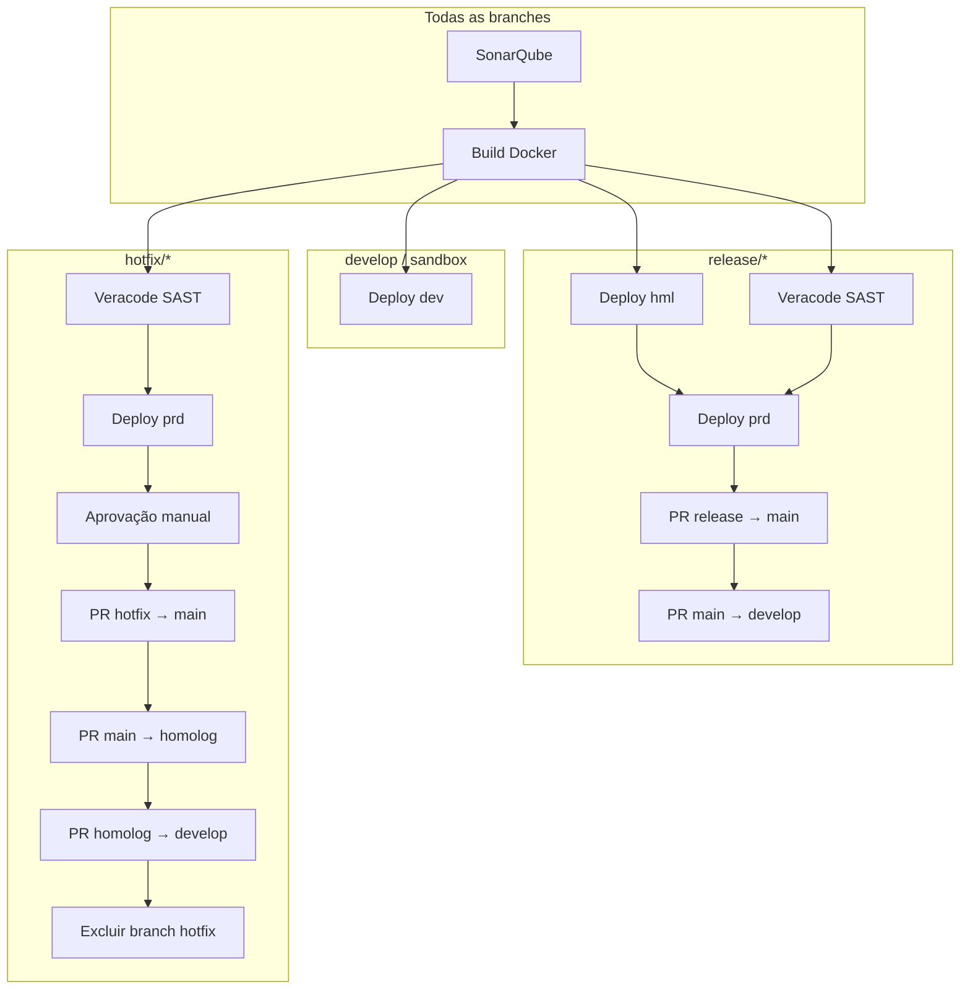

# Changelog

Biblioteca centralizada de templates de pipeline Azure DevOps para backends .NET e frontends SPA do Banco Fibra.  
Este repositório concentra **CI/CD reutilizável**, **manifests de infraestrutura** (Terraform + Kubernetes / S3 + CloudFront) e **automação de promoção entre branches**, evitando duplicação de YAML em cada aplicação.
O versionamento segue [Semantic Versioning](https://semver.org/lang/pt-BR/) (`MAJOR.MINOR.PATCH`):


| Tipo                                                                                                                                              | Quando usar                                                                                    |
| ------------------------------------------------------------------------------------------------------------------------------------------------- | ---------------------------------------------------------------------------------------------- |
| **MAJOR**                                                                                                                                         | Mudança incompatível (parâmetros removidos/renomeados, fluxo de stages alterado)               |
| **MINOR**                                                                                                                                         | Nova funcionalidade compatível (novo template, novo parâmetro opcional, novo ambiente)         |
| **PATCH**                                                                                                                                         | Correção compatível (bugfix, melhoria de `displayName`, ajuste de script sem quebrar contrato) |
| Ao referenciar este repositório nos pipelines das aplicações, **fixe a versão por tag** (ex.: `@refs/tags/v1.2.0`) em vez de apontar para `main`. |                                                                                                |


---


## Conceito e arquitetura


### Objetivo

Padronizar o ciclo de vida de APIs .NET implantadas em **Amazon EKS** e de SPAs estáticas em **S3 + CloudFront**, com provisionamento de recursos AWS via **Terraform** e gates de qualidade (**SonarQube** + **Veracode**).

### Como as aplicações consomem

Cada repositório de microserviço define um `azure-pipelines.yml` enxuto que **estende** o stack:

```yaml
resources:
  repositories:
    - repository: templates
      type: git
      name: Fibra.DevOps/fibra-devops-pipelines
      ref: refs/tags/v1.2.0
extends:
  template: templates/stacks/dotnet-backend.yaml@templates   # ou spa-frontend.yaml
  parameters:
    pod: { ... }
    networking: { ... }
    resources: { ... }
    observability: { ... }
    config: { ... }
```


### Estrutura do repositório

```
fibra-devops-pipelines/
├── templates/
│   ├── stacks/           # Ponto de entrada por tipo de aplicação (dotnet-backend, spa-frontend)
│   ├── stages/           # Stages reutilizáveis (deploy, deploy-frontend, veracode)
│   ├── dotnet/           # Build Docker + .NET
│   ├── frontend/         # Build Node/SPA
│   ├── sonarqube/        # Análise de qualidade (.NET e Node)
│   ├── veracode/         # Scan SAST
│   ├── hotfix/           # Fluxo dedicado a branches hotfix/*
│   ├── infra/            # Setup transversal (auth Git para módulos TF)
│   ├── utils/            # Automação de PRs
│   ├── variables/env/    # Variáveis por ambiente (dev, sdx, hml, prd)
│   ├── deploy-backend.yaml   # Steps de deploy (ECR, TF, kubectl)
│   └── deploy-frontend.yaml  # Steps de deploy SPA (TF, S3, CloudFront)
├── manifests/
│   ├── k8s/                  # Templates Kubernetes (placeholders)
│   ├── terraform/            # Infra AWS do backend
│   └── terraform-frontend/   # S3 + CloudFront da SPA
```


### Fluxo por branch




### Etapas do deploy (`templates/deploy-backend.yaml`)

1. Baixa artefato da imagem Docker (`.tar`) do stage de build
2. Publica imagem no **Amazon ECR**
3. Copia manifests de `manifests/k8s` e `manifests/terraform` para o workspace
4. Provisiona infraestrutura AWS (IAM Pod Identity, API Gateway, DynamoDB, S3, SQS, Secrets, etc.)
5. Substitui placeholders nos manifests Kubernetes
6. Gera ConfigMap com `env_vars` da aplicação
7. Aplica recursos no cluster EKS e anota o deployment com metadados de rastreabilidade

---


## Boas práticas


### Consumo dos templates

- **Fixe versão por tag** no `resources.repositories.ref` — evita quebras silenciosas quando `main` evolui.
- **Passe apenas parâmetros da aplicação** (`pod`, `networking`, `resources`, `config`); variáveis de conta AWS e cluster ficam em `templates/variables/env/`.
- **Não duplique** lógica de build/deploy no repositório da aplicação; estenda o stack e sobrescreva só o necessário.
- Configure o **Variable Group** `git-credentials` (com `GIT_PAT`) para módulos Terraform privados no Azure DevOps.


### Parâmetros da aplicação


| Bloco                   | Responsabilidade                                          |
| ----------------------- | --------------------------------------------------------- |
| `pod`                   | CPU/memória, réplicas, HPA                                |
| `networking`            | Ingress, domínio, base path, visibilidade da API, Cognito |
| `resources`             | DynamoDB, S3, SQS, Secrets Manager                        |
| `config.env_vars`       | Variáveis injetadas via ConfigMap                         |
| `config.ssm_parameters` | Parâmetros SSM por ambiente (dev/hml/prd)                 |
| `observability`         | Datadog (`dd_lang`, `dd_lib_version`)                     |


### Qualidade e segurança

- **SonarQube** roda antes do build; o build só prossegue se o stage anterior for bem-sucedido.
- **Veracode** é obrigatório em `release/`* e `hotfix/*` antes do deploy em produção.
- Use `continueOnError` apenas onde explicitamente tolerado (ex.: Sonar em fase de adoção); o build breaker deve permanecer ativo em produção.
- Branches protegidas (`main`, `develop`, `homolog`) não podem ser excluídas pelo script de hotfix.


### Deploy e infraestrutura

- Cada ambiente possui **service connection AWS** e cluster EKS próprios (`templates/variables/env/*.yaml`).
- O backend Terraform usa **state remoto S3** por aplicação e ambiente (`tfstate-<repo>-<env>`).
- Manifests K8s usam **placeholders** substituídos em runtime — não edite valores fixos nos YAML base.
- Anotações de deploy (`deploy.fibra.io/build-id`, `commit`, `branch`) permitem rastrear qual build está em execução.


### Manutenção deste repositório

- Adicione `displayName` descritivos em português em toda nova etapa — facilita troubleshooting no Azure DevOps.
- Alterações em parâmetros obrigatórios exigem **MAJOR** e nota de migração neste changelog.
- Teste mudanças em um microserviço piloto antes de publicar nova tag.
- Mantenha `templates/deploy-backend.yaml` alinhado ao path referenciado em `templates/stages/deploy.yaml`.


### Convenção de branches (aplicação consumidora)


| Branch               | Comportamento do pipeline                                        |
| -------------------- | ---------------------------------------------------------------- |
| `develop`, `sandbox` | Build + deploy em **dev**                                        |
| `release/*`          | hml → Veracode → prd → PRs de promoção                           |
| `hotfix/*`           | Veracode → prd → aprovação → PRs em cascata → exclusão da branch |

 ---

## [4.0.0] - 2026-09-15

Novo stack de **AWS Lambda** (.NET, Node.js e Python), limpeza de templates mortos, remoção de parâmetros de
diagnóstico do `setup-git-auth` e correção de três regressões introduzidas em `main` depois
da `3.9.0`. O MAJOR vem de uma única mudança de fluxo: o hotfix de **SPA** deixou de excluir
a branch ao final.

### Adicionado

- **Stack `stacks/dotnet-lambda.yaml`** — substitui o `azure-pipelines-infrastructure.yaml`
  legado das lambdas. O app declara só dados (`lambda`, `resources`, `config`); o Terraform
  que morava em `terraform/` de cada repositório passa a ser o root
  **`manifests/terraform-lambda/`** da plataforma. Mesmo roteamento por branch, Sonar,
  Veracode, gate de GMUD, PRs de promoção, hotfix, sandbox (`Deploy_sdx` +
  `destroySandbox`), `planOnly` e registro de release (`kind: lambda`) do backend/frontend.
  - `dotnet/build-lambda-dotnet.yaml`: `dotnet publish` framework-dependent (RID derivado de
    `lambda.architecture`), zip único `<repo>.zip` no artefato `lambda-package`; falha acima
    de 50 MB zipado / 250 MB descompactado (limites do upload direto).
  - **Node.js e Python no mesmo stack**: `lambda.runtime` (`nodejsNN.x` | `pythonX.Y`; default
    `dotnet10`) escolhe em compile-time o Sonar e o Build — o deploy e o Terraform são os mesmos.
    Prefixo fora de `dotnet|nodejs|python` falha no `Validate` (o Terraform aceitaria `java`,
    `ruby`, `provided`, mas a esteira não builda). Versão da ferramenta derivada do runtime
    (`nodejs20.x` → Node `20.x`, `python3.12` → Python `3.12`), com override em
    `lambda.node_version` / `lambda.python_version`. Sonar roda na raiz do repo; `src_path`
    (default `.`) só afeta o Build. Gate bloqueante nos três (mesma política do .NET).
    - `node/build-lambda-node.yaml`: `npm ci` → `lambda.build_command` (default
      `npm run build --if-present`) → empacota `lambda.output_dir` (ou o `src_path`, sem
      `node_modules`/testes/dotfiles) + `npm ci --omit=dev --os=linux --cpu=<x64|arm64>`
      (`lambda.include_dependencies: false` para bundle autocontido). Handler
      `'arquivo.export'` relativo à raiz do zip; o build **falha se o arquivo do handler não
      existir no pacote**. Sonar: `sonarqube/qa-sonar-node.yaml` (já existia).
    - `python/build-lambda-python.yaml`: `pip install -r lambda.requirements_file --target`
      com `--platform manylinux2014_<x86_64|aarch64> --only-binary=:all:`; sem wheel, em
      x86_64 repete instalação nativa com warning e em arm64 **falha** (agente não compila
      para arm — usar `layer_arns`). Copia o código sem venv/testes/caches/`infra/`; handler
      `'modulo.funcao'`, com a mesma checagem de existência.
    - `sonarqube/qa-sonar-python.yaml` (**novo**): `pip install` dos `requirements*.txt` que
      existirem + `pytest pytest-cov`, lint opcional (`lambda.lint_command`), `pytest --cov
      --cov-report=xml --junitxml` (rc 5 = sem testes ⇒ warning), scanner CLI com
      `sonar.python.coverage.reportPaths`/`sonar.python.xunit.reportPath` e o mesmo
      `quality-gate.yaml`. `enforce: true` também falha quando o `coverage.xml` não existe.
    - Veracode com exclusões por runtime (`node_modules`, `.venv`, caches) na release e no
      hotfix (`hotfix-lambda-dotnet.yaml` ganha `veracodeExcludePatterns`).
    - Exemplos: `examples/azure-pipelines-lambda-node.yml` e `-python.yml`.
  - `deploy-lambda.yaml` (motor) + `steps/lambda-prepare.yaml` + `stages/deploy-lambda.yaml`
    + `stages/destroy-sandbox-lambda.yaml` + `hotfix/hotfix-lambda-dotnet.yaml`. O deploy
    verifica `State/LastUpdateStatus` de cada função e publica a tabela na Summary.
  - **`manifests/terraform-lambda/`**: N funções de um pacote (`lambda.handlers`), role única
    com policy restrita ao declarado, VPC opcional (`subnetsPrivate`/`vpcId` do ambiente),
    SSM/secrets (prefixo `/sdx` no sandbox), SQS+DLQ, SNS, assinaturas, triggers SQS→função,
    Step Functions (ASL em `infra/` do app, `templatefile` com `lambda_arns`/`sns_arns`/
    `sqs_arns`) e EventBridge Pipes. Recursos nativos do provider (só a função usa o módulo
    `aws_lambda_function`) para a suíte `tests/*.tftest.hcl` rodar offline (18 runs,
    `mock_provider` nos lookups externos). `lambda` e `resources` são objetos com atributos
    `optional()`: chave omitida usa o default.
  - `steps/resolve-artifact-static.yaml`: parâmetro `artifactKind` (default `static`);
    `record-prod-release` rotula `lambda` como `static` (artefato/build).
  - `examples/azure-pipelines-lambda.yml`.

### Alterado

- **Hotfix de SPA (`hotfix/hotfix-frontend.yaml`)**: o stage `Delete_Hotfix_Branch`
  foi removido. O fluxo termina em `PR_PRD`; a branch `hotfix/*` **não é mais
  excluída** automaticamente. O hotfix de backend mantém a exclusão, agora com o job
  inline em `hotfix/hotfix-backend-dotnet.yaml` (antes em `utils/delete-branch.yaml`).
  Comportamento do backend inalterado.

### Removido

- **Templates do fluxo Lambda legado** em `templates/infra/`:
  `azure-infraestructure.yaml`, `generate-tfvars.yaml`, `terraform-infra.yaml`,
  `terraform.yaml`. Eram órfãos (nenhum stack os alcançava) e referenciavam
  caminhos inexistentes (`templates/infra/build.yaml@pipelines`,
  `variables/global-variables.yaml`). Fica só `infra/setup-git-auth.yaml`.
- **`steps/rollout-verify.yaml`**: apagado. A chamada em `stages/deploy.yaml` já
  estava comentada; o débito "deploy verde com pod em CrashLoop" segue aberto, e
  reativá-lo agora exige reescrever o step.
- **`utils/delete-branch.yaml`**: apagado; lógica internalizada no hotfix de backend
  (ver Alterado).
- **`infra/setup-git-auth.yaml`**: parâmetros `authMode` (`pat`/`systemToken`) e
  `debug` removidos. Só o modo PAT via variable group `git-credentials` permanece;
  o probe com classificação de erro (TF401019/401/proxy) e o bloco de debug saíram.
  Nenhum stack expunha esses parâmetros ao app.

### Corrigido

Regressões introduzidas em `main` em 2026-09-15, sem tag publicada com elas:

- **`steps/record-prod-release.yaml` e `steps/resolve-artifact-image.yaml`**: a chave
  raiz tinha virado `=parameters:`, o que faz o template não declarar parâmetro
  nenhum e quebra a expansão de `Deploy_hml`/`Deploy_prd` (backend e SPA) e de
  `Rollback_prd`.
- **`stages/rollback.yaml`**: a chamada ao `resolve-artifact-image.yaml` havia sido
  removida e os parâmetros dele (`serviceAccount`, `awsRegion`, `awsAccID`,
  `imageTag`) ficaram na chamada ao `record-prod-release.yaml`, que não os declara.
  Restaurada a sequência `resolve → record`; sem ela o registro de rollback sairia
  com `kind: unknown`.
- **`veracode/scanner-veracode.yaml`**: arquivo inteiro deslocado 2 espaços,
  inclusive `parameters:`/`steps:` na raiz. Reindentado; sem mudança de conteúdo.

### Notas de adoção

- Apontar `ref: refs/tags/v4.0.0`. O YAML da app **não muda**: nenhum parâmetro de
  `stacks/*` foi removido ou renomeado.
- **Lambda migrada do legado**: o state da esteira nasce vazio (bucket `tfstate-<app>-<env>`,
  não o `tfstates-<conta>` compartilhado) e os nomes coincidem com os antigos
  (`<repo>-<handler>`, `sqs-<env>-<region>-<fila>`), então o 1º apply falha com
  `ResourceConflictException`/`QueueAlreadyExists`. Rode com `planOnly: true`, importe os
  recursos no novo state (ou destrua pelo pipeline legado antes) — não há import
  automático como no frontend (`2.7.0`).
- **SPA com `hotfix/*`**: excluir a branch manualmente após o merge do `PR_PRD`,
  ou aguardar a reintrodução do stage.
- Quem usava `authMode: systemToken` ou `debug: true` chamando
  `infra/setup-git-auth.yaml` diretamente (fora dos stacks) precisa remover os
  parâmetros.
- Validar via **Preview API** um app em `release/*` (hml) e um run com
  `rollbackImageTag` antes de cortar a tag: as correções acima foram validadas só
  por parse de YAML e conferência de nomes de parâmetros.

---

## [3.9.0] - 2026-09-11

Defaults TLS mais novos na API Gateway privada e no CloudFront da SPA.

### Alterado

- **API Gateway privada**: default de `security_policy` =
  `SecurityPolicy_TLS13_1_2_PQ_2025_09` (antes `SecurityPolicy_TLS13_1_2_PFS_PQ_2025_09`).
- **CloudFront**: passa `minimum_protocol_version` = `TLSv1.3_2025` (antes o default
  interno do módulo, `TLSv1.2_2021`).

### Notas de adoção

- Apontar `ref: refs/tags/v3.9.0`. O YAML da app **não muda**.
- O próximo deploy **atualiza** TLS da REST API privada e da distribuição
  CloudFront. Revise o plan. Para manter o valor antigo, passe as variables
  Terraform `security_policy` / `minimum_protocol_version` (ainda sem parâmetro no stack).

---

## [3.8.2] - 2026-09-08

Compile da SPA em `v3.8.0`/`v3.8.1` falhava com `Expected a scalar value` /
`Unexpected value 'parameters.postInitSteps'` em `terraform-apply.yaml`.

### Corrigido

- **`postInitSteps` (stepList)**: inserção via `${{ each step in ... }}` /
  `${{ step }}`, o contrato do Azure DevOps. `- ${{ parameters.postInitSteps }}:`
  não é válido (trata a lista como chave YAML).

### Notas de adoção

- Apontar `ref: refs/tags/v3.8.2`. O YAML da app **não muda**.
- Quem tentou `v3.8.0` ou `v3.8.1` na SPA precisa desta tag para o pipeline
  compilar.

---

## [3.8.1] - 2026-09-08

Policy IAM do pod passa a incluir `sqs:ReceiveMessage` (já havia GetQueueUrl /
GetQueueAttributes / ListQueueTags).

### Alterado

- **`aws_iam_policy.app_name`**: ação `sqs:ReceiveMessage` no Sid de serviços.

### Notas de adoção

- Apontar `ref: refs/tags/v3.8.1`. O YAML da app **não muda**.
- O próximo apply atualiza a policy in-place.

---

## [3.8.0] - 2026-09-08

Esteira SPA passa a **adotar** S3/CloudFront já existentes (import no Terraform) e
ganha `planOnly` para revisar o plan sem apply nem publish.

### Adicionado

- **`planOnly`** (default `false`) em `spa-frontend.yaml`. No Run pipeline,
  marca o parâmetro: Terraform **plan** + Summary/artefato `tf-plan-<env>`;
  **não** aplica, **não** faz `s3 sync` nem invalida CloudFront.
- **`templates/steps/terraform-import-frontend.yaml`**: depois do `init`,
  gera `import {}` blocks para bucket/sub-recursos S3 e, se `cdn.cloudfront=true`,
  OAC + distribuição cuja origem é esse bucket. Nos runs seguintes o state já
  gerencia e o step é no-op.
- **`terraform-apply`**: parâmetro `postInitSteps` (stepList) para o import
  rodar entre init e validate/plan.

### Notas de adoção

- Apontar `ref: refs/tags/v3.8.0`. O YAML da app **não muda** se não for usar
  `planOnly`.
- Primeiro apply numa SPA que já tem bucket/CloudFront **importa** em vez de
  falhar com recurso existente. Revise o plan (ou rode com `planOnly`).
- Aposente o Terraform/state antigo do app — dois states no mesmo bucket é
  risco de destroy cruzado.

```yaml
# azure-pipelines.yml — UI "Run pipeline"
# planOnly: true
```

---

## [3.7.0] - 2026-09-02

IAM Role da Pod Identity deixa de usar o prefixo `eks-pod-identity-` (estoura o
limite de 64 caracteres da AWS em repos longos).

### Alterado

- **`aws_iam_role.app_name`**: `eks-pod-identity-<app><suffix>` →
  `pod-ide-<app><suffix>`. Ex.: app de 50 chars cabe (58; sandbox 62).

### Notas de adoção

- Apontar `ref: refs/tags/v3.7.0`. O YAML da app **não muda**.
- O próximo apply **recria** a role (`destroy` da antiga + `create`). A
  Pod Identity Association acompanha. Revise o plan.

---

## [3.6.3] - 2026-09-01

Compile do stack SPA falhava com `Unexpected parameter 'defaultExcludePatterns'` no stage Veracode.

### Corrigido

- **`stages/veracode.yaml`**: passa a declarar `excludePatterns` (o nome que o scanner
  já aceita) e repassar ao `scanner-veracode.yaml`.
- **`spa-frontend.yaml` / `hotfix-frontend.yaml`**: `defaultExcludePatterns` →
  `excludePatterns` (node_modules, dist, coverage, maps, `.git`).

### Notas de adoção

- Apontar `ref: refs/tags/v3.6.3`. O YAML da app **não muda**.

---

## [3.6.2] - 2026-08-25

Registro de HML deixa de abrir PR órfão quando o push na `release/*` é bloqueado por branch policy.

### Corrigido

- **`record-prod-release`**: fallback `release-record/<BuildId>` + PR só em **prd**.
  No CI de `release/*` o stage `PR_Main` continua skipped; o registro de HML ia
  abrir um PR por run (sem merge automático). Se o push falhar em hml, o step
  só avisa e mantém o artefato do pipeline.

### Notas de adoção

- Apontar `ref: refs/tags/v3.6.2`. O YAML da app **não muda**.
- PRs `release-record/*` já abertos precisam ser abandonados manualmente.

---

## [3.6.1] - 2026-08-21

No sandbox, `resourceSuffix` também entra no `ingress_path` e nos labels/selectors `app:`.

### Alterado

- **Ingress path (`sdx`)**: `/minha-api` vira `/minha-api-sdx` (o YAML da app continua
  com o path original). Evita colisão no ALB compartilhado `sdx-eks-shared-alb`.
- **Labels / matchLabels / selector `app:`**: passam a ser `<app><suffix>` no sdx,
  alinhados ao Deployment e ao Service. O label `environment:` e o `group.name`
  do Ingress **não** mudam.

### Notas de adoção

- Apontar `ref: refs/tags/v3.6.1`. O YAML da app **não muda**.
- Sandboxes já implantados: o apply atualiza labels/path; recursos com nome antigo
  da `v3.6.0` continuam no namespace até um destroy/cleanup.

---

## [3.6.0] - 2026-08-21

No sandbox (`sdx`), os nomes dos recursos Kubernetes passam a incluir o
`resourceSuffix` no **final** (ex.: `<app>-service-sdx`). `dev`/`hml`/`prd` não mudam.

### Alterado

- **K8s (`sdx`)**: novo token `PLACEHOLDER_RESOURCE_SUFFIX` nos manifests.
  Deployment `<app><suffix>`, Service `<app>-service<suffix>`, Ingress
  `<app>-ingress<suffix>`, HPA `<app>-hpa<suffix>`, ConfigMaps
  `<app>-configmap<suffix>` e `<app>-app-vars<suffix>`. Labels/selectors
  `app:` e o `group.name` do Ingress (`sdx-eks-shared-alb`) **não** mudam.
- **`k8s-render`**: `PLACEHOLDER_RESOURCE_SUFFIX` pode ser vazio fora de sdx.

### Notas de adoção

- Apontar `ref: refs/tags/v3.6.0`. O YAML da app **não muda**.
- Sandboxes já implantados: o apply cria recursos com o nome novo e **não**
  apaga os antigos. Delete o namespace ou rode o destroy do sandbox antes
  do próximo deploy.

---

## [3.5.1] - 2026-08-20

### Corrigido

- **SPA**: Terraform (apply, outputs) e destroy do sandbox passam a usar
  `AWS-Workloads-Dev` / Hml / Prd (`variables.serviceAccount`) — a mesma conexão
  AWS Toolkit do backend. `AWS-Workloads-*-Terraform` (tipo `AWSServiceEndpoint`
  em alguns projetos) quebrava o compile do `AWSShellScript@1`.

### Notas de adoção

- Apontar `ref: refs/tags/v3.5.1`. O YAML da SPA não muda.

---

## [3.5.0] - 2026-08-20

Destroy **opt-in** do sandbox (`destroySandbox: true`, só `sandbox/*` + run **Manual**)
e ajuste dos defaults TLS da API Gateway privada.

### Adicionado

- **`destroySandbox`** (default `false`) em `dotnet-backend.yaml` e `spa-frontend.yaml`.
  Fora de `sandbox/*` o pipeline falha no stage `Destroy_guard` e **não** faz deploy.
  Em sandbox, o run Manual executa só o destroy (sem Validate/Build/Deploy).
- **`templates/stages/destroy-sandbox.yaml`**: apaga o namespace EKS e `terraform destroy`
  do state `sdx` (backend .NET). Preserva `aws_api_gateway_account` (singleton da conta).
- **`templates/stages/destroy-sandbox-frontend.yaml`**: destroy do S3/CloudFront da SPA.
- **`templates/steps/terraform-destroy.yaml`**: plan `-destroy`, esvazia buckets versionados
  antes do apply, relatório no Summary e falha se o state não ficar vazio.

### Alterado

- **API Gateway privada**: `security_policy` no `aws_api_gateway_rest_api.this`.
  Defaults: `security_policy` = `SecurityPolicy_TLS13_1_2_PFS_PQ_2025_09`;
  `endpoint_access_mode` = `BASIC` (antes `STRICT` + TLS 1.3-only).

### Notas de adoção

- Apontar `ref: refs/tags/v3.5.0`. O YAML da app **não muda** se não for destruir sandbox.
- Destroy: Run pipeline na branch `sandbox/<seu-user>`, marque `destroySandbox`,
  **Manual**. Confira o plan no Summary antes de o apply seguir.
- O próximo deploy de API **atualiza** TLS/`endpoint_access_mode` da REST API privada.
  Revise o plan. Para manter o valor antigo, passe as variables Terraform
  `security_policy` / `endpoint_access_mode` (ainda sem parâmetro no stack).

```yaml
# azure-pipelines.yml — UI "Run pipeline"
# destroySandbox: true   # só sandbox/* + Manual
```

---

## [3.4.0] - 2026-08-20

Registro de release passa a ser **agnóstico de artefato** (imagem ECR ou SPA no S3).
O digest/tag móvel saem de `record-prod-release` e vão para steps `resolve-artifact-*`.
No sandbox, SSM e Secrets passam a usar **prefixo de path** em vez de concatenar `-sdx`
no fim do nome.

### Adicionado

- **`templates/steps/resolve-artifact-image.yaml`**: resolve digest no ECR e promove a
  tag móvel `prod` (desligada em hml). Expõe `RELEASE_ARTIFACT_*` para o registro.
- **`templates/steps/resolve-artifact-static.yaml`**: digest SHA-256 do `dist/` (exclui
  `env-config.js`) e URI `s3://$(FRONT_BUCKET)`. A SPA passa a gravar histórico em
  **hml** e **prd**.

### Alterado

- **`record-prod-release.yaml`**: não chama mais AWS/ECR. Lê as variáveis do
  `resolve-artifact-*`, aceita `artifact_kind: image|static` e documenta site URL no
  wiki/JSONL. Continua `continueOnError: true`.
- **SSM / Secrets no sandbox** (`local.ssm_params_named` / `local.secrets_named`):
  `resource_suffix` vira prefixo de path (`/sdx/...` ou troca `/(dev|hml|prd)/` →
  `/sdx/`). Em `dev`/`hml`/`prd` o nome permanece o declarado na app.

### Notas de adoção

- Apontar `ref: refs/tags/v3.4.0`. O YAML da aplicação **não muda**.
- **Sandbox:** o próximo apply **recria** parâmetros SSM e secrets cujo nome era
  `<nome>-sdx` — passam a `/sdx/<nome>` (ou `/sdx/...` se o nome já era um path).
  Confira o plan antes de aplicar. `dev`/`hml`/`prd` não mudam.
- SPA: conexão `AWS-Workloads-*-Terraform` (tipo **AWS**) no apply; `AWS-Workloads-*`
  no `s3 sync`.

---

## [3.3.4] - 2026-08-19

### Alterado

- **API Gateway privada** (`aws_api_gateway_rest_api.this`): passa a enviar
  `endpoint_access_mode` (`BASIC`/`STRICT`, default `STRICT`) — o mesmo valor já usado
  no domínio customizado público. Apps pinadas não precisam mudar YAML.

### Notas de adoção

- Apontar `ref: refs/tags/v3.3.4`. O default `STRICT` reproduz o contrato da variable
  já existente; para `BASIC`, passe `endpoint_access_mode` no Terraform (hoje sem
  parâmetro no stack).

---

## [3.3.3] - 2026-08-18

### Corrigido

- **SPA deploy em job `deployment`**: manifests Terraform lidos de
  `$(Pipeline.Workspace)/s/templates/manifests/terraform-frontend` e working dir
  `$(Pipeline.Workspace)/terraform`. Em `runOnce.deploy`, `Build.SourcesDirectory` /
  `System.DefaultWorkingDirectory` não apontam para o checkout `templates`.
- Apply e leitura de outputs voltam a usar `AWS-Workloads-*-Terraform`
  (`serviceAccountTerraform`); `s3 sync` e invalidação CloudFront seguem em
  `AWS-Workloads-*`.

### Notas de adoção

- Apontar `ref: refs/tags/v3.3.3`. A conexão `AWS-Workloads-Dev-Terraform` (e Hml/Prd)
  precisa ser do tipo **AWS** (AWS Toolkit), não `AWSServiceEndpoint`.

---

## [3.3.2] - 2026-08-18

### Alterado

- **SPA `quality.mode`**: default `warn` — lint, testes e Quality Gate **reportam** (job
  amarelo) e não bloqueiam o Build. `quality.mode: block` restaura o gate. Substitui
  `break_on_quality_gate`. `qa-sonar-node.yaml` ganha `enforce` para o mesmo comportamento
  em lint/testes. `test_command` default usa `npm test --if-present`.

### Notas de adoção

- Apontar `ref: refs/tags/v3.3.2`. Quem sobrescreve `quality:` precisa incluir `mode`
  (objeto no ADO **substitui** o default inteiro).

```yaml
quality:
  mode: warn          # ou block
  lint_command: 'npm run lint --if-present'
  test_command: 'npm test --if-present -- --coverage'
  coverage_report: 'coverage/lcov.info'
```

---

## [3.3.1] - 2026-08-18

### Corrigido

- **SPA (`deploy-frontend.yaml`)**: Terraform, leitura de outputs, `s3 sync` e invalidação
  CloudFront passam a usar a mesma service connection AWS Toolkit do backend
  (`AWS-Workloads-Dev` / Hml / Prd — `variables.serviceAccount`). Antes o apply usava
  `AWS-Workloads-*-Terraform`, que em alguns projetos é do tipo `AWSServiceEndpoint`
  (extensão Terraform) e o `AWSShellScript@1` recusa no compile.

### Notas de adoção

- Apontar `ref: refs/tags/v3.3.1`. O YAML da SPA não muda. A conexão
  `AWS-Workloads-Dev` (tipo **AWS**) precisa ter permissão de S3 + CloudFront + state
  Terraform; a `*-Terraform` deixa de ser exigida neste stack.

---

## [3.3.0] - 2026-08-18

Esteira de frontend SPA no mesmo contrato de branches/gates do backend, sem alterar
o stack `dotnet-backend.yaml`. Apps .NET pinadas em `v3.2.0` (ou anterior) **não precisam**
mudar nada.

### Adicionado

- **Stack `templates/stacks/spa-frontend.yaml`**: Validate → SonarQube (JS/TS) → Build Node
  → deploy por branch (`develop`/`sandbox` → dev, `sandbox/*` → sdx, `release/*` → hml +
  Veracode + prd manual, `hotfix/*` → Veracode + prd).
- **Build** (`templates/frontend/build-frontend-node.yaml`): `npm ci` (ou `npm install` se
  não houver lockfile), `.env` a partir de `config.env_vars`, artefato `frontend-dist`.
- **Sonar Node** (`templates/sonarqube/qa-sonar-node.yaml`) e Quality Gate extraído para
  `templates/sonarqube/quality-gate.yaml` (reusado pelo scanner .NET).
- **Deploy** (`templates/deploy-frontend.yaml` + `stages/deploy-frontend.yaml`): Terraform
  de `manifests/terraform-frontend` (bucket S3 privado + CloudFront/OAC), `window.env` em
  `env-config.js` a partir de `config.runtime_vars.<env>`, `aws s3 sync` e invalidação
  `/*` quando `cdn.cloudfront=true`.
- **Hotfix** (`templates/hotfix/hotfix-frontend.yaml`): Veracode → Deploy prd → aprovação
  do Environment → PR para `main`.

### Alterado

- `templates/sonarqube/qa-sonar-dotnet.yaml` passa a chamar o template compartilhado
  `quality-gate.yaml` (mesmo comportamento de gate).

### Notas de adoção

- Após publicar a tag `v3.3.0`, a SPA aponta `resources.repositories.templates.ref` para
  `refs/tags/v3.3.0` e estende `templates/stacks/spa-frontend.yaml@templates`.
- `cdn.dns_name` é **obrigatório**. Domínio: `<dns>-<env>.bancofibra.com.br` (prd:
  `<dns>.bancofibra.com.br`; sandbox: `<dns><resourceSuffix>.bancofibra.com.br`).
- O `index.html` precisa referenciar `/env-config.js` para ler `window.env` (runtime).
  Variáveis de **build** (`VITE_*` / `REACT_APP_*`) vão em `config.env_vars`.
- O Terraform **não cria o CNAME** no DNS: o alias aponta para o output
  `cloudfront_domain_name`.
- `cdn.prune_stale_files: true` liga `--delete` no `s3 sync` (remove arquivos velhos do
  bucket). Default `false`.

```yaml
extends:
  template: templates/stacks/spa-frontend.yaml@templates
  parameters:
    sistema: internet-banking
    owner: time-frontend
    frontend:
      node_version: '20.x'
      build_command: 'npm run build'
      output_dir: 'dist'
    cdn:
      dns_name: internet-banking
      cloudfront: true
    config:
      env_vars: []
      runtime_vars:
        dev: []
        hml: []
        prd: []
```

---

## [3.2.0] - 2026-08-17

DLQ opcional nas filas SQS e `resourceSuffix` parametrizado no sandbox, sem soltar o Ingress
do ALB compartilhado `sdx-eks-shared-alb`. **Nenhuma mudança de contrato**: quem não preencher
`dlq_queue_name` nem `resourceSuffix` continua com o mesmo comportamento de hoje.

### Adicionado

- **`dlq_queue_name` / `max_receive_count`** em `resources.sqs[]` (`variable "queue_name"`).
  Quando `dlq_queue_name` é informado, o Terraform cria uma fila DLQ via o mesmo módulo
  `aws_sqs_queue` (`module.aws_sqs_dlq`) e configura o redrive policy da fila principal
  (`dlq_arn` + `max_receive_count`, default `3`). A DLQ herda FIFO/`resource_suffix` da fila
  de origem e retém mensagens por 14 dias.
- **`resourceSuffix` parametrizado** no stack (`dotnet-backend.yaml`) e em
  `templates/variables/env/sdx.yaml`. Vazio no sandbox continua caindo em `-sdx` (`coalesce`);
  `dev`/`hml`/`prd` ignoram o parâmetro e seguem com sufixo vazio. AWS (IAM, API GW, SQS, etc.)
  e o **namespace** no EKS (`app${resourceSuffix}`) seguem o sufixo. O Ingress **não muda** o
  `group.name`: `PLACEHOLDER_ENVIRONMENT` no sandbox continua `sdx`, então o ALB permanece
  `sdx-eks-shared-alb`. Sufixo customizado usa state Terraform isolado
  (`<app><suffix>/terraform.tfstate`); `-sdx` e demais ambientes mantêm a chave atual.

### Notas de adoção

- Após publicar a tag `v3.2.0`, a aplicação precisa apontar `resources.repositories.templates.ref`
  para `refs/tags/v3.2.0`. O YAML da aplicação **não muda** se não quiser DLQ nem sufixo customizado.
  Para habilitar DLQ:

```yaml
sqs:
  - queue_name: minha-fila
    fifo_queue: 'false'
    dlq_queue_name: minha-fila-dlq
    max_receive_count: 3
```

  Para sobrescrever o sufixo só no sandbox (Ingress continua em `sdx-eks-shared-alb`):

```yaml
resourceSuffix: '-meu-sufixo'
```

---

## [3.1.3] - 2026-08-14

### Corrigido

- **`templates/variables/env/sdx.yaml`**: `albSharedDns`, `albSharedListener`, `apiGatewayVpcLink`,
  `domain_internal_name` e `domain_name_id` passam a apontar para os recursos atuais do sandbox
  (ALB `alb-dev-eks-sandbox`, VPC Link `6s355r` e domínio `sandbox-int.bancofibra.com.br`).

### Notas de adoção

- Após publicar a tag `v3.1.3`, a aplicação precisa apontar `resources.repositories.templates.ref`
  para `refs/tags/v3.1.3`.

---

## [3.1.2] - 2026-08-14

### Corrigido

- **Tópicos SNS declarados em `resources.sns_topics` não eram criados.** O `2.2.0` passou a
  enviar o bloco até o `terraform-apply`, mas a chave nas tfvars era `sns_topics`, enquanto o
  Terraform declara `variable "topic_name"` (`manifests/terraform/variables.tf`). O apply só
  emitia *Value for undeclared variable* e `var.topic_name` ficava `[]` — `module.aws_sns_topic`
  não iterava. O mapeamento em `deploy-backend.yaml` agora segue o mesmo padrão do SQS
  (`sqs` → `queue_name`): `sns_topics` → `topic_name`.
- **`tobool(lower(...))` duplicado** em `module.aws_sns_topic` / `module.aws_sqs_queue`: os
  locals já convertem `fifo_*` e `content_based_deduplication` para bool; `lower()` de bool
  quebra o apply assim que o tópico/fila de fato chega ao Terraform.

### Notas de adoção

- Após publicar a tag `v3.1.2`, a aplicação precisa apontar `resources.repositories.templates.ref`
  para `refs/tags/v3.1.2`. No próximo `terraform apply` o tópico
  `sns-operacoes-boletador-salvar` (ou o `topic_name` declarado) é criado. O YAML da aplicação
  **não muda** — `resources.sns_topics` continua o contrato.

---

## [3.1.1] - 2026-08-13

### Corrigido

- **Policy IAM Cognito B2C não era adicionada** mesmo com `networking.cognito: true` no YAML da
  aplicação. O Azure DevOps serializa o booleano YAML como `"True"` (estilo .NET) em
  `_pipeline.auto.tfvars.json`, e a condição `var.cognito == "true"` (case-sensitive, desde `1.0.4`)
  caía no ramo vazio — a policy ficava só com `Services` e `SSMByPath`. A esteira agora normaliza
  para a string `'true'`/`'false'` antes do Terraform, e `local.cognito_enabled` compara com
  `lower(tostring(var.cognito))`.

### Notas de adoção

- Após publicar a tag `v3.1.1`, a aplicação precisa apontar `resources.repositories.templates.ref`
  para `refs/tags/v3.1.1` (hoje em `v3.0.0` o bug continua). No próximo `terraform apply` o Sid
  `CognitoB2C` entra na policy do pod. O User Pool ainda precisa da tag `Aplicacao` igual a
  `var.app_name` para a `Condition` da policy autorizar as APIs.

---

## [3.1.0] - 2026-08-13

Duas novas tags de governança nos recursos AWS provisionados via Terraform. **Nenhuma mudança de
contrato**: `sistema` e `owner` são parâmetros opcionais (default vazio) em toda a cadeia — uma
aplicação que não os declare continua funcionando exatamente como hoje, só sem essas duas tags
preenchidas.

### Adicionado

- **`sistema`/`owner`** como novos parâmetros de nível raiz em `stacks/dotnet-backend.yaml`,
  propagados por `hotfix/hotfix-backend-dotnet.yaml` e `stages/deploy.yaml` até
  `deploy-backend.yaml` e, de lá, para as `tfVars` do Terraform (`var.sistema`/`var.owner`, ambos
  com default `""`).
- **Tags `Sistema` e `Owner`** em `local.tags` (`manifests/terraform/locals.tf`), aplicadas a todo
  recurso do stack que já recebe `local.tags` — mesmo mecanismo de `Ambiente`/`Aplicacao`/`Projeto`.
- **Aviso no stage `Validate`**: quando `sistema` ou `owner` não são informados, o pipeline emite
  `##[warning]` (não bloqueia o deploy) apontando qual dos dois ficou vazio — mesmo padrão já usado
  para `ingress_path` e para `coverageToolVersion` no Sonar.

### Notas de adoção

- Recursos já provisionados por uma tag anterior **não são recriados** só por isso: a tag `Sistema`/
  `Owner` é adicionada/atualizada in-place no próximo `terraform apply` (mudança de `tags`, não de
  nome do recurso).
- Recomenda-se que toda aplicação declare `sistema`/`owner` a partir desta versão — os avisos no
  `Validate` existem justamente para sinalizar quem ainda não migrou, sem quebrar o pipeline.

---

## [3.0.0] - 2026-08-12

**MAJOR** — remove o prefixo `sns|sqs-<ambiente>-<região>-` do nome do tópico SNS/fila SQS
**gerenciados** por este stack (padrão introduzido em `1.0.24`/`1.0.25`). O tópico/fila declarado
como `topic_name: "orders"` passa a se chamar `orders${resourceSuffix}` na AWS, em vez de
`sns-dev-us-east-2-orders`.

### Alterado (breaking)

- **`local.sns_topics`/`local.sqs_queues`** (`manifests/terraform/locals.tf`): nome do recurso
  gerenciado passa de `sns|sqs-<ambiente>-<região>-<nome>[.fifo]` para `<nome>${resource_suffix}[.fifo]`.
  Como o nome muda mas o endereço do recurso no state (`module.aws_sns_topic["<nome>"]`) não,
  o Terraform vai propor **destruir e recriar** o tópico/fila na próxima execução em qualquer
  aplicação que já tenha `resources.sns_topics`/`resources.sqs` provisionados por uma tag anterior.
  **Revise o plano antes de aplicar** — se o tópico/fila tiver assinaturas externas ou mensagens em
  trânsito, planeje a janela de recriação.
- O lookup de tópico/fila **externo** (`data.aws_sns_topic.existing`/`data.aws_sqs_queue.existing`
  em `manifests/terraform/datasource.tf`) **não é afetado**: continua buscando pelo nome completo
  com o prefixo `sns|sqs-<ambiente>-<região>-`, já que essa convenção é definida por quem gerencia
  o recurso externo (fora deste stack), não por este template.
- **`var.resource_suffix` passa a compor também o nome do tópico/fila gerenciado**, alinhando com
  os demais recursos nomeados a partir de `app_name` desde `2.2.0` (IAM, API Gateway, CloudWatch,
  SSM, DynamoDB, Secrets Manager) — sem isso, `dev` e `sdx` (mesma conta AWS) colidiriam no mesmo
  tópico/fila físico ao declarar o mesmo `topic_name`/`queue_name` curto.

### Corrigido

- **`templates/variables/env/sdx.yaml`**: `albSharedDns` apontava para o ALB compartilhado do
  `dev` (`alb-dev-eks-shared`) enquanto `albSharedListener` já apontava para o ALB dedicado do
  sandbox (`alb-dev-eks-sandbox`) — os dois valores alimentam a mesma integração do API Gateway
  em `manifests/terraform/main.tf` e precisam apontar para o mesmo ALB. Ambos passam a apontar
  para `alb-dev-eks-sandbox`.

### Notas de adoção

- Antes de atualizar a tag em uma aplicação que já declara `resources.sns_topics`/`resources.sqs`,
  rode `terraform plan` e confirme se a recriação do tópico/fila é aceitável (nome novo na AWS,
  possível perda de mensagens em trânsito na fila recriada). Não há migração automática.

---
 ## [2.2.0] - 2026-08-11

Novo ambiente `sdx` (sandbox) e suporte a múltiplos ambientes compartilhando a mesma conta AWS
sem colisão de nomes de recurso. **Nenhuma mudança de contrato**: `resourceSuffix` tem default
vazio em `dev`/`hml`/`prd` (comportamento inalterado) e `sns_topics`/`sns_sqs_subscriptions` já
eram parâmetros aceitos pelo stack — só passaram a chegar de fato ao Terraform.

### Adicionado

- **Ambiente `sdx`** (branches `sandbox/*`): novo stage `Deploy_sdx` em
  `stacks/dotnet-backend.yaml`, com o mesmo perfil de `ssm_parameters`/`env_vars` de `dev`. Nova
  `templates/variables/env/sdx.yaml`, apontando para a **mesma conta e cluster de `dev`**
  (`AWS-Workloads-Dev`, `eks-workloads-dev`).
- **`resource_suffix`** (Terraform) / **`resourceSuffix`** (pipeline): novo parâmetro opcional,
  propagado por `stages/deploy.yaml` → `deploy-backend.yaml` → tfvars. Como `sdx` roda na mesma
  conta AWS de `dev`, todo recurso nomeado a partir de `app_name` (IAM role/policy, API Gateway
  REST API, usage plan, API key, base path mapping, CloudWatch Log Group, SSM Parameter, tabela
  DynamoDB, secret do Secrets Manager) passa a incluir o sufixo (`-sdx` em `templates/variables/env/sdx.yaml`),
  evitando que o deploy de `sdx` sobrescreva/colida com o recurso homônimo de `dev`. `dev`, `hml`
  e `prd` declaram `resourceSuffix: ''` — nome final idêntico ao de hoje.
- **`var.project_name`** (Terraform, obrigatório): usado na tag `Projeto` de `local.tags`.
  Já é resolvido automaticamente pela esteira (`_app.auto.tfvars.json` em `deploy-backend.yaml`,
  a partir do repositório), nenhuma ação do app consumidor é necessária.
- `sns_topics`/`sns_sqs_subscriptions` passam a ser propagados por `deploy-backend.yaml` e
  `stages/deploy.yaml` até o `terraform-apply.yaml` — antes só existiam como default em
  `stacks/dotnet-backend.yaml` e nunca chegavam às `tfVars`; uma aplicação que declarasse
  `resources.sns_topics`/`resources.sns_sqs_subscriptions` tinha o provisionamento ignorado
  silenciosamente.

### Corrigido

- **`for_each` de `aws_sns_sqs_subscription`** usava `"${topic_name}--${queue_name}"` (dois
  hífens); padronizado para um único hífen, alinhado à convenção do restante do módulo.

---

## [2.1.2] - 2026-08-07

Correção no lookup de tópicos SNS e filas SQS **externos** (`sns_sqs_subscriptions` apontando
para recursos não gerenciados por este stack). **Nenhuma mudança de contrato**: nenhum parâmetro
adicionado, removido ou renomeado.

### Corrigido

- **`data.aws_sns_topic.existing` e `data.aws_sqs_queue.existing` buscavam pelo nome curto**
  declarado em `topic_name`/`queue_name` (ex.: `orders`), em vez do nome real do recurso na AWS
  (ex.: `sns-prd-us-east-1-orders`). Como todo tópico/fila deste stack — gerenciado ou externo —
  segue o padrão `sns|sqs-<ambiente>-<região>-<nome>` (padronizado desde `1.0.24`/`1.0.25`), a
  busca por nome curto nunca encontrava o recurso externo de fato: `terraform plan/apply` falhava
  com `NotFound` para qualquer assinatura SNS→SQS que apontasse para um tópico ou fila fora deste
  stack. Os data sources passam a prefixar o nome antes da busca
  (`local.sns_name_prefix`/`local.sqs_name_prefix` + nome curto), igual ao que já é feito para os
  recursos gerenciados em `sns_topics`/`sqs_queues`.
- `external_topic_names`/`external_queue_names` passam a derivar de `local.subscriptions` (novo
  local com os campos `topic_full_name`/`queue_full_name` já resolvidos), em vez de
  `var.sns_sqs_subscriptions` direto — mantém a comparação com `managed_topic_names`/
  `managed_queue_names` pelo nome curto (inalterada) e centraliza a montagem do nome completo em
  um único lugar.

---

## [2.1.1] - 2026-08-05

Correção no `DEPLOY-PRD.md` gerado a partir do `history.jsonl` (`2.1.0`) e extensão do registro
de HML ao mesmo arquivo. **Nenhuma mudança de contrato**: nenhum parâmetro adicionado, removido
ou renomeado.

### Corrigido

- **Migração para "Histórico anterior (pré-JSONL)" duplicava dados a cada execução.** A detecção
  de conteúdo legado comparava apenas a presença do marcador `pré-JSONL`; um `DEPLOY-PRD.md` sem
  histórico legado real (app nova, ou primeira adoção sem linhas antigas) fazia toda execução
  subsequente reclassificar a própria seção "Histórico" — já renderizada do JSONL — como legado e
  duplicá-la em "Histórico anterior" indefinidamente. Passa a verificar também o cabeçalho
  `Gerado pela esteira`, presente em todo `DEPLOY-PRD.md` já renderizado pelo JSONL: só migra
  quando o arquivo é de fato do formato antigo.
- **`updateMarkdown: false` removido da chamada de HML em `stages/deploy.yaml`.** Consequência
  direta do item abaixo: o registro de HML volta a atualizar o `DEPLOY-PRD.md` (antes só gravava
  a linha no `history.jsonl`).

### Alterado

- **`DEPLOY-PRD.md` passa a ter uma seção "Homologação (últimos 20)`,** com o que subiu em HML a
  cada merge na release — o arquivo deixa de descrever só produção e passa a dar visibilidade ao
  que está em validação da QA antes de virar candidato a promoção manual.
- **"Último deploy" deixa de usar as variáveis da execução atual e passa a ler a última entrada
  com `environment: "prd"` do `history.jsonl`.** Necessário porque a seção agora também é
  regravada em execuções de HML: sem essa mudança, um deploy em HML sobrescreveria "Último deploy
  em produção" com dados de homologação.

---

## [2.1.0] - 2026-08-03

### Adicionado

- **`.deploy/history.jsonl` no repositório da aplicação** — histórico acumulativo de deploys,
  um objeto JSON por linha (`schema_version: 1`), gravado pelo `record-prod-release.yaml` na
  mesma máquina de clone → commit → push do `DEPLOY-PRD.md` (retry ×3 re-clonando a cada
  tentativa — cobre corrida com pushes de devs na branch — e fallback de PR quando a branch tem
  policy). Campos: `app`, `environment`, `deploy_type`, `deployed_at`, `result`,
  `image{tag,digest,uri,moving_tag}`, `source{commit,commit_message,committed_at,branch}`,
  `pipeline{build_id,build_number,url,triggered_by}`, `approval{approved_by,approved_at,wait_seconds}`.
  Campos não resolvidos viram `null` — nunca abortam o registro.
- **Registro em HML** (perfil reduzido): `stages/deploy.yaml` passa a invocar o step também com
  `environment: hml` — só a linha no JSONL + artefato `hml-release`; sem tag móvel
  (`prodTag: ''`), sem carimbo de run, sem `DEPLOY-PRD.md`, sem captura de approval. Existe para
  decompor o lead time (`commit → hml` e `hml → prd`) — mede quanto tempo a mudança espera o
  gate de GMUD.
- **`source.committed_at`** via REST de Git do ADO — sem a data do commit não há lead time
  (`deployed_at − committed_at`). Rollback registra `commit`/`committed_at` nulos.
- **`approval{}`** via timeline do build → API de approvals: aprovador, data e `wait_seconds`
  (aprovação − início do gate). **Best-effort estrito e ainda não validado em run real de PRD**:
  qualquer falha vira `approval: null` + warning. Validar num run real antes de confiar na
  métrica.
- **Parâmetros novos** no `record-prod-release.yaml` (todos opcionais): `environment` (`prd`),
  `historyFile` (`.deploy/history.jsonl`), `updateMarkdown` (`true`), `captureApproval` (`true`).
  `prodTag: ''` passa a significar "não mover tag móvel".
- Artefato `history-entry.json` com a entrada do run (além do JSONL acumulado no repo).

### Alterado

- **`DEPLOY-PRD.md` passa a ser RENDERIZADO do JSONL** (só entradas de `prd`, mais recente
  primeiro, limitado a 50) em vez de raspado do próprio markdown com `awk`. **Migração única e
  automática**: na primeira execução, a tabela do formato antigo é preservada na seção
  "Histórico anterior (pré-JSONL)" e o `history.jsonl` começa vazio — linhas antigas não são
  convertidas.
- Commit do registro: mensagem vira `chore(release): <tipo> <tag> em <ambiente> [skip ci]`.
  O `[skip ci]` agora é crítico também em `release/*` (que está no trigger de CI desde `2.0.0`).

### Notas de adoção

- **Service connection de HML precisa de `ecr:DescribeImages` e `ecr:BatchGetImage`** (leitura
  do digest). Sem isso o registro de hml grava `digest: null` com warning — o deploy não é
  afetado.
- O registro continua sendo **o último step do stage** e nunca bloqueia deploy (best-effort da
  `1.3.2` + guardas novas).
- Consultas prontas (validadas contra registro sintético):
  ```bash
  # Deployment frequency (prd, sem rollback), por mês
  jq -s '[.[]|select(.environment=="prd" and .deploy_type!="rollback")]
         | group_by(.deployed_at[0:7]) | map({mes:.[0].deployed_at[0:7], deploys:length})' .deploy/history.jsonl
  # Lead time mediano commit→prd, em horas
  jq -s '[.[]|select(.environment=="prd" and .source.committed_at!=null)
          | ((.deployed_at|fromdate)-(.source.committed_at|fromdate))/3600] | sort | .[length/2|floor]' .deploy/history.jsonl
  # Espera média no gate de GMUD, em minutos
  jq -s '[.[]|select(.approval!=null and .approval.wait_seconds!=null)|.approval.wait_seconds/60]
         | add/length' .deploy/history.jsonl
  ```

---

## [2.0.0] - 2026-08-03

**MAJOR** — remoção de contrato e mudança de fluxo de stages. CI contínuo em `release/*` até
HML; promoção para PRD vira run manual atrás do gate de GMUD; back-merge automático eliminado.
Aplicações precisam de ajuste ao adotar (ver Notas de adoção).

### Removido (breaking)

- **Parâmetro `hotfix`** de `stacks/dotnet-backend.yaml` e `hotfix/hotfix-backend-dotnet.yaml`
  (`main_pr_require_manual_approval`, `main_pr_reviewers`, `main_pr_wait_timeout_minutes`), e
  com ele os parâmetros `requireManualApproval`/`reviewers`/`waitTimeoutMinutes` do
  `utils/create-pullrequest.yaml`. O caminho de polling (`while … sleep 30` segurando agente por
  até 6h esperando merge manual) foi removido — a aprovação manual do hotfix **continua
  existindo** e sempre foi o Environment approval do stage `Approve_PR_Main`; o polling era um
  segundo mecanismo, morto (`false` em toda a cadeia) e redundante. App que declara `hotfix:` no
  `extends` **falha na compilação** com `Unexpected parameter 'hotfix'` — correção: apagar o
  bloco.
- **Stage `BackMerge_Develop`** dos fluxos `release/*` e `hotfix/*`. Justificativa: no modelo de
  branches da casa, `release/X.Y.Z` **nasce do `main`**, então hotfixes e correções já entram na
  próxima release por construção — o back-merge não protegia contra regressão; só gerava
  pipeline vermelho pós-deploy quando `main`×`develop` conflitavam (caso normal) e escrevia em
  `develop` com bypass de policy. `develop` ressincroniza fora da esteira. **Isso converte a
  premissa "toda `release/*` e `feature/*` nasce do `main`" em requisito** — invariante
  documentado no `CLAUDE.md`; se o corte passar a ser do `develop`, o back-merge precisa voltar.
  `Delete_Hotfix_Branch` religado a `dependsOn: PR_PRD`.

### Alterado

- **`Deploy_prd` e `PR_Main` do fluxo `release/*`** ganham
  `condition: and(succeeded(), eq(variables['Build.Reason'], 'Manual'))`. Run de CI para na HML;
  a promoção é "Run pipeline" manual na branch da release, passando pelo approval do Environment
  `prd`. **GMUD híbrido**: mudança normal = promoção manual agendável (deferred approval);
  expressa/emergencial = `hotfix/*`, que **não tem essas condições** e sobe em PRD no run de CI
  (as duas ocorrências de `Build.Reason` estão dentro do ramo compile-time de `release/*`;
  hotfix e rollback não compilam esse bloco). Nota: a condição é **runtime** — na Preview API os
  stages aparecem também no cenário de CI; em execução ficam *skipped*.
- **`Veracode` do fluxo `release/*`**: `dependsOn: [Build]` → `[Deploy_hml]`. HML quebrado não
  consome mais um scan de até 110 min. Custo: o scan sai do paralelo — o run de release cresce
  ~a duração do deploy de HML. `Deploy_prd` mantém `dependsOn: [Deploy_hml, Veracode]`.
- **`utils/create-pullrequest.yaml`**:
    - `--squash false` explícito na conclusão — promoção exige merge commit verdadeiro (squash
      quebraria a rastreabilidade de revert por feature e o merge de volta);
    - `--bypass-policy-reason` com BuildId, BuildNumber, RequestedFor e rota
      (cadeia de evidência de auditoria no próprio PR);
    - `az devops configure --defaults` + `--repository` explícitos (antes: auto-detect implícito,
      frágil em job com múltiplos checkouts).
- **Exemplos unificados** (`examples/*.yml`): trigger único `develop`, `sandbox`, `release/*`,
  `hotfix/*` com **`batch: true`** — serializa runs de CI por branch (proteção principal contra
  `terraform apply` concorrente no mesmo state, que segue sem locking — débito registrado no
  `CLAUDE.md`).

---

## [1.3.4] - 2026-08-03

Correção de robustez no registro de release em PRD. O step deixa de poder reprovar um deploy que
já subiu com sucesso, e as falhas de registro passam a nomear a permissão que faltou.
**Nenhuma mudança de contrato**: nenhum parâmetro adicionado, removido ou renomeado; nenhum
stage, `dependsOn` ou condição alterada.

### Corrigido

- **`steps/record-prod-release.yaml` não era best-effort, apesar do princípio estar documentado
  no próprio arquivo.** A task principal roda sob `set -euo pipefail` e não tinha
  `continueOnError`: uma falha em `aws ecr describe-images` — permissão `ecr:DescribeImages`
  ausente, imagem já removida pela lifecycle policy, throttling do ECR — matava o script e
  reprovava o stage `Deploy_prd` **depois** de o `kubectl apply` ter subido a versão com sucesso.
  Resultado: cluster atualizado e saudável, painel vermelho, e o Environment `prd` registrando
  como falha uma implantação que funcionou. Pior efeito colateral: `PR_Main` e
  `BackMerge_Develop` dependem de `Deploy_prd` com `succeeded()` e não rodavam — a release ficava
  em produção sem chegar à `main` nem à `develop`. A task passa a ter `continueOnError: true`.
- **Leitura do digest guardada.** Falha vira warning citando a permissão e o registro segue com
  `image_digest` vazio, em vez de abortar — `latest.json`, `latest.md` e `DEPLOY-PRD.md`
  continuam sendo gerados. O retorno `"None"` do `--query` (que sai com código 0 quando o
  JMESPath não encontra nada) passa a ser tratado como falha, em vez de virar digest literal no
  registro. `image_ref_by_digest` fica vazio nesse caso, em vez da string truncada
  `<registry>/<repo>@`.
- **Leitura do manifesto (`aws ecr batch-get-image`) guardada.** Antes era captura direta sob
  `set -e` e matava o step inteiro.
- **Falha de `ecr:PutImage` deixa de se disfarçar de operação normal.** Quando o `put-image`
  recusava, o step imprimia `"Tag 'prod' já aponta para este digest (nada a fazer)"` — mensagem
  correta para `ImageAlreadyExistsException`, mas **idêntica** no caso de permissão negada. A tag
  móvel `prod` podia ficar congelada numa versão antiga com o log dizendo que estava tudo certo —
  defeito que só se manifesta durante um incidente, quando alguém usa a tag para escolher o alvo
  do rollback. Os dois casos passam a ser distinguidos pelo erro retornado pelo ECR: o benigno
  mantém a mensagem informativa; o resto vira warning citando `ecr:PutImage`.

### Notas de adoção

- **O stage passa a exibir "succeeded with issues"** quando o registro falha, e a implantação
  aparece como *partially succeeded* no Environment. `succeeded()` continua verdadeiro para esse
  resultado, então `PR_Main` e `BackMerge_Develop` seguem rodando normalmente.
- Ausência de registro deixa de ser silenciosa: todo caminho de falha emite `##[warning]` nomeando
  a permissão ou a condição que faltou, com os 500 primeiros caracteres do erro do ECR.
- **Revise as permissões da service account de PRD** na primeira execução após adotar esta versão.
  Warnings que antes apareciam como falha de stage (ou não apareciam) ficam visíveis agora:
  `ecr:DescribeImages`, `ecr:BatchGetImage` e `ecr:PutImage`.
- `update_release_log` já estava protegida (chamada em `||`, o que suspende o `set -e` dentro da
  função) — nada muda naquele bloco, inclusive no `curl` de criação de PR.
- A geração dos arquivos (`jq` / `latest.*`) segue sem guarda própria por decisão: não é chamada
  externa e o `continueOnError` da task já cobre.
- Vale igualmente para o **rollback**, que usa o mesmo step via `stages/rollback.yaml`. Sem efeito
  em `dev`/`hml`, onde o step não é invocado.


## [1.3.0] - 2026-07-20
Parametrização do fluxo Veracode ponta a ponta. **Nenhuma quebra de contrato**: `veracode` é opcional
em toda a cadeia, e uma aplicação que não o declare roda exatamente como em `1.2.0`.

## Adicionado

- **`templates/veracode/scanner-veracode.yaml` parametrizado** (16 parâmetros): `appName`, `serviceConnection`, `version`, `sandboxName`, `criticality`, `createSandbox`, `deleteIncompleteScan`, `createProfile`, `importResults`, `failBuildIfUploadAndScanFails`, `failBuildOnPolicyFail`, `maximumWaitTime`, `sourceFolder`, `excludePatterns`, `archiveFile` e `fetchDepth`. Antes o template aceitava só `appName`e o ignorava.

 ## [1.2.0] - 2026-07-20

Parametrização dos templates de qualidade, build e autenticação Git. **Nenhuma quebra de contrato**:
todos os parâmetros novos são opcionais e seus defaults reproduzem o comportamento de `1.1.1`.

> ⚠️ **Ao tagear**: `examples/azure-pipelines.yml` referencia `refs/tags/v2.0.0`, tag que não existe.
> Aponte o exemplo para `refs/tags/v1.2.0` — senão um pipeline copiado dele não resolve o
> `resources.repositories` e sequer compila.


### Removido

- `templates/variables/frontend/{dev,hml,prd}.yaml` e `templates/variables/pix/{dev,hml,prd}.yaml`. Eram um estado intermediário do fatiamento por domínio × ambiente e **nunca chegaram a uma tag publicada** — por isso não há migração a fazer nem quebra de contrato. As variáveis de ambiente ficam apenas em `templates/variables/env/{dev,hml,prd}.yaml`.


### Adicionado

- `templates/infra/setup-git-auth.yaml` **parametrizado**: `orgUrl`, `patVariable`, `probeRepo` e `verifyAccess`. A organização (`bancofibra`) e o repositório de módulos (`Fibra.DevOps.Terraform`) deixam de estar fixos no corpo do script. Todos os defaults preservam o comportamento anterior.
- `templates/dotnet/build-backend-dotnet.yaml` **parametrizado**: `pool`, `dockerfilePath`, `buildContext`, `imageName`, `imageTag`, `artifactName` e `extraBuildArgs`. O template não tinha nenhum parâmetro; os defaults de `imageName`/`imageTag`/`artifactName` são iguais aos de `steps/image-promote.yaml` por contrato — se alterar em um, altere no outro.
- `templates/sonarqube/qa-sonar-dotnet.yaml` **parametrizado** (16 parâmetros): `sonarServiceConnection`, `projectKey`, `projectName`, `branchName`, `extraProperties`, `dotnetVersion`, `includePreviewVersions`, `solutionPattern`, `nugetFeedId`, `buildConfiguration`, `coverageFile`, `relaxNugetSignatureChecks`, `pollingTimeoutSec`, `gateWaitAttempts`, `gateWaitIntervalSeconds` e `breakOnQualityGate`.
  - `extraProperties` substitui os blocos de `sonar.exclusions` / `coverage.exclusions` / `cpd.exclusions` que estavam comentados no arquivo — agora o app declara as exclusões sem forkar o template.
  - `breakOnQualityGate: false` publica o resultado do gate sem derrubar o build, permitindo adoção gradual em aplicações novas.
- **Resultados de teste publicados no run** (`PublishTestResults@2`): o `dotnet test` passou a gerar `.trx` e a aba **Tests** do Azure DevOps deixa de ficar vazia — com contagem, duração e histórico de flakiness. Roda com `condition: succeededOrFailed()` (é quando o teste falha que o relatório importa) e não falha se não houver `.trx`. Desligável com `publishTestResults: false`.
- `qa-sonar-dotnet.yaml`: parâmetro `coverageToolVersion` para pinar a versão do `dotnet-coverage`. Vazio (default) instala a última e emite `##[warning]` — **defina uma versão** para builds reprodutíveis.


### Alterado

- `sonar.branch.name` **deixou de ser fixo em** `develop` e passa a derivar da branch do run (`coalesce(parameters.branchName, replace(variables['Build.SourceBranch'], 'refs/heads/', ''))`). Análises de `release/`* e `hotfix/*` passam a ser registradas na branch correta. Depende do `sonarqube-community-branch-plugin` instalado no servidor; para voltar ao comportamento anterior, passe `branchName: 'develop'`.
- `templates/sonarqube/qa-sonar-dotnet.yaml`: o glob do `restore` e o `find` do build passaram a derivar do mesmo parâmetro `solutionPattern` — antes eram dois literais `*.slnx` independentes.


### Corrigido

- `setup-git-auth.yaml` **não imprime mais o PAT no log.** A linha de diagnóstico usava `${GIT_PAT}` (o valor) onde a intenção era `${#GIT_PAT}` (o tamanho).
- `build-backend-dotnet.yaml`: a autodetecção da pasta em `src/` (`ls | head -1`, ordem alfabética) agora emite `##[warning]` quando há mais de uma pasta e falha explicitamente se o Dockerfile não existir. Use `dockerfilePath` para eliminar a ambiguidade.
- `qa-sonar-dotnet.yaml`: `find` sem resultado agora falha com mensagem clara em vez de chamar `dotnet build ""`.
- `qa-sonar-dotnet.yaml`: `NUGET_CERT_REVOCATION_MODE: 'no'` passou a ser citado (em YAML, `no` sem aspas é o booleano `false`).
- `qa-sonar-dotnet.yaml`**: falha intermitente por** `SIGPIPE`**.** Os dois `find … | head -n 1` (solução e `report-task.txt`) rodavam sob `set -o pipefail`: quando o `head` fechava o pipe antes de o `find` terminar, o `find` saía com 141 e derrubava o step sem motivo aparente. Trocados por `find … -print -quit`.
- `qa-sonar-dotnet.yaml`**:** `PATH` **montado com macro do Azure DevOps.** O bloco `env` usava `PATH: $(PATH):$(HOME)/.dotnet/tools`; se as macros não resolvessem, o `PATH` do step viraria a string literal e todo comando falharia com *command not found*. Passou a ser `export PATH="$PATH:$HOME/.dotnet/tools"` dentro do script, onde é shell de verdade.
- `qa-sonar-dotnet.yaml`**: token do SonarQube agora é mascarado** (`##vso[task.setsecret]`) assim que é extraído de `SONARQUBE_SCANNER_PARAMS`, protegendo contra vazamento em log caso alguém habilite `set -x` ou um erro ecoe a linha de comando.
- `qa-sonar-dotnet.yaml`: removida a instalação de `jq` via `sudo apt-get` em runtime. O `jq` já vem no `ubuntu-latest` e os demais templates do repo o consomem sem instalar; agora o step falha com mensagem clara se faltar.
- `qa-sonar-dotnet.yaml`: `dotnet tool install` trocado por `dotnet tool update`, que é idempotente — o `install` falhava quando a ferramenta já existia no agente (self-hosted reaproveitado).


### Notas de adoção

- Nenhum chamador precisa mudar: todos os parâmetros novos são opcionais e os defaults preservam o comportamento anterior — **exceto** `sonar.branch.name`, que muda de propósito (ver *Alterado*).
- **Valide no primeiro run**: confira no log do step `Configurar SonarQube (.NET)` se `sonar.branch.name` recebeu o valor esperado. Se vier vazio ou com o prefixo `refs/heads/`, a expressão não resolveu — passe `branchName` a partir de `stacks/dotnet-backend.yaml`.
- Com branches reais, cada `release/X.Y.Z` vira um registro permanente no SonarQube. Configure o *housekeeping* de branches inativas antes de adotar.
- A primeira análise de cada branch nova não tem baseline; Quality Gates com condição sobre *novo código* podem se comportar de forma diferente nesse run.
- **Verifique se teste quebrado derruba o stage.** O `dotnet test` roda dentro do `dotnet-coverage collect`; se o exit code não for propagado, um teste falhando passaria despercebido. Com o `PublishTestResults@2` desta versão dá para conferir: quebre um teste de propósito e confirme que a aba **Tests** fica vermelha **e** o stage falha.
- **Pine o** `dotnet-coverage`**.** O default de `coverageToolVersion` é vazio (instala a última) e emite `##[warning]`. Pegue a versão do log do primeiro run e passe no chamador.

---


## [1.1.1] - 2026-07-17


### Alterado

- `templates/deploy-backend.yaml`: remover a duplicação do `record-prod-release.yaml` em compile-time quando `environment == prd` (DEV/HML não são afetados).


## [1.1.0] - 2026-07-17


### Adicionado

- **Registro rastreável de releases em PRD** (`templates/steps/record-prod-release.yaml`), injetado automaticamente pela esteira em todo caminho que toca produção (release, hotfix e rollback — o app não configura nada):
  - `DEPLOY-PRD.md` **na raiz do repositório da aplicação**: seção "Último deploy" (situação deploy/hotfix/rollback, data, imagem/tag ECR, digest, commit + mensagem, link do run, autor) sobrescrita a cada subida, e seção "Histórico" acumulando as últimas 50 entradas. O commit entra na branch deployada com `[skip ci]` e chega à `main`/`develop` pelos PRs que a esteira já abre; se o push for bloqueado por branch policy (ex.: rollback executado na `main`), o registro é publicado na branch `release-record/<buildId>` e um PR é aberto automaticamente via REST.
  - **Resumo na aba Summary do run** (`task.uploadsummary`) e **artefato** `prod-release` com `latest.json` (estruturado, para automação), `latest.txt` e `latest.md`.
  - **Tag móvel** `prod` **no ECR** sempre apontando para o digest em produção (o rollback reaponta a tag para a imagem restaurada).
  - **Carimbo do run**: Build Number ganha sufixo `· prd` e tags `prod`/`<app>`, permitindo filtrar na lista de runs o que foi para produção.
  - Parâmetros: `deployType` (`auto` distingue deploy × hotfix pelo branch; rollback é explícito), `updateReleaseLog`, `recordBranch`, `prodTag`, `stampRun`.


### Alterado

- `templates/stages/deploy.yaml`: passa a incluir o `record-prod-release.yaml` em compile-time quando `environment == prd` (DEV/HML não são afetados).


### Notas de adoção

- **Azure DevOps**: usuário *Build Service* com permissão **Contribute** e **Contribute to pull requests** no repositório do app; opção *"Allow scripts to access the OAuth token"* habilitada (ambos já necessários aos PRs automáticos da esteira).
- **AWS (conta PRD)**: a service account precisa de `ecr:DescribeImages`, `ecr:BatchGetImage` e `ecr:PutImage` (leitura do digest + tag móvel `prod`).
- O `[skip ci]` no commit do registro é o que impede o redisparo da esteira em `hotfix/*`; não remova.
- Registro é **best-effort**: falha em qualquer etapa do registro vira warning e não bloqueia o deploy.


## [1.0.29] - 2026-07-16


### Adicionado

- Suporte a tópicos SNS e filas SQS já existentes na conta AWS nas `sns_sqs_subscriptions`. Nomes não declarados em
`topic_name`/`queue_name` passam a ser resolvidos via data source, permitindo reaproveitar recursos criados por outros
projetos.


### Corrigido

- Corrigido `local.managed_queue_names`, que referenciava a variável inexistente `var.sqs_queues` em vez de `var.queue_name`,
fazendo com que toda fila fosse tratada como externa.


## [1.0.27] - 2026-07-15


### Alterado

- Rollback de stages no fluxo `release/` do `templates/stacks/dotnet-backend.yaml`. O stage `Deploy_DEV` passa a ser executado agora somente com a branch `develop & sandbox`


## [1.0.26] - 2026-07-10

> ⚠️ **Obsoleto.** Este encadeamento foi revertido em [1.0.27]. No fluxo atual, `Deploy_hml` e `Veracode`
> dependem ambos de `[Build]`, e não existe `Deploy_dev` no caminho `release/*`.


### Alterado

- Encadeamento de stages no fluxo `release/` do `templates/stacks/dotnet-backend.yaml`. O stage `Veracode` passa a depender de `Deploy_dev` (`dependsOn: [Deploy_dev]`) e o deploy de homologação (`environment: hml`) passa a depender de ambos (`dependsOn: [Deploy_dev, Veracode]`). Garante que o deploy em `hml` só ocorra após a conclusão do deploy em `dev` e da análise Veracode.


## [1.0.25] - 2026-07-10


### Alterado

- Padronização do nome dos **queues SQS** por aplicação. O `manifests/terraform/main.tf` passa a iterar sobre o novo `local.sqs_queues` (em `locals.tf`) em vez de `var.queue_name` diretamente. O local monta o nome no padrão `sqs-${var.environment}-${data.aws_region.current.name}-<queue_name>`, converte `fifo_queue` / via `tobool(lower(...))` e acrescenta o sufixo `.fifo` automaticamente para queues FIFO. Adicionado `datasource.tf` com `data "aws_region" "current"`. O dev passa a declarar apenas a parte curta do nome em `resources.sqs[].queue_name`;


## [1.0.24] - 2026-07-10


### Alterado

- Padronização do nome dos **tópicos SNS** por aplicação. O `manifests/terraform/main.tf` passa a iterar sobre o novo `local.sns_topics` (em `locals.tf`) em vez de `var.topic_name` diretamente. O local monta o nome no padrão `sns-${var.environment}-${data.aws_region.current.name}-<topic_name>`, converte `fifo_topic` / `content_based_deduplication` via `tobool(lower(...))` e acrescenta o sufixo `.fifo` automaticamente para tópicos FIFO. Adicionado `datasource.tf` com `data "aws_region" "current"`. O dev passa a declarar apenas a parte curta do nome em `resources.sns_topics[].topic_name`;


## [1.0.22] - 2026-07-08


### Adicionado

- Suporte a **assinaturas SNS → SQS** por aplicação. Novo parâmetro opcional `resources.sns_sqs_subscriptions` (default `[]`) propagado pelo stack `dotnet-backend.yaml` → `stages/deploy.yaml` → `deploy-backend.yaml`, mapeado para a nova variável Terraform `sns_sqs_subscriptions`. O `manifests/terraform/main.tf` provisiona as assinaturas via módulo `aws_sns_sqs_subscription` (`for_each` por par `topic_name--queue_name`), referenciando os módulos `aws_sns_topic`/`aws_sqs_queue` pela chave. Cada item aceita `topic_name` e `queue_name` (devem existir em `sns_topics`/`sqs`) e, opcionalmente, `filter_policy` (objeto convertido via `jsonencode`) e `filter_policy_scope` (default `MessageAttributes`); sem `filter_policy` a assinatura recebe todas as mensagens e o `filter_policy_scope` é anulado para não exigir policy.


## [1.0.21] - 2026-07-08


### Adicionado

- Suporte a **tópicos SNS** por aplicação. Novo parâmetro opcional `resources.sns_topics` (default `[]`) propagado pelo stack `dotnet-backend.yaml` → `stages/deploy.yaml` → `deploy-backend.yaml`, mapeado para a nova variável Terraform `topic_name` (com campos `topic_name`, `fifo_topic` e `content_based_deduplication`). O `manifests/terraform/main.tf` provisiona os tópicos via módulo `aws_sns_topic` (`for_each` sobre `var.topic_name`). A IAM policy do pod já concede `sns:Publish`/`sns:Subscribe`, então aplicações que não declararem `sns_topics` seguem sem alteração.


## [1.0.20] - 2026-07-02

> ⚠️ **Obsoleto.** O registro em Wiki foi substituído em [1.1.0] pelo `DEPLOY-PRD.md` no repositório da
> aplicação. Esta correção não se aplica ao template atual — não há mais chamada à API de Wiki.


### Corrigido

- `record-prod-release` não bloqueia mais a atualização da Wiki quando a **API de listagem** (`_apis/wiki/wikis`) retorna vazia para o token do build (comportamento observado mesmo com *Contribute* concedido — `list` e `get` têm checagens de permissão/escopo diferentes). Agora, se a listagem não resolver o `id`, o step **cai de volta para o identificador por nome** `<Projeto>.wiki` e tenta o GET/PUT diretamente (que costuma funcionar), decidindo o sucesso pela resposta real da página — em vez de abortar. Também passou a **logar a resposta crua da listagem** (500 primeiros chars) para diagnóstico, e a URL-encodar o identificador da Wiki.


## [1.0.19] - 2026-07-02

> ⚠️ **Obsoleto.** O registro em Wiki foi substituído em [1.1.0] pelo `DEPLOY-PRD.md` no repositório da
> aplicação. O parâmetro `wikiName` não existe mais.


### Alterado

- `record-prod-release` agora **descobre a Wiki de projeto automaticamente** (via API de listagem `_apis/wiki/wikis`, usando o `id`/GUID da Wiki do tipo `projectWiki`) em vez de assumir o nome `<Projeto>.wiki`. Isso evita `WikiNotFoundException` (HTTP 404) quando o identificador por nome não resolve e torna o parâmetro `wikiName` opcional (só necessário para *code wikis* ou cenários específicos). Quando não existe nenhuma Wiki no projeto, o warning fica explícito ("crie em Overview > Wiki > Create project wiki e dê Contribute ao Build Service").


## [1.0.18] - 2026-07-02

> ⚠️ **Parcialmente obsoleto.** O **histórico em Wiki** foi substituído em [1.1.0] pelo `DEPLOY-PRD.md` no
> repositório da aplicação: os parâmetros `updateWiki`, `wikiName` e `wikiPagePath` não existem mais —
> os equivalentes atuais são `updateReleaseLog` e `recordBranch`. O **carimbo do run** (`stampRun`) segue
> válido e em uso.


### Adicionado

- O step `record-prod-release` ganhou **visibilidade nativa do deploy em prod**, sem o dev precisar abrir o stage e caçar o artefato:
  - **Carimbo do run** (parâmetro `stampRun`, default `true`): adiciona as build tags `prod` e `<imageName>` e renomeia o Build Number com o sufixo  `· prd` (idempotente em reexecução). Assim a **lista de runs** do pipeline mostra, de relance e filtrável, quais execuções foram para produção. Segue o mesmo padrão já usado em `stages/rollback.yaml`.
  - **Histórico incremental em Wiki** (parâmetro `updateWiki`, default `true`): a cada deploy em prod, acrescenta **uma linha** (mais recente no topo) numa página única da Wiki do projeto (`wikiPagePath`, default `/Releases/prd`), formando uma tabela central com data (UTC), aplicação, tag, digest, commit, link do build e quem disparou. Usa a REST API de Wiki com `System.AccessToken` (mapeado via `env:`, mesmo padrão de `hotfix`/`utils`) e cria a página automaticamente na primeira vez. Falhas na Wiki **não derrubam o deploy** (o artefato `prod-release` e o resumo em Markdown continuam sendo a fonte oficial). Requer que exista uma **Wiki de projeto** e que o **Build Service** tenha permissão de *Contribute* na Wiki, além de "Allow scripts to access the OAuth token" habilitado.
  - Novos parâmetros opcionais: `stampRun`, `updateWiki`, `wikiName` (vazio ⇒ `<Projeto>.wiki`) e `wikiPagePath`.


## [1.0.17] - 2026-07-01


### Adicionado

- O step `record-prod-release` agora publica um **resumo em Markdown na aba "Summary" do run** (`##vso[task.uploadsummary]`), com link do pipeline, imagem, digest, tag móvel, commit e branch. Facilita a visualização do último release em prod direto na página da execução, sem precisar baixar o artefato (que continua sendo gerado como registro oficial).


## [1.0.16] - 2026-07-01

> ⚠️ **Obsoleto.** Depende do forçamento de `min_replicas: 2` em prd introduzido em [1.0.9], que não
> existe mais. Hoje `prd` usa os valores de `pod.min_replicas`/`pod.max_replicas` da aplicação sem
> alteração, e `dev`/`hml` são forçados a `1`/`1`.


### Corrigido

- HPA inválido em produção (`spec.maxReplicas must be >= minReplicas`): como o ambiente `prd` força `min_replicas: 2`, o `max_replicas` da aplicação era mantido mesmo quando menor que 2, resultando em `min=2 > max=1`. Agora, em `prd`, quando a aplicação define `max_replicas < 2`, o template usa `5` como teto padrão; valores `>= 2` continuam sendo respeitados. `dev`/`hml` seguem usando o `min`/`max` informados pela aplicação.


## [1.0.15] - 2026-07-01

> ⚠️ **Referência obsoleta.** A subseção "Valores aceitos por parâmetro" não existe mais: a `docs/` foi
> reescrita (índice, glossário, C4 e ADRs). O contrato de parâmetros hoje está em
> `docs/devops/workflow.md` e `docs/arquitetura/c4-componentes.md`.


### Adicionado

- Subseção **"Valores aceitos por parâmetro"** na doc (`docs/README.md`), detalhando as opções/formatos/defaults de cada campo que o dev pode setar (`pod`, `networking`, `observability`, `resources`, `config`, `hotfix`, `rollbackImageTag`). Os valores foram extraídos da fonte real (templates + `manifests/terraform/`), ex.: `api_visibility` = `private`/`public`, `cognito` = `true`/`false`, `dd_lang` = `dotnet`/`java`/`js`/`python`/`ruby`.


### Corrigido

- Exemplo de consumo na doc estava com `api_visibility: internal` (valor inválido); corrigido para `private` e adicionados comentários inline com os valores aceitos.


## [1.0.14] - 2026-07-01

> ⚠️ **Obsoleto.** Nada desta entrada descreve o comportamento atual: o encadeamento sequencial foi
> revertido em [1.0.27]; `Validate`, `SonarQube` e `Build` voltaram a rodar em todos os fluxos que não
> são rollback; o stage `Skip` **não existe** no repositório; e a documentação citada foi substituída
> pela `docs/` atual.


### Alterado

- **Deploy do** `release/`* **agora é sequencial** no stack `dotnet-backend.yaml`: `Deploy_hml` passou a depender de `Deploy_dev` (antes ambos dependiam apenas do `Build` e rodavam em paralelo). Assim cada ambiente vira um gate — se `dev` falha, `hml`/`prd` não iniciam. O `Veracode` segue em paralelo a partir do `Build`, e `Deploy_prd` continua dependendo de `[Deploy_hml, Veracode]`.
- `Validate`**,** `SonarQube` **e** `Build` **passaram a rodar apenas em** `release/`* **e** `hotfix/`* (antes rodavam em qualquer branch). Branches como `develop`/`sandbox` deixam de gastar agente com qualidade/build, e apenas o `release/*` implanta nos ambientes — eliminando concorrência no `dev`.


### Adicionado

- Stage `Skip` para branches fora de `release/*` e `hotfix/*`: evita erro de compilação do Azure DevOps (pipeline sem stages) e deixa claro nos logs que a branch não dispara a esteira. Pode ser removido se os `triggers` da aplicação já limitarem o pipeline a `release/*` e `hotfix/*`.
- Documentação didática em `[docs/README.md](docs/README.md)`: visão geral, glossário, estrutura do repositório, como as aplicações consomem os templates, fluxogramas da esteira (geral, `release/*`, `hotfix/*` e anatomia do deploy), guia passo a passo de **como adicionar novas linguagens** (com contratos a respeitar), tabela de alterações comuns, boas práticas e FAQ/troubleshooting.


## [1.0.13] - 2026-07-01

> ⚠️ **Parcialmente obsoleto.** O `record-prod-release.yaml` continua existindo, mas evoluiu bastante
> (ver [1.1.0] e [1.1.1]) e hoje é invocado por `stages/deploy.yaml`, não pelo `deploy-backend.yaml`.
> A mudança de fluxo descrita em *Alterado* — `Deploy_dev` como primeira etapa do `release/`* — foi
> revertida em [1.0.27].


### Adicionado

- Novo step `templates/steps/record-prod-release.yaml`, executado ao final do deploy em **produção** (`deploy-backend.yaml`, guardado por `${{ if eq(parameters.environment, 'prd') }}`). Ele registra o último release em prod: consulta o **digest imutável** (`sha256`) da imagem no ECR, aplica a **tag móvel** `prod` apontando para esse digest (idempotente) e publica um artefato `prod-release` com `latest.json` (estruturado) e `latest.txt` (leitura humana) contendo link do pipeline, Build ID/Number, URI e digest da imagem, commit, branch, quem disparou e timestamp UTC. Requer permissões `ecr:DescribeImages`, `ecr:BatchGetImage` e `ecr:PutImage` na service connection de prd.


### Alterado

- Fluxo `release/*` do stack `dotnet-backend.yaml` passou a incluir um deploy em **dev** como primeira etapa (dev → hml → Veracode → prd), e o bloco `${{ else }}` que fazia deploy dedicado em `develop`/`sandbox` foi removido.


## [1.0.12] - 2026-06-30


### Adicionado

- Novo stage de **validação** (`Validate`) no início do fluxo do stack `dotnet-backend.yaml`, antes de SonarQube/Build. Ele barra, em tempo de compilação (`${{ if eq(parameters.networking.ingress_path, '/') }}`), configurações com `ingress_path: /`, que transformariam a rota em um catch-all no ALB compartilhado e sequestrariam o tráfego das demais APIs. O `SonarQube` passou a depender desse stage (`dependsOn: Validate`), fazendo o pipeline falhar cedo e com mensagem clara quando o path é inválido. O fluxo de `rollbackImageTag` não é afetado.


## [1.0.11] - 2026-06-26


### Alterado

- O gatilho de rollback no stack `dotnet-backend.yaml` passou a usar o valor sentinela `none` (além de string vazia) como "sem rollback": `${{ if and(ne(rollbackImageTag, ''), ne(rollbackImageTag, 'none')) }}`. Isso permite que a aplicação defina `default: 'none'` no parâmetro de runtime, deixando o campo pré-preenchido no run manual (sem ficar "Required") e caindo no fluxo normal de build/deploy; para rollback, basta substituir `none` pela tag desejada.


## [1.0.10] - 2026-06-25


### Adicionado

- Novo stage de **rollback** (`templates/stages/rollback.yaml`): troca a imagem do deployment para uma tag anterior, anota metadados de rastreabilidade e aguarda o rollout ficar saudável (com falha clara se a versão escolhida não subir).
- Parâmetro `rollbackImageTag` no stack `dotnet-backend.yaml`: quando informado, executa o fluxo de rollback em produção em vez do pipeline normal de build/deploy.


### Alterado

- Restaurados os `displayName` do `dotnet-backend.yaml` para a convenção padrão (verbo no infinitivo + objeto, PT) após a refatoração do fluxo, e padronizados os nomes do novo `rollback.yaml`.


## [1.0.9] - 2026-06-25

> ⚠️ **Obsoleto.** O forçamento de `min_replicas: 2` em prd não existe mais. Hoje `stages/deploy.yaml`
> repassa `pod.min_replicas`/`pod.max_replicas` da aplicação sem alterar em prd, e força `1`/`1` em
> `dev`/`hml`. Veja também a nota em [1.0.16].


### Alterado

- No stage de deploy, o ambiente de **produção** (`prd`) passa a forçar `pod_min_replicas: 2`, garantindo alta disponibilidade (mínimo de 2 réplicas). Demais ambientes seguem usando o valor informado em `pod.min_replicas`.


## [1.0.8] - 2026-06-25


### Corrigido

- Corrigido erro `Invalid value for input variable / string required` no `terraform plan` ao usar o novo fluxo de tfvars (`*.auto.tfvars.json`). As variáveis `ssm_parameters` e `s3_buckets` passaram de `type = string` para `type = any` (default `[]`), e o `locals.tf` agora aceita tanto objeto nativo (novo fluxo) quanto string JSON (compatibilidade com chamadas antigas).


## [1.0.7] - 2026-06-25


### Alterado

- Modularizado o fluxo de Terraform: novo orquestrador `templates/steps/terraform-apply.yaml` (instalar Terraform, provisionar bucket S3 endurecido, configurar backend remoto e gerar tfvars) que compõe os steps granulares em `templates/steps/terraform/` (`init`, `validate`, `plan` com `-detailed-exitcode` e `apply` com tratamento de erros toleráveis).
- `deploy-backend.yaml` passou a consumir o `terraform-apply.yaml`, gerando apenas as tfvars de runtime da aplicação.
- Padronizados os `displayName` dos novos steps de Terraform conforme a convenção verbo no infinitivo + objeto (PT), sem prefixos `TF:`.


## [1.0.6] - 2026-06-25


### Alterado

- Extraído o fluxo de imagem do `deploy-backend.yaml` para `templates/steps/image-promote.yaml` (download do artefato, `docker load` e push no ECR), completando a modularização do deploy.
- Padronizados os `displayName` do `image-promote.yaml` e dos steps de Terraform no `deploy-backend.yaml` conforme a convenção verbo no infinitivo + objeto (PT).


## [1.0.5] - 2026-06-25


### Alterado

- Extraídos os passos de Kubernetes do `deploy-backend.yaml` para `templates/steps/k8s-render.yaml` (copiar manifests, preencher placeholders e gerar ConfigMap) e `templates/steps/k8s-deploy.yaml` (kubeconfig, namespace, apply e anotações), tornando o deploy mais modular e reutilizável.
- Padronizados os `displayName` dos novos steps e do `deploy-backend.yaml` refatorado seguindo a convenção verbo no infinitivo + objeto (PT), sem prefixos `K8s:`.


## [1.0.4] - 2026-06-24


### Corrigido

- Corrigido erro `Incorrect condition type` no `terraform apply` quando `cognito` não é informado. A condição em `main.tf` passou a comparar a string explicitamente (`var.cognito == "true"`), tratando string vazia e `"false"` sem quebrar o `apply` — aplicações que não usam Cognito não precisam mais declarar o parâmetro.


## [1.0.3] - 2026-06-24


### Corrigido

- Renomeado o `--build-arg` de `FEED_ACCESS_TOKEN` para `FEED_ACCESSTOKEN` no build Docker (`build-backend-dotnet.yaml`), alinhando ao nome esperado pelo `Dockerfile` para autenticação no feed NuGet.


## [1.0.2] - 2026-06-24


### Alterado

- Preenchidas as variáveis de ambiente de **homologação** (`hml`) e **produção** (`prd`): cluster EKS, conta AWS, ALB compartilhado, certificado ACM, VPC Link do API Gateway, endpoint da VPC, domínios internos, bucket de tfstate, subnets privadas e VPC.


## [1.0.1] - 2026-06-24


### Alterado

- Padronização dos `displayName` com a convenção **verbo no infinitivo + objeto** (PT), concisos e fáceis de identificar em execução; ambiente/branch entre parênteses quando agrega valor (ex.: `Implantar (prd)`, `Abrir PR (release → main)`).
- `deploy-backend.yaml` movido para `templates/deploy-backend.yaml` (path esperado por `deploy.yaml`).

---


## [1.0.0] - 2026-06-24

Primeira versão da biblioteca de pipelines compartilhados.

### Adicionado

- Stack `templates/stacks/dotnet-backend.yaml` com orquestração completa por branch.
- Build .NET 10 com Docker, autenticação NuGet e artefato `docker-image` (`.tar`).
- Análise SonarQube para .NET com cobertura (`dotnet-coverage`), Quality Gate e build breaker.
- Scan Veracode SAST (empacotamento ZIP + upload).
- Stage de deploy reutilizável com variáveis por ambiente (`dev`, `hml`, `prd`).
- Template `deploy-backend.yaml`: ECR, Terraform, manifests K8s e anotações de rastreabilidade.
- Manifests base em `manifests/k8s/` (Deployment, Service, HPA, Ingress, ConfigMap).
- Manifests Terraform para IAM Pod Identity, API Gateway, DynamoDB, S3, SQS e integrações AWS.
- Fluxo de **hotfix** com aprovação manual, PRs em cascata e exclusão automática da branch.
- Fluxo de **release** com deploy hml/prd, Veracode e back-merge para `develop`.
- Utilitário `create-pullrequest.yaml` para criar/concluir PRs via Azure CLI.
- Setup de autenticação Git (`GIT_PAT`) para módulos Terraform privados.
- `displayName` descritivos em português em todos os templates principais.


### Notas de adoção

- Publicar tag `v1.0.0` após validação em um serviço piloto.
- Garantir Variable Group `git-credentials` e service connections AWS/Veracode/SonarQube configuradas no Azure DevOps.
- Registrar o repositório `templates` como resource em cada `azure-pipelines.yml` consumidor.

 
