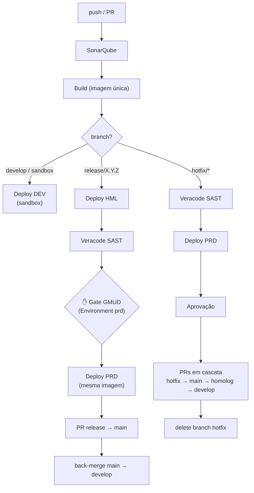
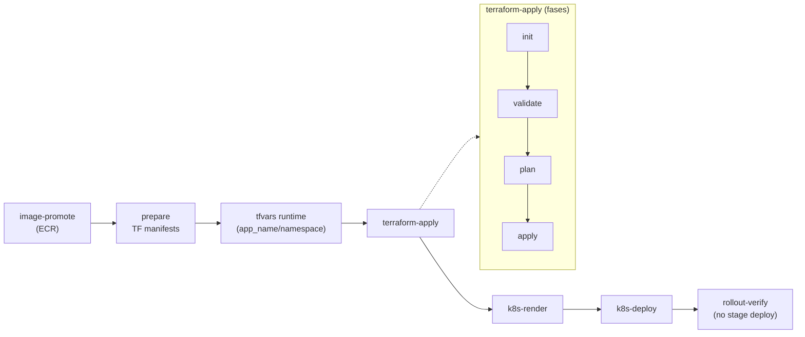

# Fibra.DevOps.Pipelines — Esteira Reutilizável (Paved Road)

Plataforma de **templates de Azure Pipelines** versionados. Cada aplicação tem um
pipeline **fino** (só dados) que faz `extends` de um *stack* desta plataforma; toda
a esteira (qualidade → build → deploy por ambiente → promoção/GMUD) mora aqui, uma
vez, reutilizável e pinada por tag.

> **Princípios:** *o ambiente é DADO, não código* · *build único* (a mesma imagem
> promovida sem rebuild) · *compliance por construção* (steps obrigatórios injetados
> via `extends`, que o app não remove) · *rollout controlado* (apps pinam tag).

---

## Sumário

1. [Conceitos](#1-conceitos)
2. [Estrutura do repositório](#2-estrutura-do-repositório)
3. [Diagrama de fluxo](#3-diagrama-de-fluxo)
4. [Como um app consome a esteira](#4-como-um-app-consome-a-esteira)
5. [Catálogo de templates](#5-catálogo-de-templates)
6. [Como adicionar uma nova linguagem/stack](#6-como-adicionar-uma-nova-linguagemstack)
7. [Manifests (K8s / Terraform)](#7-manifests-k8s--terraform)
8. [Variáveis: ambiente como dado](#8-variáveis-ambiente-como-dado)
9. [Versionamento](#9-versionamento)
10. [Pré-requisitos no Azure DevOps / AWS](#10-pré-requisitos-no-azure-devops--aws)
11. [Roadmap / melhorias futuras](#11-roadmap--melhorias-futuras)
12. [Documentação complementar](#12-documentação-complementar)

---

## 1. Conceitos

| Conceito | O que é |
|---|---|
| **Stack** | Entrypoint da esteira de uma linguagem (ex.: `stacks/dotnet-backend.yaml`). O app faz `extends` dele. |
| **`extends` (vs `template`)** | Garante que steps obrigatórios (Sonar, Veracode, rollout-verify, annotations) **não** possam ser removidos pelo app → compliance do GMUD por construção. |
| **Ambiente é dado** | Um único `stages/deploy.yaml` parametrizado por `environment`; os valores de infra vêm de `variables/env/<env>.yaml`. Sem bloco de deploy replicado por ambiente. |
| **Build único** | A imagem é buildada uma vez e a **mesma** é promovida (HML → PRD) sem rebuild. |
| **Gate de GMUD** | Aprovação manual configurada como *check* no Environment `prd` do Azure DevOps. |
| **Config agrupada** | O app declara objetos (`pod`, `networking`, `resources`, `observability`, `config`, `hotfix`) em vez de dezenas de parâmetros soltos. |

---

## 2. Estrutura do repositório

```
.
├── README.md                      # este arquivo
├── docs/                          # arquitetura e planos
│   ├── ARQUITETURA-TEMPLATES.md   # arquitetura da paved road (templates)
│   ├── ARQUITETURA-RELEASE.md     # arquitetura de solução (build único + release isolada)
│   ├── fluxo-release.md           # estratégia de branches e ambientes
│   └── MIGRACAO-GLOBAL-VARIABLES.md  # plano faseado de migração das variáveis
│
├── examples/
│   ├── azure-pipelines.yml             # exemplo canônico (copiar p/ a raiz do app)
│   └── azure-pipelines-project.yaml    # exemplo de um app real
│
├── manifests/                     # ARTEFATOS da app (copiados/renderizados em runtime)
│   ├── k8s/                       # deployment/service/hpa/configmap/ingress (PLACEHOLDER_*)
│   └── terraform/                 # root module .tf (referencia módulos do repo Terraform)
│
└── templates/                     # TEMPLATES de pipeline (consumidos via extends/template)
    ├── stacks/
    │   └── dotnet-backend.yaml     # ENTRYPOINT .NET — roteia por branch
    ├── stages/
    │   ├── deploy.yaml             # 1 stage de deploy; param: environment
    │   └── veracode.yaml           # 1 stage de SAST (reusado por release/* e hotfix)
    ├── steps/
    │   ├── image-promote.yaml      # download + docker load + push ECR
    │   ├── k8s-render.yaml         # copia manifests + substitui PLACEHOLDER_* + ConfigMap
    │   ├── k8s-deploy.yaml         # kubeconfig + namespace + apply + annotations
    │   ├── rollout-verify.yaml     # kubectl rollout status + undo on fail
    │   ├── terraform-apply.yaml    # ORQUESTRADOR do Terraform (backend + fases)
    │   └── terraform/              # fases isoladas do Terraform
    │       ├── init.yaml
    │       ├── validate.yaml
    │       ├── plan.yaml
    │       └── apply.yaml
    ├── dotnet/build-backend-dotnet.yaml   # build/teste da imagem .NET
    ├── hotfix/hotfix-backend-dotnet.yaml  # fluxo de hotfix (reusa veracode + deploy)
    ├── sonarqube/qa-sonar-dotnet.yaml     # análise SonarQube (.NET)
    ├── veracode/scanner-veracode.yaml     # steps do scanner Veracode
    ├── infra/setup-git-auth.yaml          # auth git p/ módulos Terraform privados
    ├── utils/create-pullrequest.yaml      # cria/conclui PR via Azure CLI
    ├── deploy-backend.yaml                # MOTOR: orquestra image→tf→render→deploy
    └── variables/
        ├── env/{dev,hml,prd}.yaml         # infra backend por ambiente
        ├── frontend/{dev,hml,prd}.yaml    # config de SPA (Firebase/B2C/Vite/…)
        └── pix/{dev,hml,prd}.yaml         # variantes do domínio PIX
```

**Duas categorias de "templates" — não confundir:**
- `templates/` → **templates de pipeline** (YAML do Azure DevOps; entram via `extends`/`template`).
- `manifests/` → **artefatos da aplicação** (K8s/Terraform; copiados e processados em runtime).

---

## 3. Diagrama de fluxo

### 3.1 Roteamento por branch (no stack)



### 3.2 O motor de deploy (`deploy-backend.yaml`) — orquestrador de steps



---

## 4. Como um app consome a esteira

1. Copie [`examples/azure-pipelines.yml`](examples/azure-pipelines.yml) para a **raiz** do repositório da aplicação como `azure-pipelines.yml`.
2. Ajuste os **dados** (objetos `pod`, `networking`, `resources`, `observability`, `config`).
3. **Pine numa tag** da plataforma — nunca `refs/heads/main`.

```yaml
resources:
  repositories:
    - repository: templates                 # alias OBRIGATÓRIO (o deploy.yaml faz checkout: templates)
      type: git
      name: Fibra.DevOps/Fibra.DevOps.Pipelines
      ref: refs/tags/1.0.0                   # pin por tag

extends:
  template: templates/stacks/dotnet-backend.yaml@templates
  parameters:
    pod: { min_replicas: '2', max_replicas: '6', requests_cpu: 250m, requests_memory: 256Mi,
           limits_cpu: 500m, limits_memory: 512Mi, cpu_utilization: '70' }
    networking: { ingress_path: /pedidos, base_path: pedidos, api_visibility: private,
                  domain_name: '', deployment_aspnetcore_urls: 'http://+:8080', cognito: false }
    resources: { dynamodb_tables: [], s3_buckets: [], sqs: [], secrets: [] }
    observability: { dd_lang: dotnet, dd_lib_version: latest }
    config:
      env_vars: []
      ssm_parameters: { dev: [], hml: [], prd: [] }   # a esteira escolhe o do ambiente
```

> O **alias do repositório precisa ser `templates`** — o `stages/deploy.yaml` faz
> `- checkout: templates`. Se renomear, o checkout interno quebra.

A branch determina o caminho: `develop`/`sandbox` → DEV; `release/X.Y.Z` → HML → (GMUD) → PRD → PRs; `hotfix/*` → Veracode → PRD → PRs em cascata.

### 4.1 Política de réplicas por ambiente

A esteira aplica uma política central de **HA em PRD e economia em não-produção**:

| Ambiente | min / max réplicas |
|---|---|
| **PRD** | usa o `pod.min_replicas` / `pod.max_replicas` do app (deve ser **≥ 2**) |
| **DEV / HML** | **forçado a 1 pod** (`min = max = 1`), independentemente do que o app declarar |

Implicações para o app:
- O objeto `pod` representa o **sizing de PRODUÇÃO** — declare `min_replicas: '2'` (ou mais).
- Em DEV/HML esses valores são **ignorados**; a esteira sobe 1 pod só (custo menor no sandbox).
- O **hotfix** sobe em PRD pelo mesmo `stages/deploy.yaml`, então herda o sizing de PRD.
- `requests`/`limits`/`cpu_utilization` **não** variam por ambiente (iguais em todos).

> Onde isso vive: a decisão é compile-time em `stages/deploy.yaml`
> (`${{ if eq(parameters.environment, 'prd') }}`). Para flexibilizar (ex.: HML
> espelhar PRD), adicione overrides por ambiente no objeto `pod` e ajuste o `deploy.yaml`.

---

## 5. Catálogo de templates

### Stacks (entrypoints — alvo do `extends`)
| Template | Uso |
|---|---|
| `stacks/dotnet-backend.yaml` | Backend .NET. Declara o contrato de parâmetros e roteia por branch. |

### Stages (reutilizáveis)
| Template | Responsabilidade |
|---|---|
| `stages/deploy.yaml` | Deploy de **1** ambiente (`environment`); resolve infra de `variables/env/<env>.yaml`; chama `deploy-backend.yaml` + `rollout-verify`. |
| `stages/veracode.yaml` | Stage de SAST (Veracode). |

### Steps (reutilizáveis, agnósticos de stack)
| Template | Responsabilidade | Parâmetros-chave |
|---|---|---|
| `steps/image-promote.yaml` | Download artefato + `docker load` + push ECR | `imageName`, `imageTag`, `autoCreateRepository` |
| `steps/terraform-apply.yaml` | Orquestra backend S3 + fases TF | `backendBucket`, `tfVars`, `planOnly`, `tolerableErrorPatterns` |
| `steps/terraform/{init,validate,plan,apply}.yaml` | Fases isoladas do Terraform | `planFile`, `hasChangesVariable`, `extraArgs` |
| `steps/k8s-render.yaml` | Copia manifests + substitui `PLACEHOLDER_*` + ConfigMap | `sourceDir`, `substitutions`, `envVars` |
| `steps/k8s-deploy.yaml` | kubeconfig + namespace + apply + annotations | `namespace`, `manifestsDir`, `annotate` |
| `steps/rollout-verify.yaml` | `kubectl rollout status` + `undo` on fail | `timeoutSeconds` |

### Apoio
`dotnet/build-backend-dotnet.yaml`, `sonarqube/qa-sonar-dotnet.yaml`, `veracode/scanner-veracode.yaml`, `infra/setup-git-auth.yaml`, `utils/create-pullrequest.yaml`.

---

## 6. Como adicionar uma nova linguagem/stack

A esteira foi desenhada para isso: **stages e steps são agnósticos**; o que muda por
linguagem é o **build** e os **manifests**. Para adicionar (ex.: `node-backend`):

1. **Build** — crie `templates/node/build-backend-node.yaml` (instala deps, testa,
   builda a imagem e publica o artefato `docker-image` no mesmo formato que o .NET).
2. **Qualidade** (opcional) — `templates/sonarqube/qa-sonar-node.yaml` se o Sonar for diferente.
3. **Stack** — crie `templates/stacks/node-backend.yaml` copiando o de .NET e trocando:
   - o `Build` para o template de build da nova linguagem;
   - o `dd_lang`/observabilidade default, se aplicável.
   O **roteamento por branch e o deploy permanecem iguais** (reusam `stages/deploy.yaml`,
   `stages/veracode.yaml`, `hotfix/...`).
4. **Manifests** — adicione os manifests da linguagem em `manifests/k8s/` (mesmos
   `PLACEHOLDER_*`) e o root module em `manifests/terraform/` (se a infra diferir).
   Veja os contratos em [`manifests/k8s/README.md`](manifests/k8s/README.md) e
   [`manifests/terraform/README.md`](manifests/terraform/README.md).
5. **Exemplo** — adicione um `examples/azure-pipelines-node.yml` consumindo o novo stack.
6. **Tag** — publique uma nova versão (ver §9) e aponte o app piloto para ela.

> Reuso máximo: idealmente o novo stack só difere no **Build**. Deploy, SAST, hotfix,
> rollout-verify, Terraform e K8s já são compartilhados.

---

## 7. Manifests (K8s / Terraform)

Vivem em `manifests/` (na raiz), separados dos templates de pipeline. São **copiados
em runtime** pelo `deploy-backend.yaml` para o workspace e processados:

- **K8s** (`manifests/k8s/`): `deployment.yaml`, `service.yaml`, `hpa.yaml`,
  `configmap.yaml`, `ingress.yaml` com tokens `PLACEHOLDER_*` substituídos pelo
  `k8s-render.yaml`. Contrato completo em `manifests/k8s/README.md`.
- **Terraform** (`manifests/terraform/`): root module `.tf` que referencia módulos do
  repo `Fibra.DevOps.Terraform` (clonados pelo `terraform init` via `setup-git-auth.yaml`).
  O `backend.tf` (state S3) é **gerado** pela esteira. Contrato em `manifests/terraform/README.md`.

---

## 8. Variáveis: ambiente como dado

Em vez de um `global-variables.yaml` monolítico, as variáveis são fatiadas por
**domínio × ambiente**, com os **mesmos nomes** em cada ambiente (só os valores mudam):

```
variables/env/{dev,hml,prd}.yaml        # backend .NET/EKS (serviceAccount, clusterName, awsRegion, …)
variables/frontend/{dev,hml,prd}.yaml   # SPA (Firebase/B2C/Vite/Hotjar/Zendesk)
variables/pix/{dev,hml,prd}.yaml        # domínio PIX
```

O `stages/deploy.yaml` carrega o arquivo do ambiente via caminho dinâmico:
`- template: ../variables/env/${{ parameters.environment }}.yaml`.

> ⚠️ Itens sensíveis (chaves/segredos) hoje estão em YAML. O destino correto é
> **Azure Key Vault** via variable group — ver `docs/MIGRACAO-GLOBAL-VARIABLES.md`.

---

## 9. Versionamento

- A plataforma é versionada por **tags imutáveis** (ex.: `1.0.0`).
- Apps pinam `ref: refs/tags/X.Y.Z` — **nunca** `refs/heads/main` (evita que uma
  mudança na plataforma quebre todos os apps de uma vez).
- Bump é **deliberado por app** → rollout controlado (um app por vez).
- Antes de publicar uma tag, valide com a **Preview API** do Azure Pipelines
  (`POST /_apis/pipelines/{id}/preview`, `previewRun=true`) contra um app de exemplo.

---

## 10. Pré-requisitos no Azure DevOps / AWS

- **Variable group `git-credentials`** (com `GIT_PAT`) autorizado no projeto do app —
  usado pelo `setup-git-auth.yaml` para clonar módulos Terraform privados.
- **Environments** `dev`, `hml`, `prd` criados; o **gate de GMUD** é um *check de
  aprovação* no Environment `prd`.
- **Service connections AWS** (uma por ambiente) referenciadas em `variables/env/<env>.yaml`.
- **Permissões da service account** (deploy): ECR push; EKS; e para o backend de state —
  `s3:CreateBucket/PutBucketVersioning/PutEncryptionConfiguration/PutBucketPublicAccessBlock/PutBucketPolicy`.

---

## 11. Roadmap / melhorias futuras

- [ ] **State locking** do Terraform (DynamoDB ou `use_lockfile`) — hoje sem lock; evitar runs concorrentes por app/env.
- [ ] **Promoção por digest** (`@sha256`) no lugar de tag `BuildId` (build único íntegro cross-account).
- [ ] **Kustomize/Helm** no lugar da substituição por `sed`/`PLACEHOLDER_`.
- [ ] **Secrets → Key Vault** (ver `docs/MIGRACAO-GLOBAL-VARIABLES.md`).
- [ ] `autoCreateRepository: false` em PRD (least privilege).
- [ ] Annotations embutidas no manifest (no render) para evitar rollout duplo.

---

## 12. Documentação complementar

- [`docs/ARQUITETURA-TEMPLATES.md`](docs/ARQUITETURA-TEMPLATES.md) — arquitetura da paved road.
- [`docs/ARQUITETURA-RELEASE.md`](docs/ARQUITETURA-RELEASE.md) — build único + release isolada + GMUD.
- [`docs/fluxo-release.md`](docs/fluxo-release.md) — estratégia de branches (merge × cherry-pick).
- [`docs/MIGRACAO-GLOBAL-VARIABLES.md`](docs/MIGRACAO-GLOBAL-VARIABLES.md) — plano de migração das variáveis.
