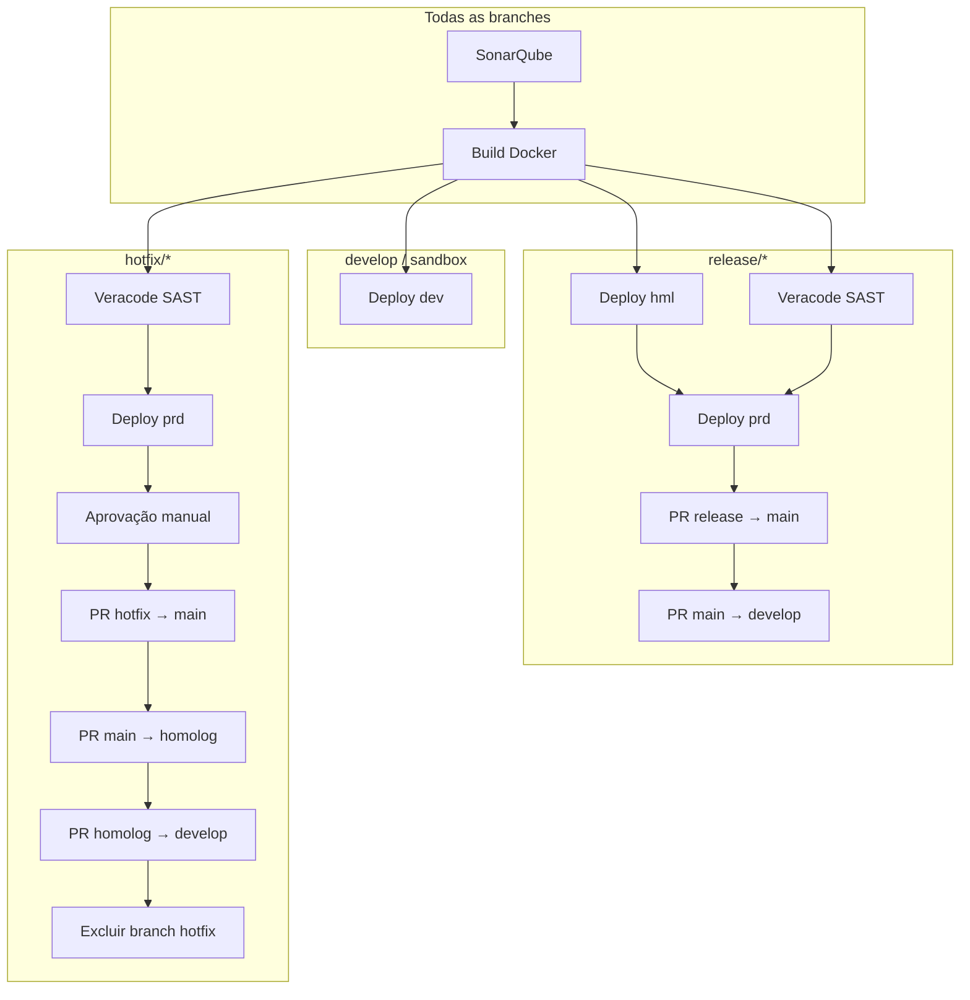

# Changelog

Biblioteca centralizada de templates de pipeline Azure DevOps para backends .NET do Banco Fibra.  
Este repositório concentra **CI/CD reutilizável**, **manifests de infraestrutura** (Terraform + Kubernetes) e **automação de promoção entre branches**, evitando duplicação de YAML em cada microserviço.

O versionamento segue [Semantic Versioning](https://semver.org/lang/pt-BR/) (`MAJOR.MINOR.PATCH`):

| Tipo | Quando usar |
|------|-------------|
| **MAJOR** | Mudança incompatível (parâmetros removidos/renomeados, fluxo de stages alterado) |
| **MINOR** | Nova funcionalidade compatível (novo template, novo parâmetro opcional, novo ambiente) |
| **PATCH** | Correção compatível (bugfix, melhoria de `displayName`, ajuste de script sem quebrar contrato) |

Ao referenciar este repositório nos pipelines das aplicações, **fixe a versão por tag** (ex.: `@refs/tags/v1.2.0`) em vez de apontar para `main`.

---

## Conceito e arquitetura

### Objetivo

Padronizar o ciclo de vida de APIs .NET implantadas em **Amazon EKS**, com provisionamento de recursos AWS via **Terraform** e gates de qualidade (**SonarQube** + **Veracode**).

### Como as aplicações consomem

Cada repositório de microserviço define um `azure-pipelines.yml` enxuto que **estende** o stack:

```yaml
resources:
  repositories:
    - repository: templates
      type: git
      name: Fibra.DevOps/fibra-devops-pipelines
      ref: refs/tags/v1.2.0

extends:
  template: templates/stacks/dotnet-backend.yaml@templates
  parameters:
    pod: { ... }
    networking: { ... }
    resources: { ... }
    observability: { ... }
    config: { ... }
```

### Estrutura do repositório

```
fibra-devops-pipelines/
├── templates/
│   ├── stacks/           # Ponto de entrada por tipo de aplicação
│   ├── stages/           # Stages reutilizáveis (deploy, veracode)
│   ├── dotnet/           # Build Docker + .NET
│   ├── sonarqube/        # Análise de qualidade
│   ├── veracode/         # Scan SAST
│   ├── hotfix/           # Fluxo dedicado a branches hotfix/*
│   ├── infra/            # Setup transversal (auth Git para módulos TF)
│   ├── utils/            # Automação de PRs
│   ├── variables/env/    # Variáveis por ambiente (dev, hml, prd)
│   └── deploy-backend.yaml  # Steps de deploy (ECR, TF, kubectl)
├── manifests/
│   ├── k8s/              # Templates Kubernetes (placeholders)
│   └── terraform/        # Infra AWS por aplicação
```

### Fluxo por branch



### Etapas do deploy (`templates/deploy-backend.yaml`)

1. Baixa artefato da imagem Docker (`.tar`) do stage de build
2. Publica imagem no **Amazon ECR**
3. Copia manifests de `manifests/k8s` e `manifests/terraform` para o workspace
4. Provisiona infraestrutura AWS (IAM Pod Identity, API Gateway, DynamoDB, S3, SQS, Secrets, etc.)
5. Substitui placeholders nos manifests Kubernetes
6. Gera ConfigMap com `env_vars` da aplicação
7. Aplica recursos no cluster EKS e anota o deployment com metadados de rastreabilidade

---

## Boas práticas

### Consumo dos templates

- **Fixe versão por tag** no `resources.repositories.ref` — evita quebras silenciosas quando `main` evolui.
- **Passe apenas parâmetros da aplicação** (`pod`, `networking`, `resources`, `config`); variáveis de conta AWS e cluster ficam em `templates/variables/env/`.
- **Não duplique** lógica de build/deploy no repositório da aplicação; estenda o stack e sobrescreva só o necessário.
- Configure o **Variable Group** `git-credentials` (com `GIT_PAT`) para módulos Terraform privados no Azure DevOps.

### Parâmetros da aplicação

| Bloco | Responsabilidade |
|-------|------------------|
| `pod` | CPU/memória, réplicas, HPA |
| `networking` | Ingress, domínio, base path, visibilidade da API, Cognito |
| `resources` | DynamoDB, S3, SQS, Secrets Manager |
| `config.env_vars` | Variáveis injetadas via ConfigMap |
| `config.ssm_parameters` | Parâmetros SSM por ambiente (dev/hml/prd) |
| `observability` | Datadog (`dd_lang`, `dd_lib_version`) |

### Qualidade e segurança

- **SonarQube** roda antes do build; o build só prossegue se o stage anterior for bem-sucedido.
- **Veracode** é obrigatório em `release/*` e `hotfix/*` antes do deploy em produção.
- Use `continueOnError` apenas onde explicitamente tolerado (ex.: Sonar em fase de adoção); o build breaker deve permanecer ativo em produção.
- Branches protegidas (`main`, `develop`, `homolog`) não podem ser excluídas pelo script de hotfix.

### Deploy e infraestrutura

- Cada ambiente possui **service connection AWS** e cluster EKS próprios (`templates/variables/env/*.yaml`).
- O backend Terraform usa **state remoto S3** por aplicação e ambiente (`tfstate-<repo>-<env>`).
- Manifests K8s usam **placeholders** substituídos em runtime — não edite valores fixos nos YAML base.
- Anotações de deploy (`deploy.fibra.io/build-id`, `commit`, `branch`) permitem rastrear qual build está em execução.

### Manutenção deste repositório

- Adicione `displayName` descritivos em português em toda nova etapa — facilita troubleshooting no Azure DevOps.
- Alterações em parâmetros obrigatórios exigem **MAJOR** e nota de migração neste changelog.
- Teste mudanças em um microserviço piloto antes de publicar nova tag.
- Mantenha `templates/deploy-backend.yaml` alinhado ao path referenciado em `templates/stages/deploy.yaml`.

### Convenção de branches (aplicação consumidora)

| Branch | Comportamento do pipeline |
|--------|---------------------------|
| `develop`, `sandbox` | Build + deploy em **dev** |
| `release/*` | hml → Veracode → prd → PRs de promoção |
| `hotfix/*` | Veracode → prd → aprovação → PRs em cascata → exclusão da branch |

---

## [1.2.0] - 2026-07-20

Parametrização dos templates de qualidade, build e autenticação Git. **Nenhuma quebra de contrato**:
todos os parâmetros novos são opcionais e seus defaults reproduzem o comportamento de `1.1.1`.

> ⚠️ **Ao tagear**: `examples/azure-pipelines.yml` referencia `refs/tags/v2.0.0`, tag que não existe.
> Aponte o exemplo para `refs/tags/v1.2.0` — senão um pipeline copiado dele não resolve o
> `resources.repositories` e sequer compila.

### Removido

- `templates/variables/frontend/{dev,hml,prd}.yaml` e `templates/variables/pix/{dev,hml,prd}.yaml`. Eram um estado intermediário do fatiamento por domínio × ambiente e **nunca chegaram a uma tag publicada** — por isso não há migração a fazer nem quebra de contrato. As variáveis de ambiente ficam apenas em `templates/variables/env/{dev,hml,prd}.yaml`.

### Adicionado

- **`templates/infra/setup-git-auth.yaml` parametrizado**: `orgUrl`, `patVariable`, `probeRepo` e `verifyAccess`. A organização (`bancofibra`) e o repositório de módulos (`Fibra.DevOps.Terraform`) deixam de estar fixos no corpo do script. Todos os defaults preservam o comportamento anterior.
- **`templates/dotnet/build-backend-dotnet.yaml` parametrizado**: `pool`, `dockerfilePath`, `buildContext`, `imageName`, `imageTag`, `artifactName` e `extraBuildArgs`. O template não tinha nenhum parâmetro; os defaults de `imageName`/`imageTag`/`artifactName` são iguais aos de `steps/image-promote.yaml` por contrato — se alterar em um, altere no outro.
- **`templates/sonarqube/qa-sonar-dotnet.yaml` parametrizado** (16 parâmetros): `sonarServiceConnection`, `projectKey`, `projectName`, `branchName`, `extraProperties`, `dotnetVersion`, `includePreviewVersions`, `solutionPattern`, `nugetFeedId`, `buildConfiguration`, `coverageFile`, `relaxNugetSignatureChecks`, `pollingTimeoutSec`, `gateWaitAttempts`, `gateWaitIntervalSeconds` e `breakOnQualityGate`.
  - `extraProperties` substitui os blocos de `sonar.exclusions` / `coverage.exclusions` / `cpd.exclusions` que estavam comentados no arquivo — agora o app declara as exclusões sem forkar o template.
  - `breakOnQualityGate: false` publica o resultado do gate sem derrubar o build, permitindo adoção gradual em aplicações novas.
- **Resultados de teste publicados no run** (`PublishTestResults@2`): o `dotnet test` passou a gerar `.trx` e a aba **Tests** do Azure DevOps deixa de ficar vazia — com contagem, duração e histórico de flakiness. Roda com `condition: succeededOrFailed()` (é quando o teste falha que o relatório importa) e não falha se não houver `.trx`. Desligável com `publishTestResults: false`.
- `qa-sonar-dotnet.yaml`: parâmetro `coverageToolVersion` para pinar a versão do `dotnet-coverage`. Vazio (default) instala a última e emite `##[warning]` — **defina uma versão** para builds reprodutíveis.

### Alterado

- **`sonar.branch.name` deixou de ser fixo em `develop`** e passa a derivar da branch do run (`coalesce(parameters.branchName, replace(variables['Build.SourceBranch'], 'refs/heads/', ''))`). Análises de `release/*` e `hotfix/*` passam a ser registradas na branch correta. Depende do `sonarqube-community-branch-plugin` instalado no servidor; para voltar ao comportamento anterior, passe `branchName: 'develop'`.
- `templates/sonarqube/qa-sonar-dotnet.yaml`: o glob do `restore` e o `find` do build passaram a derivar do mesmo parâmetro `solutionPattern` — antes eram dois literais `*.slnx` independentes.

### Corrigido

- **`setup-git-auth.yaml` não imprime mais o PAT no log.** A linha de diagnóstico usava `${GIT_PAT}` (o valor) onde a intenção era `${#GIT_PAT}` (o tamanho).
- `build-backend-dotnet.yaml`: a autodetecção da pasta em `src/` (`ls | head -1`, ordem alfabética) agora emite `##[warning]` quando há mais de uma pasta e falha explicitamente se o Dockerfile não existir. Use `dockerfilePath` para eliminar a ambiguidade.
- `qa-sonar-dotnet.yaml`: `find` sem resultado agora falha com mensagem clara em vez de chamar `dotnet build ""`.
- `qa-sonar-dotnet.yaml`: `NUGET_CERT_REVOCATION_MODE: 'no'` passou a ser citado (em YAML, `no` sem aspas é o booleano `false`).
- **`qa-sonar-dotnet.yaml`: falha intermitente por `SIGPIPE`.** Os dois `find … | head -n 1` (solução e `report-task.txt`) rodavam sob `set -o pipefail`: quando o `head` fechava o pipe antes de o `find` terminar, o `find` saía com 141 e derrubava o step sem motivo aparente. Trocados por `find … -print -quit`.
- **`qa-sonar-dotnet.yaml`: `PATH` montado com macro do Azure DevOps.** O bloco `env` usava `PATH: $(PATH):$(HOME)/.dotnet/tools`; se as macros não resolvessem, o `PATH` do step viraria a string literal e todo comando falharia com *command not found*. Passou a ser `export PATH="$PATH:$HOME/.dotnet/tools"` dentro do script, onde é shell de verdade.
- **`qa-sonar-dotnet.yaml`: token do SonarQube agora é mascarado** (`##vso[task.setsecret]`) assim que é extraído de `SONARQUBE_SCANNER_PARAMS`, protegendo contra vazamento em log caso alguém habilite `set -x` ou um erro ecoe a linha de comando.
- `qa-sonar-dotnet.yaml`: removida a instalação de `jq` via `sudo apt-get` em runtime. O `jq` já vem no `ubuntu-latest` e os demais templates do repo o consomem sem instalar; agora o step falha com mensagem clara se faltar.
- `qa-sonar-dotnet.yaml`: `dotnet tool install` trocado por `dotnet tool update`, que é idempotente — o `install` falhava quando a ferramenta já existia no agente (self-hosted reaproveitado).

### Notas de adoção

- Nenhum chamador precisa mudar: todos os parâmetros novos são opcionais e os defaults preservam o comportamento anterior — **exceto** `sonar.branch.name`, que muda de propósito (ver *Alterado*).
- **Valide no primeiro run**: confira no log do step `Configurar SonarQube (.NET)` se `sonar.branch.name` recebeu o valor esperado. Se vier vazio ou com o prefixo `refs/heads/`, a expressão não resolveu — passe `branchName` a partir de `stacks/dotnet-backend.yaml`.
- Com branches reais, cada `release/X.Y.Z` vira um registro permanente no SonarQube. Configure o *housekeeping* de branches inativas antes de adotar.
- A primeira análise de cada branch nova não tem baseline; Quality Gates com condição sobre *novo código* podem se comportar de forma diferente nesse run.
- **Verifique se teste quebrado derruba o stage.** O `dotnet test` roda dentro do `dotnet-coverage collect`; se o exit code não for propagado, um teste falhando passaria despercebido. Com o `PublishTestResults@2` desta versão dá para conferir: quebre um teste de propósito e confirme que a aba **Tests** fica vermelha **e** o stage falha.
- **Pine o `dotnet-coverage`.** O default de `coverageToolVersion` é vazio (instala a última) e emite `##[warning]`. Pegue a versão do log do primeiro run e passe no chamador.

---

## [1.1.1] - 2026-07-17

### Alterado

- `templates/deploy-backend.yaml`: remover a duplicação do `record-prod-release.yaml` em compile-time quando `environment == prd` (DEV/HML não são afetados).

## [1.1.0] - 2026-07-17

### Adicionado

- **Registro rastreável de releases em PRD** (`templates/steps/record-prod-release.yaml`), injetado automaticamente pela esteira em todo caminho que toca produção (release, hotfix e rollback — o app não configura nada):
  - **`DEPLOY-PRD.md` na raiz do repositório da aplicação**: seção "Último deploy" (situação deploy/hotfix/rollback, data, imagem/tag ECR, digest, commit + mensagem, link do run, autor) sobrescrita a cada subida, e seção "Histórico" acumulando as últimas 50 entradas. O commit entra na branch deployada com `[skip ci]` e chega à `main`/`develop` pelos PRs que a esteira já abre; se o push for bloqueado por branch policy (ex.: rollback executado na `main`), o registro é publicado na branch `release-record/<buildId>` e um PR é aberto automaticamente via REST.
  - **Resumo na aba Summary do run** (`task.uploadsummary`) e **artefato `prod-release`** com `latest.json` (estruturado, para automação), `latest.txt` e `latest.md`.
  - **Tag móvel `prod` no ECR** sempre apontando para o digest em produção (o rollback reaponta a tag para a imagem restaurada).
  - **Carimbo do run**: Build Number ganha sufixo `· prd` e tags `prod`/`<app>`, permitindo filtrar na lista de runs o que foi para produção.
  - Parâmetros: `deployType` (`auto` distingue deploy × hotfix pelo branch; rollback é explícito), `updateReleaseLog`, `recordBranch`, `prodTag`, `stampRun`.

### Alterado

- `templates/stages/deploy.yaml`: passa a incluir o `record-prod-release.yaml` em compile-time quando `environment == prd` (DEV/HML não são afetados).

### Notas de adoção

- **Azure DevOps**: usuário *Build Service* com permissão **Contribute** e **Contribute to pull requests** no repositório do app; opção *"Allow scripts to access the OAuth token"* habilitada (ambos já necessários aos PRs automáticos da esteira).
- **AWS (conta PRD)**: a service account precisa de `ecr:DescribeImages`, `ecr:BatchGetImage` e `ecr:PutImage` (leitura do digest + tag móvel `prod`).
- O `[skip ci]` no commit do registro é o que impede o redisparo da esteira em `hotfix/*`; não remova.
- Registro é **best-effort**: falha em qualquer etapa do registro vira warning e não bloqueia o deploy.

## [1.0.29] - 2026-07-16

### Adicionado

- Suporte a tópicos SNS e filas SQS já existentes na conta AWS nas `sns_sqs_subscriptions`. Nomes não declarados em
  `topic_name`/`queue_name` passam a ser resolvidos via data source, permitindo reaproveitar recursos criados por outros
  projetos.

### Corrigido

- Corrigido `local.managed_queue_names`, que referenciava a variável inexistente `var.sqs_queues` em vez de `var.queue_name`,
  fazendo com que toda fila fosse tratada como externa.


## [1.0.27] - 2026-07-15

### Alterado

- Rollback de stages no fluxo `release/` do `templates/stacks/dotnet-backend.yaml`. O stage `Deploy_DEV` passa a ser executado agora somente com a branch `develop & sandbox`


## [1.0.26] - 2026-07-10

> ⚠️ **Obsoleto.** Este encadeamento foi revertido em [1.0.27]. No fluxo atual, `Deploy_hml` e `Veracode`
> dependem ambos de `[Build]`, e não existe `Deploy_dev` no caminho `release/*`.

### Alterado

- Encadeamento de stages no fluxo `release/` do `templates/stacks/dotnet-backend.yaml`. O stage `Veracode` passa a depender de `Deploy_dev` (`dependsOn: [Deploy_dev]`) e o deploy de homologação (`environment: hml`) passa a depender de ambos (`dependsOn: [Deploy_dev, Veracode]`). Garante que o deploy em `hml` só ocorra após a conclusão do deploy em `dev` e da análise Veracode.


## [1.0.25] - 2026-07-10

### Alterado

- Padronização do nome dos **queues SQS** por aplicação. O `manifests/terraform/main.tf` passa a iterar sobre o novo `local.sqs_queues` (em `locals.tf`) em vez de `var.queue_name` diretamente. O local monta o nome no padrão `sqs-${var.environment}-${data.aws_region.current.name}-<queue_name>`, converte `fifo_queue` / via `tobool(lower(...))` e acrescenta o sufixo `.fifo` automaticamente para queues FIFO. Adicionado `datasource.tf` com `data "aws_region" "current"`. O dev passa a declarar apenas a parte curta do nome em `resources.sqs[].queue_name`;


## [1.0.24] - 2026-07-10

### Alterado

- Padronização do nome dos **tópicos SNS** por aplicação. O `manifests/terraform/main.tf` passa a iterar sobre o novo `local.sns_topics` (em `locals.tf`) em vez de `var.topic_name` diretamente. O local monta o nome no padrão `sns-${var.environment}-${data.aws_region.current.name}-<topic_name>`, converte `fifo_topic` / `content_based_deduplication` via `tobool(lower(...))` e acrescenta o sufixo `.fifo` automaticamente para tópicos FIFO. Adicionado `datasource.tf` com `data "aws_region" "current"`. O dev passa a declarar apenas a parte curta do nome em `resources.sns_topics[].topic_name`;


## [1.0.22] - 2026-07-08

### Adicionado

- Suporte a **assinaturas SNS → SQS** por aplicação. Novo parâmetro opcional `resources.sns_sqs_subscriptions` (default `[]`) propagado pelo stack `dotnet-backend.yaml` → `stages/deploy.yaml` → `deploy-backend.yaml`, mapeado para a nova variável Terraform `sns_sqs_subscriptions`. O `manifests/terraform/main.tf` provisiona as assinaturas via módulo `aws_sns_sqs_subscription` (`for_each` por par `topic_name--queue_name`), referenciando os módulos `aws_sns_topic`/`aws_sqs_queue` pela chave. Cada item aceita `topic_name` e `queue_name` (devem existir em `sns_topics`/`sqs`) e, opcionalmente, `filter_policy` (objeto convertido via `jsonencode`) e `filter_policy_scope` (default `MessageAttributes`); sem `filter_policy` a assinatura recebe todas as mensagens e o `filter_policy_scope` é anulado para não exigir policy.

## [1.0.21] - 2026-07-08

### Adicionado

- Suporte a **tópicos SNS** por aplicação. Novo parâmetro opcional `resources.sns_topics` (default `[]`) propagado pelo stack `dotnet-backend.yaml` → `stages/deploy.yaml` → `deploy-backend.yaml`, mapeado para a nova variável Terraform `topic_name` (com campos `topic_name`, `fifo_topic` e `content_based_deduplication`). O `manifests/terraform/main.tf` provisiona os tópicos via módulo `aws_sns_topic` (`for_each` sobre `var.topic_name`). A IAM policy do pod já concede `sns:Publish`/`sns:Subscribe`, então aplicações que não declararem `sns_topics` seguem sem alteração.

## [1.0.20] - 2026-07-02

> ⚠️ **Obsoleto.** O registro em Wiki foi substituído em [1.1.0] pelo `DEPLOY-PRD.md` no repositório da
> aplicação. Esta correção não se aplica ao template atual — não há mais chamada à API de Wiki.

### Corrigido

- `record-prod-release` não bloqueia mais a atualização da Wiki quando a **API de listagem** (`_apis/wiki/wikis`) retorna vazia para o token do build (comportamento observado mesmo com *Contribute* concedido — `list` e `get` têm checagens de permissão/escopo diferentes). Agora, se a listagem não resolver o `id`, o step **cai de volta para o identificador por nome `<Projeto>.wiki`** e tenta o GET/PUT diretamente (que costuma funcionar), decidindo o sucesso pela resposta real da página — em vez de abortar. Também passou a **logar a resposta crua da listagem** (500 primeiros chars) para diagnóstico, e a URL-encodar o identificador da Wiki.

## [1.0.19] - 2026-07-02

> ⚠️ **Obsoleto.** O registro em Wiki foi substituído em [1.1.0] pelo `DEPLOY-PRD.md` no repositório da
> aplicação. O parâmetro `wikiName` não existe mais.

### Alterado

- `record-prod-release` agora **descobre a Wiki de projeto automaticamente** (via API de listagem `_apis/wiki/wikis`, usando o `id`/GUID da Wiki do tipo `projectWiki`) em vez de assumir o nome `<Projeto>.wiki`. Isso evita `WikiNotFoundException` (HTTP 404) quando o identificador por nome não resolve e torna o parâmetro `wikiName` opcional (só necessário para *code wikis* ou cenários específicos). Quando não existe nenhuma Wiki no projeto, o warning fica explícito ("crie em Overview > Wiki > Create project wiki e dê Contribute ao Build Service").

## [1.0.18] - 2026-07-02

> ⚠️ **Parcialmente obsoleto.** O **histórico em Wiki** foi substituído em [1.1.0] pelo `DEPLOY-PRD.md` no
> repositório da aplicação: os parâmetros `updateWiki`, `wikiName` e `wikiPagePath` não existem mais —
> os equivalentes atuais são `updateReleaseLog` e `recordBranch`. O **carimbo do run** (`stampRun`) segue
> válido e em uso.

### Adicionado

- O step `record-prod-release` ganhou **visibilidade nativa do deploy em prod**, sem o dev precisar abrir o stage e caçar o artefato:
  - **Carimbo do run** (parâmetro `stampRun`, default `true`): adiciona as build tags `prod` e `<imageName>` e renomeia o Build Number com o sufixo ` · prd` (idempotente em reexecução). Assim a **lista de runs** do pipeline mostra, de relance e filtrável, quais execuções foram para produção. Segue o mesmo padrão já usado em `stages/rollback.yaml`.
  - **Histórico incremental em Wiki** (parâmetro `updateWiki`, default `true`): a cada deploy em prod, acrescenta **uma linha** (mais recente no topo) numa página única da Wiki do projeto (`wikiPagePath`, default `/Releases/prd`), formando uma tabela central com data (UTC), aplicação, tag, digest, commit, link do build e quem disparou. Usa a REST API de Wiki com `System.AccessToken` (mapeado via `env:`, mesmo padrão de `hotfix`/`utils`) e cria a página automaticamente na primeira vez. Falhas na Wiki **não derrubam o deploy** (o artefato `prod-release` e o resumo em Markdown continuam sendo a fonte oficial). Requer que exista uma **Wiki de projeto** e que o **Build Service** tenha permissão de *Contribute* na Wiki, além de "Allow scripts to access the OAuth token" habilitado.
  - Novos parâmetros opcionais: `stampRun`, `updateWiki`, `wikiName` (vazio ⇒ `<Projeto>.wiki`) e `wikiPagePath`.

## [1.0.17] - 2026-07-01

### Adicionado

- O step `record-prod-release` agora publica um **resumo em Markdown na aba "Summary" do run** (`##vso[task.uploadsummary]`), com link do pipeline, imagem, digest, tag móvel, commit e branch. Facilita a visualização do último release em prod direto na página da execução, sem precisar baixar o artefato (que continua sendo gerado como registro oficial).

## [1.0.16] - 2026-07-01

> ⚠️ **Obsoleto.** Depende do forçamento de `min_replicas: 2` em prd introduzido em [1.0.9], que não
> existe mais. Hoje `prd` usa os valores de `pod.min_replicas`/`pod.max_replicas` da aplicação sem
> alteração, e `dev`/`hml` são forçados a `1`/`1`.

### Corrigido

- HPA inválido em produção (`spec.maxReplicas must be >= minReplicas`): como o ambiente `prd` força `min_replicas: 2`, o `max_replicas` da aplicação era mantido mesmo quando menor que 2, resultando em `min=2 > max=1`. Agora, em `prd`, quando a aplicação define `max_replicas < 2`, o template usa `5` como teto padrão; valores `>= 2` continuam sendo respeitados. `dev`/`hml` seguem usando o `min`/`max` informados pela aplicação.

## [1.0.15] - 2026-07-01

> ⚠️ **Referência obsoleta.** A subseção "Valores aceitos por parâmetro" não existe mais: a `docs/` foi
> reescrita (índice, glossário, C4 e ADRs). O contrato de parâmetros hoje está em
> `docs/devops/workflow.md` e `docs/arquitetura/c4-componentes.md`.

### Adicionado

- Subseção **"Valores aceitos por parâmetro"** na doc (`docs/README.md`), detalhando as opções/formatos/defaults de cada campo que o dev pode setar (`pod`, `networking`, `observability`, `resources`, `config`, `hotfix`, `rollbackImageTag`). Os valores foram extraídos da fonte real (templates + `manifests/terraform/`), ex.: `api_visibility` = `private`/`public`, `cognito` = `true`/`false`, `dd_lang` = `dotnet`/`java`/`js`/`python`/`ruby`.

### Corrigido

- Exemplo de consumo na doc estava com `api_visibility: internal` (valor inválido); corrigido para `private` e adicionados comentários inline com os valores aceitos.

## [1.0.14] - 2026-07-01

> ⚠️ **Obsoleto.** Nada desta entrada descreve o comportamento atual: o encadeamento sequencial foi
> revertido em [1.0.27]; `Validate`, `SonarQube` e `Build` voltaram a rodar em todos os fluxos que não
> são rollback; o stage **`Skip` não existe** no repositório; e a documentação citada foi substituída
> pela `docs/` atual.

### Alterado

- **Deploy do `release/*` agora é sequencial** no stack `dotnet-backend.yaml`: `Deploy_hml` passou a depender de `Deploy_dev` (antes ambos dependiam apenas do `Build` e rodavam em paralelo). Assim cada ambiente vira um gate — se `dev` falha, `hml`/`prd` não iniciam. O `Veracode` segue em paralelo a partir do `Build`, e `Deploy_prd` continua dependendo de `[Deploy_hml, Veracode]`.
- **`Validate`, `SonarQube` e `Build` passaram a rodar apenas em `release/*` e `hotfix/*`** (antes rodavam em qualquer branch). Branches como `develop`/`sandbox` deixam de gastar agente com qualidade/build, e apenas o `release/*` implanta nos ambientes — eliminando concorrência no `dev`.

### Adicionado

- Stage **`Skip`** para branches fora de `release/*` e `hotfix/*`: evita erro de compilação do Azure DevOps (pipeline sem stages) e deixa claro nos logs que a branch não dispara a esteira. Pode ser removido se os `triggers` da aplicação já limitarem o pipeline a `release/*` e `hotfix/*`.
- Documentação didática em [`docs/README.md`](docs/README.md): visão geral, glossário, estrutura do repositório, como as aplicações consomem os templates, fluxogramas da esteira (geral, `release/*`, `hotfix/*` e anatomia do deploy), guia passo a passo de **como adicionar novas linguagens** (com contratos a respeitar), tabela de alterações comuns, boas práticas e FAQ/troubleshooting.

## [1.0.13] - 2026-07-01

> ⚠️ **Parcialmente obsoleto.** O `record-prod-release.yaml` continua existindo, mas evoluiu bastante
> (ver [1.1.0] e [1.1.1]) e hoje é invocado por `stages/deploy.yaml`, não pelo `deploy-backend.yaml`.
> A mudança de fluxo descrita em *Alterado* — `Deploy_dev` como primeira etapa do `release/*` — foi
> revertida em [1.0.27].

### Adicionado

- Novo step `templates/steps/record-prod-release.yaml`, executado ao final do deploy em **produção** (`deploy-backend.yaml`, guardado por `${{ if eq(parameters.environment, 'prd') }}`). Ele registra o último release em prod: consulta o **digest imutável** (`sha256`) da imagem no ECR, aplica a **tag móvel `prod`** apontando para esse digest (idempotente) e publica um artefato `prod-release` com `latest.json` (estruturado) e `latest.txt` (leitura humana) contendo link do pipeline, Build ID/Number, URI e digest da imagem, commit, branch, quem disparou e timestamp UTC. Requer permissões `ecr:DescribeImages`, `ecr:BatchGetImage` e `ecr:PutImage` na service connection de prd.

### Alterado

- Fluxo `release/*` do stack `dotnet-backend.yaml` passou a incluir um deploy em **dev** como primeira etapa (dev → hml → Veracode → prd), e o bloco `${{ else }}` que fazia deploy dedicado em `develop`/`sandbox` foi removido.

## [1.0.12] - 2026-06-30

### Adicionado

- Novo stage de **validação** (`Validate`) no início do fluxo do stack `dotnet-backend.yaml`, antes de SonarQube/Build. Ele barra, em tempo de compilação (`${{ if eq(parameters.networking.ingress_path, '/') }}`), configurações com `ingress_path: /`, que transformariam a rota em um catch-all no ALB compartilhado e sequestrariam o tráfego das demais APIs. O `SonarQube` passou a depender desse stage (`dependsOn: Validate`), fazendo o pipeline falhar cedo e com mensagem clara quando o path é inválido. O fluxo de `rollbackImageTag` não é afetado.

## [1.0.11] - 2026-06-26

### Alterado

- O gatilho de rollback no stack `dotnet-backend.yaml` passou a usar o valor sentinela `none` (além de string vazia) como "sem rollback": `${{ if and(ne(rollbackImageTag, ''), ne(rollbackImageTag, 'none')) }}`. Isso permite que a aplicação defina `default: 'none'` no parâmetro de runtime, deixando o campo pré-preenchido no run manual (sem ficar "Required") e caindo no fluxo normal de build/deploy; para rollback, basta substituir `none` pela tag desejada.

## [1.0.10] - 2026-06-25

### Adicionado

- Novo stage de **rollback** (`templates/stages/rollback.yaml`): troca a imagem do deployment para uma tag anterior, anota metadados de rastreabilidade e aguarda o rollout ficar saudável (com falha clara se a versão escolhida não subir).
- Parâmetro `rollbackImageTag` no stack `dotnet-backend.yaml`: quando informado, executa o fluxo de rollback em produção em vez do pipeline normal de build/deploy.

### Alterado

- Restaurados os `displayName` do `dotnet-backend.yaml` para a convenção padrão (verbo no infinitivo + objeto, PT) após a refatoração do fluxo, e padronizados os nomes do novo `rollback.yaml`.

## [1.0.9] - 2026-06-25

> ⚠️ **Obsoleto.** O forçamento de `min_replicas: 2` em prd não existe mais. Hoje `stages/deploy.yaml`
> repassa `pod.min_replicas`/`pod.max_replicas` da aplicação sem alterar em prd, e força `1`/`1` em
> `dev`/`hml`. Veja também a nota em [1.0.16].

### Alterado

- No stage de deploy, o ambiente de **produção** (`prd`) passa a forçar `pod_min_replicas: 2`, garantindo alta disponibilidade (mínimo de 2 réplicas). Demais ambientes seguem usando o valor informado em `pod.min_replicas`.

## [1.0.8] - 2026-06-25

### Corrigido

- Corrigido erro `Invalid value for input variable / string required` no `terraform plan` ao usar o novo fluxo de tfvars (`*.auto.tfvars.json`). As variáveis `ssm_parameters` e `s3_buckets` passaram de `type = string` para `type = any` (default `[]`), e o `locals.tf` agora aceita tanto objeto nativo (novo fluxo) quanto string JSON (compatibilidade com chamadas antigas).

## [1.0.7] - 2026-06-25

### Alterado

- Modularizado o fluxo de Terraform: novo orquestrador `templates/steps/terraform-apply.yaml` (instalar Terraform, provisionar bucket S3 endurecido, configurar backend remoto e gerar tfvars) que compõe os steps granulares em `templates/steps/terraform/` (`init`, `validate`, `plan` com `-detailed-exitcode` e `apply` com tratamento de erros toleráveis).
- `deploy-backend.yaml` passou a consumir o `terraform-apply.yaml`, gerando apenas as tfvars de runtime da aplicação.
- Padronizados os `displayName` dos novos steps de Terraform conforme a convenção verbo no infinitivo + objeto (PT), sem prefixos `TF:`.

## [1.0.6] - 2026-06-25

### Alterado

- Extraído o fluxo de imagem do `deploy-backend.yaml` para `templates/steps/image-promote.yaml` (download do artefato, `docker load` e push no ECR), completando a modularização do deploy.
- Padronizados os `displayName` do `image-promote.yaml` e dos steps de Terraform no `deploy-backend.yaml` conforme a convenção verbo no infinitivo + objeto (PT).

## [1.0.5] - 2026-06-25

### Alterado

- Extraídos os passos de Kubernetes do `deploy-backend.yaml` para `templates/steps/k8s-render.yaml` (copiar manifests, preencher placeholders e gerar ConfigMap) e `templates/steps/k8s-deploy.yaml` (kubeconfig, namespace, apply e anotações), tornando o deploy mais modular e reutilizável.
- Padronizados os `displayName` dos novos steps e do `deploy-backend.yaml` refatorado seguindo a convenção verbo no infinitivo + objeto (PT), sem prefixos `K8s:`.

## [1.0.4] - 2026-06-24

### Corrigido

- Corrigido erro `Incorrect condition type` no `terraform apply` quando `cognito` não é informado. A condição em `main.tf` passou a comparar a string explicitamente (`var.cognito == "true"`), tratando string vazia e `"false"` sem quebrar o `apply` — aplicações que não usam Cognito não precisam mais declarar o parâmetro.

## [1.0.3] - 2026-06-24

### Corrigido

- Renomeado o `--build-arg` de `FEED_ACCESS_TOKEN` para `FEED_ACCESSTOKEN` no build Docker (`build-backend-dotnet.yaml`), alinhando ao nome esperado pelo `Dockerfile` para autenticação no feed NuGet.

## [1.0.2] - 2026-06-24

### Alterado

- Preenchidas as variáveis de ambiente de **homologação** (`hml`) e **produção** (`prd`): cluster EKS, conta AWS, ALB compartilhado, certificado ACM, VPC Link do API Gateway, endpoint da VPC, domínios internos, bucket de tfstate, subnets privadas e VPC.

## [1.0.1] - 2026-06-24

### Alterado

- Padronização dos `displayName` com a convenção **verbo no infinitivo + objeto** (PT), concisos e fáceis de identificar em execução; ambiente/branch entre parênteses quando agrega valor (ex.: `Implantar (prd)`, `Abrir PR (release → main)`).
- `deploy-backend.yaml` movido para `templates/deploy-backend.yaml` (path esperado por `deploy.yaml`).

---

## [1.0.0] - 2026-06-24

Primeira versão da biblioteca de pipelines compartilhados.

### Adicionado

- Stack `templates/stacks/dotnet-backend.yaml` com orquestração completa por branch.
- Build .NET 10 com Docker, autenticação NuGet e artefato `docker-image` (`.tar`).
- Análise SonarQube para .NET com cobertura (`dotnet-coverage`), Quality Gate e build breaker.
- Scan Veracode SAST (empacotamento ZIP + upload).
- Stage de deploy reutilizável com variáveis por ambiente (`dev`, `hml`, `prd`).
- Template `deploy-backend.yaml`: ECR, Terraform, manifests K8s e anotações de rastreabilidade.
- Manifests base em `manifests/k8s/` (Deployment, Service, HPA, Ingress, ConfigMap).
- Manifests Terraform para IAM Pod Identity, API Gateway, DynamoDB, S3, SQS e integrações AWS.
- Fluxo de **hotfix** com aprovação manual, PRs em cascata e exclusão automática da branch.
- Fluxo de **release** com deploy hml/prd, Veracode e back-merge para `develop`.
- Utilitário `create-pullrequest.yaml` para criar/concluir PRs via Azure CLI.
- Setup de autenticação Git (`GIT_PAT`) para módulos Terraform privados.
- `displayName` descritivos em português em todos os templates principais.

### Notas de adoção

- Publicar tag `v1.0.0` após validação em um serviço piloto.
- Garantir Variable Group `git-credentials` e service connections AWS/Veracode/SonarQube configuradas no Azure DevOps.
- Registrar o repositório `templates` como resource em cada `azure-pipelines.yml` consumidor.
