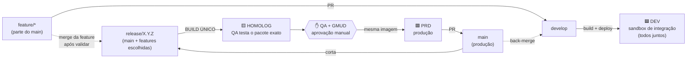
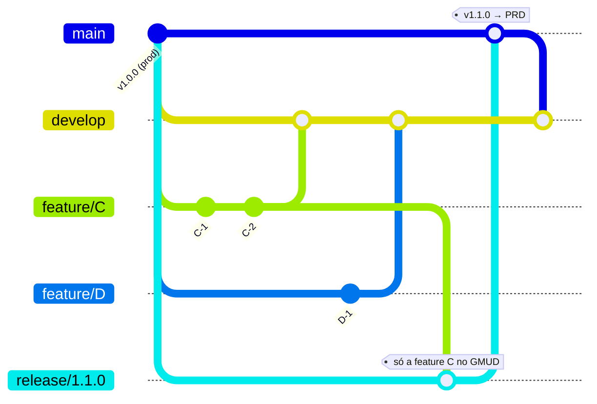
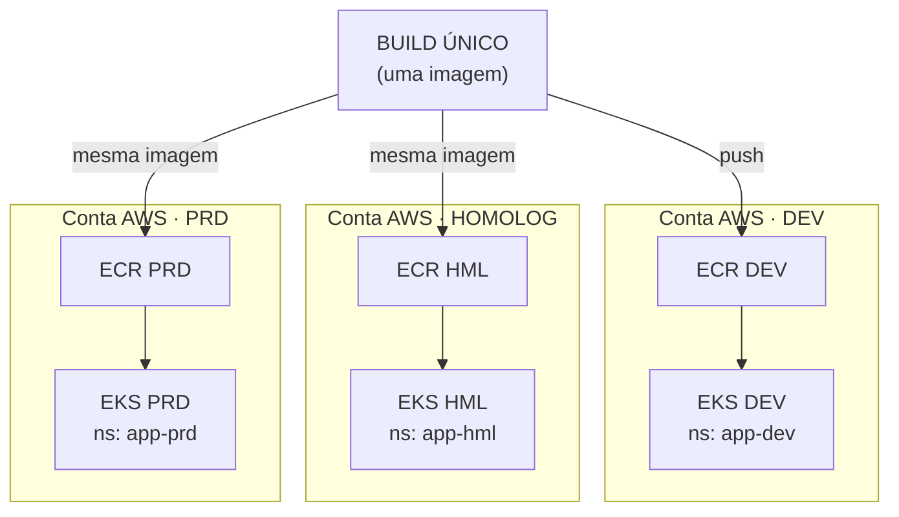
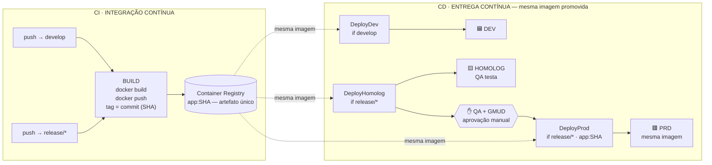
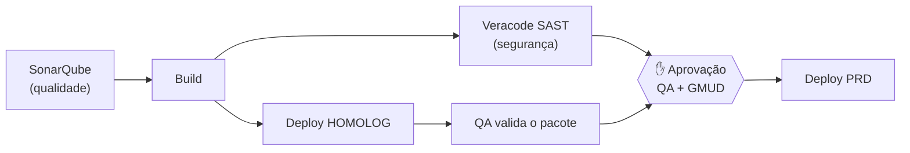
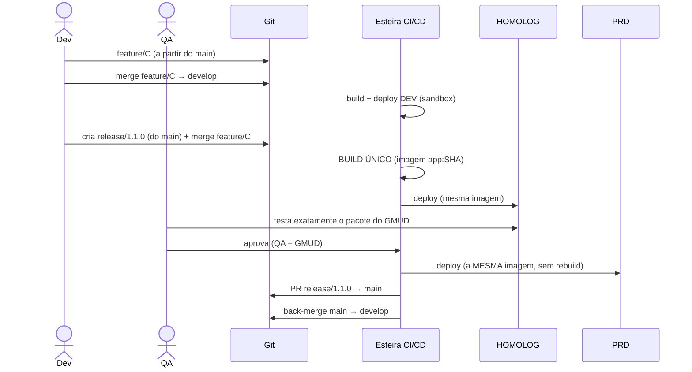

Crue # Arquitetura de Solução — Esteira de Release (Build Único + Release Isolada)

> **Documento de Arquitetura de Solução** · Autor: Arquitetura de Soluções / Plataforma DevOps
> **Público:** liderança técnica, squads de produto, QA, segurança, operações
> **Finalidade dupla:** (1) servir como fonte de verdade da arquitetura da esteira;
> (2) servir de *blueprint* para geração fiel de uma apresentação (PPTX).
>
> ℹ️ **Para quem vai gerar o slide:** as seções **§12 (Design System)** e
> **§13 (Roteiro de Slides)** contêm a especificação visual e o conteúdo
> slide-a-slide. Os diagramas em Mermaid das seções anteriores são a referência
> canônica do que cada slide deve ilustrar. Mantenha cores, ícones e rótulos
> **exatamente** como descritos.

---

## Sumário

1. Sumário executivo
2. Contexto e problema (a dor atual)
3. Objetivos e requisitos não-funcionais
4. Princípios de arquitetura
5. Visão geral da solução
6. Estratégia de branches (GitHub Flow adaptado — Opção A: merge)
7. Mapa de ambientes e topologia AWS
8. Esteira CI/CD e o conceito de **Build Único**
9. Governança, qualidade e o gate de GMUD
10. Ciclo de vida de uma release (passo a passo)
11. Decisões arquiteturais (ADRs), trade-offs e riscos
12. Design System (guia visual para o PPTX)
13. Roteiro de slides (slide-a-slide)
14. Glossário
15. Apêndice — status de implementação

---

## 1. Sumário executivo

Esta arquitetura define como uma alteração de software sai do desenvolvimento e
chega à produção de forma **isolada, auditável e segura**, sob processo de **GMUD**.

Três pilares sustentam a solução:

- **Build Único** — a imagem do contêiner é construída **uma única vez** e a
  **mesma imagem** (mesmo digest) é promovida por todos os ambientes, **sem rebuild**.
  Garante que *o que foi homologado é exatamente o que sobe em produção*.
- **Release Isolada** — a branch `release/X.Y.Z` parte do `main` (produção) e recebe
  **apenas as features selecionadas** para aquele GMUD. Permite subir uma alteração
  específica **sem arrastar** todo o trabalho em andamento.
- **Separação de papéis dos ambientes** — `develop`/**DEV** é o *sandbox de
  integração* (todos os devs juntos); `release`/**HOMOLOG** é o *pacote do GMUD*
  (onde a QA testa exatamente o que vai subir); **PRD** recebe a mesma imagem.

---

## 2. Contexto e problema (a dor atual)

O modelo anterior usava promoção linear de branches (`develop → homolog → main`),
em que **todo ambiente carregava o trabalho de todos os devs**. Isso gera três
problemas concretos:

| # | Dor | Consequência |
|---|-----|--------------|
| 1 | **Acoplamento de entregas** | Não é possível subir **uma feature isolada** sem levar junto tudo o que está em `develop`/`homolog`. |
| 2 | **Homologação não-fiel** | A QA validava "tudo integrado", mas a produção recebia outra coisa → risco de defeito só aparecer em produção. |
| 3 | **Falta de previsibilidade no GMUD** | O pacote de mudança não era um conjunto fechado e auditável. |

> **Insight central (o trilema):** não é possível, ao mesmo tempo, ter
> (A) ambientes refletindo *tudo de todos*, (B) subir *uma feature isolada* e
> (C) *build único*. A solução **resolve o conflito separando os papéis**: a
> integração de todos vive no DEV; a homologação do que sobe vive no HOMOLOG.

---

## 3. Objetivos e requisitos não-funcionais

**Objetivos**
- Permitir entrega seletiva de features para produção via GMUD.
- Garantir que homologação == produção (paridade de artefato).
- Preservar um espaço de integração contínua para os times.
- Manter rastreabilidade ponta-a-ponta (commit → imagem → ambiente).

**Requisitos não-funcionais**
- **Confiabilidade:** promoção sem rebuild elimina divergência de binário.
- **Auditabilidade:** cada deploy anotado com commit, branch, build e responsável.
- **Segurança:** SAST (Veracode) e qualidade (SonarQube) como gates; aprovação
  manual obrigatória antes de produção.
- **Reprodutibilidade:** infraestrutura como código (Terraform) por app/ambiente.
- **Isolamento de blast-radius:** ambientes em **contas AWS distintas**.

---

## 4. Princípios de arquitetura

1. **Build once, deploy many** — nunca recompilar entre ambientes.
2. **Promova o artefato, não a branch** — o que viaja entre ambientes é a imagem.
3. **A produção parte do `main`** — a release é sempre `main` + features escolhidas.
4. **Cada ambiente tem um único propósito** — DEV integra, HOMOLOG homologa, PRD serve.
5. **Gate humano antes de produção** — QA + GMUD são aprovação explícita.
6. **Infra imutável e versionada** — Terraform + manifests K8s versionados.
7. **Rastreabilidade por padrão** — annotations de deploy em todo workload.

---

## 5. Visão geral da solução



**Leitura em uma frase:** os devs integram tudo no DEV via `develop`; quando uma
alteração específica é aprovada para o GMUD, ela é mesclada em uma `release/X.Y.Z`
cortada do `main`, que builda **uma vez**, é homologada pela QA e — após aprovação —
tem a **mesma imagem** promovida para produção.

---

## 6. Estratégia de branches (GitHub Flow adaptado — Opção A: merge)

### 6.1 Papéis das branches

| Branch | Origem | Destino de deploy | Papel |
|--------|--------|-------------------|-------|
| `feature/*` | **`main`** | — | Trabalho individual do dev |
| `develop` | — | **DEV** | Sandbox de integração (todos juntos). Não vai para prod. |
| `release/X.Y.Z` | **`main`** | **HOMOLOG → PRD** | Pacote do GMUD: só o que vai subir |
| `main` | — | — | Espelho da produção |
| `hotfix/*` | `main` | **PRD** (direto) | Correção emergencial |

> **Regra de ouro:** toda `feature/*` **nasce do `main`**. Isso garante que o
> `merge` da feature na release traga **apenas** aquela feature (sem arrastar o
> conteúdo do `develop`). Uma `release/X.Y.Z` ativa por vez.

### 6.2 Fluxo de trabalho do desenvolvedor (dual-track)

A **mesma** feature branch é mesclada em **dois lugares**, com propósitos distintos:

```
feature/C ──merge──▶ develop          → aparece no DEV, integra com todos, valida no sandbox
feature/C ──merge──▶ release/1.1.0     → após validada, entra no pacote do GMUD
```

### 6.3 Diagrama Git (Opção A — merge)



> A `feature/D` permanece em `develop`/DEV (intacta) e subirá em um GMUD futuro.
> **Nada é apagado** — a promoção a produção é seletiva, não destrutiva.

---

## 7. Mapa de ambientes e topologia AWS

Cada ambiente vive em uma **conta AWS distinta** (isolamento de blast-radius),
com seu próprio cluster **EKS**, registro **ECR** e estado **Terraform** (S3).



| Ambiente | Branch | Conta AWS | Cluster EKS | Namespace | Quem usa |
|----------|--------|-----------|-------------|-----------|----------|
| **DEV** | `develop` | `DevAwsAccID` | `DevAwsEksClusterName` | `app-dev` | devs |
| **HOMOLOG** | `release/X.Y.Z` | `HmlAwsAccID` | `HmlAwsEksClusterName` | `app-hml` | QA |
| **PRD** | `release` (promovido) | `PrdAwsAccId` | `PrdAwsEksClusterName` | `app-prd` | produção |

**Componentes por ambiente:** ECR (imagens), EKS (workloads), ALB compartilhado,
API Gateway (VPC Link / VPC Endpoint), ACM (certificados), SSM/Secrets (config),
DynamoDB/S3/SQS/Cognito (recursos da aplicação) — provisionados via Terraform.

---

## 8. Esteira CI/CD e o conceito de Build Único

### 8.1 Diagrama da esteira (este é o slide-âncora)



### 8.2 O que é "Build Único" (e o que **não** é)

| | Definição | Toca/apaga ambiente? |
|---|---|---|
| **Build Único** | A imagem é **compilada uma vez** por esteira e **a mesma** (mesmo digest, identificada pela **commit SHA**) é promovida entre ambientes **sem recompilar**. | ❌ Não |

Pontos-chave:
- **Não significa "um único build no mundo".** A esteira do `develop` produz a
  imagem do DEV; a esteira da `release` produz a imagem de HOMOLOG/PRD. São builds
  diferentes; "único" = *sem rebuild entre ambientes dentro da mesma esteira*.
- **Não apaga nada.** É sobre o **binário**, não sobre branches ou ambientes.
  DEV e HOMOLOG são ambientes separados; promover a release ao HOMOLOG não toca o DEV.
- **Identidade da imagem = commit SHA.** Torna a promoção determinística e auditável.

---

## 9. Governança, qualidade e o gate de GMUD

A esteira aplica **portões de qualidade e segurança** antes de produção:



- **SonarQube** — análise de qualidade de código (sempre, no início).
- **Veracode SAST** — análise estática de segurança, em paralelo ao HOMOLOG.
- **Gate QA + GMUD** — aprovação **manual obrigatória** configurada como *check* no
  Environment `prd` do Azure DevOps. A esteira **pausa** até a liberação.
- **Rastreabilidade** — o deploy é anotado no workload (`deploy.fibra.io/build-id`,
  `/commit`, `/branch`, `/triggered-by`).

---

## 10. Ciclo de vida de uma release (passo a passo)



1. Dev cria `feature/C` **a partir do `main`**.
2. `merge feature/C → develop` → DEV (sandbox, integra com todos).
3. Cria `release/1.1.0` do `main` e faz `merge feature/C` (só a feature do GMUD).
4. Esteira **builda uma vez** e publica `app:SHA`.
5. Deploy em **HOMOLOG** → **QA testa o pacote exato**.
6. **Aprovação QA + GMUD** → deploy em **PRD** com a **mesma imagem**.
7. `PR release → main` (registro de produção) + **back-merge `main → develop`**.

---

## 11. Decisões arquiteturais (ADRs), trade-offs e riscos

### ADR-01 — HOMOLOG passa a refletir a release (não "tudo de todos")
- **Decisão:** o HOMOLOG é alimentado pela `release/X.Y.Z`.
- **Porquê:** a QA precisa testar **exatamente o que vai subir**. Resolve o trilema.
- **Trade-off:** a visão "tudo integrado" deixa de existir no HOMOLOG → passa a viver
  somente no **DEV**.

### ADR-02 — Promoção seletiva por **merge** (Opção A), não cherry-pick
- **Decisão:** features entram na release via `git merge` da branch.
- **Porquê:** preserva SHAs, back-merge limpo, histórico rastreável.
- **Condição:** toda `feature/*` deve nascer do `main`.

### ADR-03 — Build Único com identidade por commit SHA
- **Decisão:** imagem taggeada por commit e promovida sem rebuild.
- **Porquê:** paridade homologação == produção; rastreabilidade determinística.

### Riscos e mitigações

| Risco | Mitigação |
|-------|-----------|
| Feature C depende de algo que ficou de fora do GMUD (ex.: migration) | Detectado **no HOMOLOG isolado** (antes da prod), não em produção |
| Disciplina de branch (feature não nascida do `main`) | Política de branch + checagem na criação da release |
| Duas releases simultâneas | Regra "uma release por vez" + bloqueio na esteira |
| Aprovação de GMUD esquecida | Gate obrigatório no Environment `prd` (a esteira não avança sem ele) |

---

## 12. Design System (guia visual para o PPTX)

> Replicar o estilo já existente: **limpo, claro, com containers arredondados e
> ambientes codificados por cor.**

### 12.1 Paleta

| Elemento | Cor (hex) | Uso |
|----------|-----------|-----|
| Fundo | `#FFFFFF` / `#FAFAFA` | base dos slides |
| Container/seção | borda `#E5E7EB`, fill `#FFFFFF` | blocos "CI" / "CD", grupos |
| **DEV** | fill `#EAF2FE`, acento `#2563EB` (azul) | ambiente DEV |
| **HOMOLOG** | fill `#FEF6E0`, acento `#F59E0B` (âmbar) | ambiente HOMOLOG |
| **PRD** | fill `#FDECEC`, acento `#DC2626` (vermelho) | ambiente PRD |
| **Build / código** | fill `#FFFFFF`, borda `#111827` (preto) | caixa de BUILD |
| **Registry / "mesma imagem"** | `#EA580C` (laranja) | cilindro de registry e setas pontilhadas |
| Gate GMUD | pill `#1F2937` (grafite), texto âmbar | aprovação manual (ícone ✋) |
| Texto | `#111827` (títulos), `#6B7280` (secundário) | tipografia |

### 12.2 Tipografia e formas
- **Títulos/labels:** sans-serif (Inter / Helvetica Neue), peso bold nos títulos.
- **Triggers, tags e comandos:** **monospace** (ex.: `push → release/*`, `tag = SHA`).
- **Formas:** retângulos arredondados (raio ~12px); registry como **cilindro**;
  gate como **pill**; triggers como **chips** arredondados.

### 12.3 Setas / legenda (sempre incluir)
- **Linha cheia preta** = sequência do fluxo.
- **Linha pontilhada laranja** = "mesma imagem" (promoção sem rebuild).
- Rótulo fixo no slide da esteira: **"sem rebuild"**.

### 12.4 Ícones sugeridos
- DEV 🟦 / HOMOLOG 🟨 / PRD 🟥 (ou ícones de servidor coloridos).
- Build: engrenagem/contêiner. Registry: cilindro/banco. GMUD: ✋ mão / cadeado.

---

## 13. Roteiro de slides (slide-a-slide)

> Cada slide abaixo = 1 slide do PPTX. "Visual" descreve o que desenhar.

**S1 — Capa**
- Título: *Arquitetura de Solução — Esteira de Release*
- Subtítulo: *Build Único · Release Isolada · GMUD*
- Visual: fundo claro, título grande, faixa de cor com os 3 ambientes (azul/âmbar/vermelho).

**S2 — Contexto e problema**
- Mensagem: "develop/homolog carregavam tudo de todos → não dava para subir uma feature isolada e a QA não testava o que ia para prod."
- Visual: tabela das 3 dores (§2). Ícone de alerta.

**S3 — O trilema**
- Mensagem: "A + B + C não coexistem; resolvemos separando papéis."
- Visual: triângulo com vértices A (tudo integrado) / B (feature isolada) / C (build único); destaque "escolhemos separar a integração (DEV) da homologação (HOMOLOG)".

**S4 — Objetivos e princípios**
- Visual: 7 princípios (§4) como cards; 4 objetivos (§3) ao lado.

**S5 — Visão geral da solução**
- Visual: diagrama §5 (feature → develop → DEV; main → release → HOMOLOG → gate → PRD; back-merge). Cores do design system.

**S6 — Estratégia de branches**
- Visual: tabela de papéis (§6.1) + destaque da "regra de ouro" (feature nasce do main).

**S7 — Fluxo do desenvolvedor (dual-track) + Git graph**
- Visual: o gitGraph (§6.3); caixa lateral "a mesma feature vai para develop **e** para a release".

**S8 — Mapa de ambientes e AWS**
- Visual: diagrama §7 (3 contas AWS, cada uma com EKS+ECR) + tabela de ambientes.

**S9 — Esteira CI/CD (slide-âncora)**
- Visual: **reproduzir fielmente o diagrama §8.1** (blocos CI e CD, BUILD, registry `app:SHA`, DeployDev/Homolog/Prod, gate GMUD, legenda sequência/mesma imagem/sem rebuild). Este é o slide central.

**S10 — Build Único explicado**
- Mensagem: "buildada uma vez, a mesma percorre os ambientes — sem rebuild; não apaga nada."
- Visual: tabela §8.2 + ícone de imagem única viajando (seta laranja pontilhada).

**S11 — Governança e gate de GMUD**
- Visual: diagrama §9 (SonarQube → Build → HOMOLOG/Veracode → gate QA+GMUD → PRD).

**S12 — Ciclo de vida da release**
- Visual: o sequenceDiagram (§10) **ou** uma timeline numerada de 7 passos.

**S13 — Decisões e trade-offs**
- Visual: 3 ADRs (§11) como cards + tabela de riscos/mitigações.

**S14 — Próximos passos**
- Visual: checklist (§15): configurar gate no Environment `prd`; política de branch (feature do main); persistir release única; observabilidade do deploy.

**S15 — Glossário (opcional / backup)**
- Visual: lista §14.

---

## 14. Glossário

- **GMUD** — Gestão de Mudança: aprovação formal para alterar produção.
- **Build Único** — construir a imagem uma vez e promover a **mesma** entre ambientes, sem rebuild.
- **Sandbox de integração** — ambiente (DEV/`develop`) onde o trabalho de todos convive; **não** é o caminho de produção.
- **Release isolada** — `release/X.Y.Z` = `main` + apenas as features do GMUD.
- **Back-merge** — trazer o `main` de volta ao `develop` após a release, para o `develop` não regredir.
- **Promoção por digest/SHA** — referenciar a imagem pela identidade do commit, garantindo o mesmo binário em todos os ambientes.

---

## 15. Apêndice — status de implementação

- **`azure-pipeline-dotnet.yaml`** — implementa os três caminhos: `develop/sandbox`
  (Build → DEV), `release/*` (Build → HML + Veracode → PRD → PR `release→main` →
  back-merge), e `hotfix/*` (inalterado).
- **Gate QA + GMUD** — configurar como *check de aprovação* no Environment `prd`
  (Azure DevOps → Pipelines → Environments → `prd` → Approvals and checks). **Passo manual.**
- **Identidade da imagem** — alvo de arquitetura: tag por **commit SHA**. A
  implementação atual promove a mesma imagem **dentro de um único run** (artefato
  `docker-image.tar`) com `Build.BuildId`; alinhar a tag/promoção por SHA + cópia
  cross-account (ECR→ECR por digest) é a evolução natural para refletir 100% o §8.1.
- **Disciplina de branch** — `feature/*` deve nascer do `main` (Opção A); recomenda-se
  política de branch no Azure Repos para reforçar.