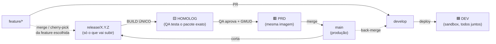
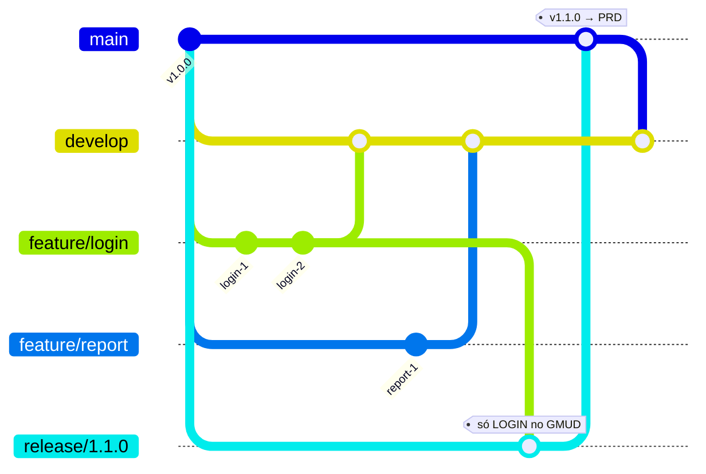
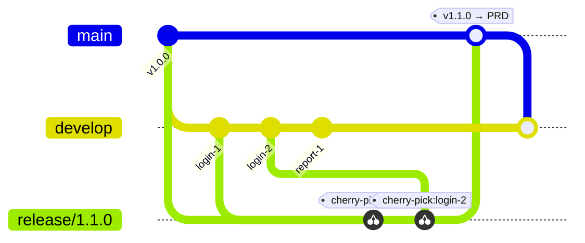

# Fluxo de Release — Build Único + Branch Release Isolada

> **Status:** proposta para revisão. Este documento descreve o fluxo de branches e
> ambientes para entrega em produção via GMUD, com **build único** e uma
> **branch `release/X.Y.Z` isolada** contendo apenas o que vai subir.

---

## 1. Objetivo

Resolver três necessidades que hoje conflitam:

| | Necessidade | Como é atendida |
|---|---|---|
| **Dor dos devs** | Subir **uma feature isolada** pra produção, sem arrastar tudo que está em develop/homolog | A `release/X.Y.Z` contém **só o que vai subir** |
| **QA** | A QA precisa testar **exatamente o que vai pra prod** | O **HOMOLOG é alimentado pela release**, não pelo develop |
| **Build único** | O que foi homologado é **o mesmo artefato** que sobe em prod | A imagem é **buildada uma vez na release** e promovida sem rebuild |

**Princípio central:** o `develop` deixa de ser o caminho para produção e vira um
**sandbox de integração** (onde todo mundo vê o conjunto). O caminho para
produção passa a ser a **`release/X.Y.Z`**, cortada do `main` e contendo apenas as
features selecionadas para aquele GMUD.

---

## 2. Papéis das branches e ambientes

| Branch | Ambiente | Papel | Quem usa |
|--------|----------|-------|----------|
| `feature/*` | — | Trabalho individual do dev | dev |
| `develop` | **DEV** | **Sandbox de integração** — todos juntos. **Não vai pra prod.** | devs |
| `release/X.Y.Z` | **HOMOLOG** | **Pacote do GMUD** — só o que vai subir. **QA testa aqui.** | QA |
| _(a mesma imagem da release)_ | **PRD** | Produção | — |
| `main` | — | Espelho do que está em produção | — |

> **Regra de ouro:** uma `release/X.Y.Z` por vez, e ela **sempre nasce do `main`**
> (estado de produção) + recebe apenas as features escolhidas.

---

## 3. Visão geral do fluxo



**Resumo em palavras:**

1. Devs trabalham em `feature/*` e mandam pro `develop` → aparece no **DEV** (todos juntos).
2. Pra montar um GMUD: corta-se `release/X.Y.Z` do `main` e coloca-se **só as
   features que vão subir** (via **merge** ou **cherry-pick** — ver opções A e B).
3. A release builda **uma vez** → vai pro **HOMOLOG** → a **QA testa exatamente o
   pacote**.
4. QA aprova + GMUD → a **mesma imagem** vai pro **PRD**.
5. `release` → `main` (registro de produção) e back-merge `main` → `develop`.

---

## 4. Opção A — `merge` da feature branch

A feature branch é **criada a partir do `main`** e, quando selecionada, é
**mesclada** (`git merge`) na release.

> ⚠️ Para o merge trazer **só a feature**, a `feature/*` precisa ser cortada do
> `main`. Se ela for cortada do `develop`, o merge arrasta junto tudo que estava no
> develop — quebrando o isolamento.

### Diagrama (Opção A)



> Note que `feature/report` está no **develop** (visível no DEV), mas **não** entrou
> na `release/1.1.0` — logo **não vai pra produção** neste GMUD.

### Fallback ASCII (Opção A)

```
main      v1.0.0 ───────────────────────────────●─ v1.1.0 (PRD)
            │\                                  ╱│
            │ \ feature/login (corta do main) ╱ │
            │  ●──●  login-1, login-2 ───────╱  │  merge na release
            │   \                          ╱    │
develop ────●────\────●(merge login)──────╱─────●(back-merge main)
                  \    \                  ╱
                   \    feature/report ──╳ (fica só no develop/DEV)
                    \                    ╱
release/1.1.0        ●──────────────────●  (main + só login) → HOMOLOG → QA → PRD
```

### Passo a passo (Opção A)

```bash
# dev cria a feature a partir do main
git checkout main && git pull
git checkout -b feature/login
# ... commits ...
# (opcional) integra no sandbox pra ver junto com os outros
git checkout develop && git merge feature/login   # aparece no DEV

# montar o GMUD: release nasce do main + só a feature escolhida
git checkout main && git pull
git checkout -b release/1.1.0
git merge feature/login                            # entra só o login
git push origin release/1.1.0                      # dispara build único → HOMOLOG

# após QA + GMUD aprovado: pipeline promove a MESMA imagem pra PRD
# e conclui: release/1.1.0 -> main  e  back-merge main -> develop
```

### Prós e contras (Opção A)

| ✅ Prós | ⚠️ Contras |
|--------|-----------|
| Preserva os SHAs originais dos commits | **Exige disciplina:** toda `feature/*` tem que nascer do `main` |
| Back-merge para `develop`/`main` é limpo (sem commits duplicados) | Se a feature foi cortada do develop, o merge arrasta o que não deveria |
| Histórico rastreável (merge commit aponta a feature) | Menos flexível pra "pegar só alguns commits" de uma feature grande |

---

## 5. Opção B — `cherry-pick` dos commits

A feature pode viver em qualquer lugar (inclusive cortada do `develop`). Na release,
você **copia apenas os commits desejados** (`git cherry-pick`).

### Diagrama (Opção B)



> O commit `report-1` continua no **develop** (DEV), mas **não** foi cherry-picked
> pra release → não vai pra produção. Só `login-1` e `login-2` sobem.

### Fallback ASCII (Opção B)

```
main      v1.0.0 ──────────────────────────●─ v1.1.0 (PRD)
            │                              ╱│
            │   branch release do main    ╱ │
            │                            ╱  │
develop ────●──●──●──●─────────────────╱───●(back-merge main)
               │  │  │                 ╱
            login login report-1      ╱  (report-1 NÃO é cherry-picked)
             -1   -2  (fica)         ╱
                                    ╱
release/1.1.0  ●····●·············●   cherry-pick(login-1, login-2) → HOMOLOG → QA → PRD
              (cópias dos commits com novos SHAs)
```

### Passo a passo (Opção B)

```bash
# descobrir os hashes dos commits da feature
git log --oneline develop

# release nasce do main e recebe só os commits escolhidos
git checkout main && git pull
git checkout -b release/1.1.0
git cherry-pick <hash-login-1> <hash-login-2>      # copia só esses commits
git push origin release/1.1.0                       # build único → HOMOLOG

# após QA + GMUD: promove a MESMA imagem pra PRD
# release/1.1.0 -> main  e  back-merge main -> develop
```

### Prós e contras (Opção B)

| ✅ Prós | ⚠️ Contras |
|--------|-----------|
| Máxima flexibilidade: escolhe commit a commit | Cria **commits duplicados** (novos SHAs) |
| Feature pode estar no develop (não precisa nascer do main) | Back-merge pode gerar **conflitos / duplicação** se não usar a estratégia certa |
| Bom pra "subir só parte" de uma feature grande | Exige saber quais commits pertencem à feature (disciplina de commits atômicos) |

---

## 6. Comparação rápida A × B

| Critério | A — Merge | B — Cherry-pick |
|----------|-----------|------------------|
| Onde a feature nasce | **Obrigatório do `main`** | Qualquer lugar (ex: develop) |
| Granularidade | Feature inteira | Commit a commit |
| SHAs | Preservados | Duplicados (novos) |
| Back-merge | Limpo | Requer cuidado |
| Disciplina exigida | Branch base = main | Commits atômicos + saber os hashes |
| Indicado quando | Features bem isoladas, 1 feature = 1 branch | Precisa fatiar / feature mora no develop |

**Recomendação:** começar com a **Opção A** (mais previsível e back-merge limpo),
exigindo que toda `feature/*` nasça do `main`. Usar **B** pontualmente quando
precisar fatiar uma feature ou quando ela já estiver só no develop.

---

## 7. Como isso muda os pipelines (implementado)

Implementação em `azure-pipeline-dotnet.yaml`, escolhida a **Opção A (merge)**:

1. **Build único por run.** O caminho da release roda num **único run do pipeline**:
   `Build → HML → PRD`. A imagem é buildada uma vez (stage `Build`, artefato
   `docker-image.tar`) e a **mesma** é promovida para HML e PRD pelo
   `templates/deploy-backend.yaml` (que dá `docker load` do mesmo `.tar` e faz push
   para a ECR de cada conta). Como é o mesmo run, a tag `$(Build.BuildId)` já é
   estável — **não foi preciso trocar para commit SHA**. A rastreabilidade de
   commit/branch já é gravada nas annotations do deployment (`deploy.fibra.io/*`).
2. **`develop` / `sandbox`** → `SonarQube → Build → DEV`. **Para no DEV** (sandbox de
   integração). Não segue para HML/PRD.
3. **`release/X.Y.Z`** → `SonarQube → Build → HML + Veracode → PRD → PRs`:
   - **HML**: QA testa exatamente o pacote do GMUD;
   - **Veracode**: SAST em paralelo ao HML;
   - **PRD**: deployment job no Environment `prd` — o **gate de QA + GMUD** é um
     *check de aprovação* configurado nesse Environment (no Azure DevOps), que pausa
     o run até a aprovação. Sobe a **mesma imagem** homologada;
   - **PR `release → main`** (registro de produção) e **back-merge `main → develop`**,
     reaproveitando `templates/utils/create-pullrequest.yaml`.
4. **`hotfix/*`** → fluxo existente inalterado (deploy direto em PRD).
5. **Papel das branches mudou:** o HOMOLOG passa a ser alimentado pela `release`
   (não mais pela promoção de `develop`); `main` é o espelho de produção; `homolog`
   deixa de existir como branch de promoção.

> **Ação manual necessária (fora do YAML):** configurar o *check de aprovação*
> (QA + GMUD) no Environment **`prd`** do Azure DevOps. É ele que segura o deploy de
> produção até a liberação. Sem esse check, o PRD subiria automaticamente após HML.

---

## 8. Glossário

- **GMUD:** Gestão de Mudança — janela/aprovação formal para subir em produção.
- **Build único:** a imagem Docker é construída **uma vez** e a **mesma** é promovida
  por todos os ambientes (sem rebuild), garantindo que o que foi homologado é o que sobe.
- **Sandbox de integração:** ambiente onde o trabalho de todos os devs convive
  (DEV/`develop`), usado para enxergar o conjunto — **não** é o que vai pra produção.
